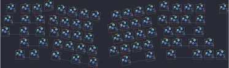

## jacky_studio/bear_65/via

[layout](via-kle.json) - [PCB](via.kicad_pcb)

{:loading="lazy"}

[Open in keyboard-layout-editor](http://www.keyboard-layout-editor.com/##@@_x:5.75&y:0.75;&=0,2;&@_x:15.65&y:-0.95;&=0,11%0A-;&@_x:2.5&y:-0.8&c=#777777;&=3,1&_x:0.25&c=#cccccc;&=0,0&=0,1&_x:11.0;&=0,12&_c=#aaaaaa;&=0,13%0A%0A%0A0,0&=0,14%0A%0A%0A0,0&_x:1.0;&=4,14;&@_x:2.25;&=1,14&_x:0.25&w:1.5;&=1,0&_c=#cccccc;&=1,1&_x:9.5;&=1,10&=1,11&=1,12&_c=#aaaaaa&w:1.5;&=1,13;&@_x:2;&=2,14&_x:0.25&w:1.75;&=2,0&_c=#cccccc;&=2,1&_x:10.0;&=2,10&=2,11&_c=#777777&w:2.25;&=2,13;&@_x:3&c=#aaaaaa&w:2.25;&=3,0&_c=#cccccc;&=3,2&_x:9.5;&=3,11&=3,12&_c=#aaaaaa&w:1.75;&=3,13&_c=#777777;&=3,14;&@_x:3&c=#aaaaaa&w:1.5;&=4,0%0A%0A%0A1,0&=4,1%0A%0A%0A1,0&_x:10.75;&=4,10%0A%0A%0A1,0&_x:1.25&c=#777777;&=4,11&=4,12&=4,13;&@_r:10&rx:1&x:6&c=#cccccc;&=0,3&=0,4&=0,5&=0,6;&@_x:5.5;&=1,2&=1,3&=1,4&=1,5;&@_x:5.75;&=2,2&=2,3&=2,4&=2,5;&@_x:6.25;&=3,3&=3,4&=3,5&=3,6;&@_x:6&c=#aaaaaa&w:1.5;&=4,3%0A%0A%0A1,0&_c=#777777&w:2;&=4,5%0A%0A%0A1,0&_c=#aaaaaa;&=4,6%0A%0A%0A1,0;&@_r:-10&x:10&y:-1.5&c=#cccccc;&=0,7&=0,8&=0,9&=0,10;&@_x:9.5;&=1,6&=1,7&=1,8&=1,9;&@_x:9.75;&=2,6&=2,7&=2,8&=2,9;&@_x:9.25;&=3,7&=3,8&=3,9&=3,10;&@_x:9.25&c=#777777&w:2.75;&=4,8%0A%0A%0A1,0&_c=#aaaaaa&w:1.5;&=4,9%0A%0A%0A1,0;&@_r:0&rx:0&x:22.75&y:1.0&w:2;&=0,13%0A%0A%0A0,1;&@_x:3.25&y:4.25&w:1.5;&=4,0%0A%0A%0A1,1&_c=#cccccc&d:true;&=4,1%0A%0A%0A1,1&_x:10.75&c=#aaaaaa;&=4,10%0A%0A%0A1,1;&@_r:10&rx:1&x:6.25&y:5.25&w:1.5;&=4,3%0A%0A%0A1,1&_c=#777777&w:2;&=4,5%0A%0A%0A1,1&_c=#aaaaaa;&=4,6%0A%0A%0A1,1;&@_r:-10&x:9.5&y:2.5&c=#777777&w:2.75;&=4,8%0A%0A%0A1,1&_c=#cccccc&w:1.5&d:true;&=4,9%0A%0A%0A1,1)

{:loading="lazy"}

