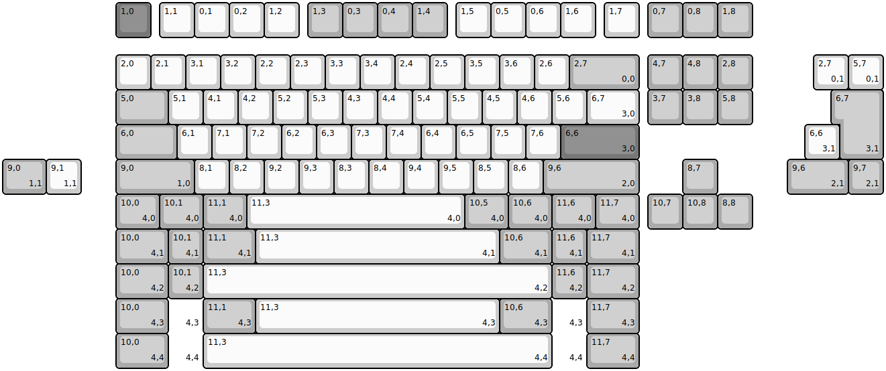
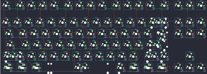

## jels/jels88

[layout](jels88-kle.json) - [PCB](jels88.kicad_pcb)

{:loading="lazy"}

[Open in keyboard-layout-editor](http://www.keyboard-layout-editor.com/##@@_x:3.25&c=#777777;&=1,0&_x:0.25&c=#cccccc;&=1,1&=0,1&=0,2&=1,2&_x:0.25&c=#aaaaaa;&=1,3&=0,3&=0,4&=1,4&_x:0.25&c=#cccccc;&=1,5&=0,5&=0,6&=1,6&_x:0.25;&=1,7&_x:0.25&c=#aaaaaa;&=0,7&=0,8&=1,8;&@_x:3.25&y:0.5&c=#cccccc;&=2,0&=2,1&=3,1&=3,2&=2,2&=2,3&=3,3&=3,4&=2,4&=2,5&=3,5&=3,6&=2,6&_c=#aaaaaa&w:2;&=2,7%0A%0A%0A0,0&_x:0.25;&=4,7&=4,8&=2,8;&@_x:3.25&w:1.5;&=5,0&_c=#cccccc;&=5,1&=4,1&=4,2&=5,2&=5,3&=4,3&=4,4&=5,4&=5,5&=4,5&=4,6&=5,6&_w:1.5;&=6,7%0A%0A%0A3,0&_x:0.25&c=#aaaaaa;&=3,7&=3,8&=5,8;&@_x:3.25&w:1.75;&=6,0&_c=#cccccc;&=6,1&=7,1&=7,2&=6,2&=6,3&=7,3&=7,4&=6,4&=6,5&=7,5&=7,6&_c=#777777&w:2.25;&=6,6%0A%0A%0A3,0;&@_x:3.25&c=#aaaaaa&w:2.25;&=9,0%0A%0A%0A1,0&_c=#cccccc;&=8,1&=8,2&=9,2&=9,3&=8,3&=8,4&=9,4&=9,5&=8,5&=8,6&_c=#aaaaaa&w:2.75;&=9,6%0A%0A%0A2,0&_x:1.25;&=8,7;&@_x:3.25&w:1.25;&=10,0%0A%0A%0A4,0&_w:1.25;&=10,1%0A%0A%0A4,0&_w:1.25;&=11,1%0A%0A%0A4,0&_c=#cccccc&w:6.25;&=11,3%0A%0A%0A4,0&_c=#aaaaaa&w:1.25;&=10,5%0A%0A%0A4,0&_w:1.25;&=10,6%0A%0A%0A4,0&_w:1.25;&=11,6%0A%0A%0A4,0&_w:1.25;&=11,7%0A%0A%0A4,0&_x:0.25;&=10,7&=10,8&=8,8;&@_x:23.25&y:-5.0&c=#cccccc;&=2,7%0A%0A%0A0,1&=5,7%0A%0A%0A0,1;&@_x:24.0&c=#aaaaaa&w:1.25&h:2&w2:1.5&h2:1&x2:-0.25;&=6,7%0A%0A%0A3,1;&@_x:23.0&c=#cccccc;&=6,6%0A%0A%0A3,1;&@_c=#aaaaaa&w:1.25;&=9,0%0A%0A%0A1,1&_c=#cccccc;&=9,1%0A%0A%0A1,1&_x:20.25&c=#aaaaaa&w:1.75;&=9,6%0A%0A%0A2,1&=9,7%0A%0A%0A2,1;&@_x:3.25&y:1.0&w:1.5;&=10,0%0A%0A%0A4,1&=10,1%0A%0A%0A4,1&_w:1.5;&=11,1%0A%0A%0A4,1&_c=#cccccc&w:7;&=11,3%0A%0A%0A4,1&_c=#aaaaaa&w:1.5;&=10,6%0A%0A%0A4,1&=11,6%0A%0A%0A4,1&_w:1.5;&=11,7%0A%0A%0A4,1;&@_x:3.25&w:1.5;&=10,0%0A%0A%0A4,2&=10,1%0A%0A%0A4,2&_c=#cccccc&w:10;&=11,3%0A%0A%0A4,2&_c=#aaaaaa;&=11,6%0A%0A%0A4,2&_w:1.5;&=11,7%0A%0A%0A4,2;&@_x:3.25&w:1.5;&=10,0%0A%0A%0A4,3&_d:true;&=%0A%0A%0A4,3&_w:1.5;&=11,1%0A%0A%0A4,3&_c=#cccccc&w:7;&=11,3%0A%0A%0A4,3&_c=#aaaaaa&w:1.5;&=10,6%0A%0A%0A4,3&_d:true;&=%0A%0A%0A4,3&_w:1.5;&=11,7%0A%0A%0A4,3;&@_x:3.25&w:1.5;&=10,0%0A%0A%0A4,4&_d:true;&=%0A%0A%0A4,4&_c=#cccccc&w:10;&=11,3%0A%0A%0A4,4&_c=#aaaaaa&d:true;&=%0A%0A%0A4,4&_w:1.5;&=11,7%0A%0A%0A4,4)

{:loading="lazy"}

