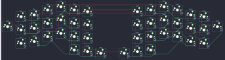

## jian/jianrev2

[layout](jianrev2-kle.json) - [PCB](jianrev2.kicad_pcb)

{:loading="lazy"}

[Open in keyboard-layout-editor](http://www.keyboard-layout-editor.com/##@@_x:4;&=0,2&_x:6.75;&=4,2;&@_x:3&y:-0.75;&=1,2&_x:1;&=0,3&_x:4.75;&=4,3&_x:1.0;&=5,2;&@_x:6&y:-0.88;&=0,4&_x:2.75;&=4,4;&@_x:2&y:-0.75;&=0,1&_x:10.75;&=4,1;&@_x:1&y:-0.87;&=0,0&_x:12.75;&=4,0;&@_x:4&y:-0.75;&=1,3&_x:6.75;&=5,3;&@_x:3&y:-0.75;&=2,2&_x:1;&=1,4&_x:4.75;&=5,4&_x:1.0;&=6,2;&@_x:6&y:-0.88;&=0,5&_x:2.75;&=4,5;&@_y:-0.87&c=#777777;&=2,0&_x:14.75;&=6,0;&@_x:2&y:-0.88&c=#cccccc;&=1,1&_x:10.75;&=5,1;&@_x:1&y:-0.87&c=#777777;&=1,0&_x:12.75;&=5,0;&@_x:4&y:-0.75&c=#cccccc;&=2,3&_x:6.75;&=6,3;&@_x:3&y:-0.75;&=3,3&_x:1;&=2,4&_x:4.75;&=6,4&_x:1.0;&=7,3;&@_x:6&y:-0.88;&=1,5&_x:2.75;&=5,5;&@_x:2&y:-0.75;&=3,2&_x:10.75;&=7,2;&@_x:1&y:-0.87&c=#777777;&=2,1&_x:12.75;&=6,1;&@_x:5&y:-0.5;&=3,4&_x:4.75;&=7,4;&@_x:6&y:-0.88;&=2,5&_x:2.75;&=6,5;&@_x:7&y:-0.87;&=3,5&_x:0.75;&=7,5)

{:loading="lazy"}

