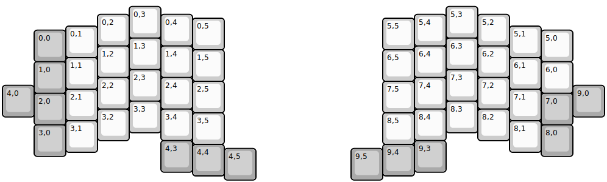
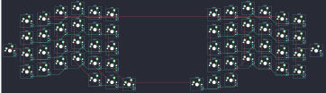

## jiran/jiran

[layout](jiran-kle.json) - [PCB](jiran.kicad_pcb)

{:loading="lazy"}

[Open in keyboard-layout-editor](http://www.keyboard-layout-editor.com/##@@_x:4&y:0.13;&=0,3&_x:9;&=5,3;&@_x:3&y:-0.75;&=0,2&_x:1;&=0,4&_x:7;&=5,4&_x:1;&=5,2;&@_x:6&y:-0.88;&=0,5&_x:5;&=5,5;&@_x:2&y:-0.75;&=0,1&_x:13;&=5,1;&@_x:1&y:-0.87&c=#aaaaaa;&=0,0&_x:15&c=#cccccc;&=5,0;&@_x:4&y:-0.75;&=1,3&_x:9;&=6,3;&@_x:3&y:-0.75;&=1,2&_x:1;&=1,4&_x:7;&=6,4&_x:1;&=6,2;&@_x:6&y:-0.88;&=1,5&_x:5;&=6,5;&@_x:2&y:-0.75;&=1,1&_x:13;&=6,1;&@_x:1&y:-0.87&c=#aaaaaa;&=1,0&_x:15&c=#cccccc;&=6,0;&@_x:4&y:-0.75;&=2,3&_x:9;&=7,3;&@_x:3&y:-0.75;&=2,2&_x:1&n:true;&=2,4&_x:7&n:true;&=7,4&_x:1;&=7,2;&@_x:6&y:-0.88;&=2,5&_x:5;&=7,5;&@_y:-0.87&c=#aaaaaa;&=4,0&_x:17;&=9,0;&@_x:2&y:-0.88&c=#cccccc;&=2,1&_x:13;&=7,1;&@_x:1&y:-0.87&c=#aaaaaa;&=2,0&_x:15;&=7,0;&@_x:4&y:-0.75&c=#cccccc;&=3,3&_x:9;&=8,3;&@_x:3&y:-0.75;&=3,2&_x:1;&=3,4&_x:7;&=8,4&_x:1;&=8,2;&@_x:6&y:-0.88;&=3,5&_x:5;&=8,5;&@_x:2&y:-0.75;&=3,1&_x:13;&=8,1;&@_x:1&y:-0.87&c=#aaaaaa;&=3,0&_x:15;&=8,0;&@_x:5&y:-0.5;&=4,3&_x:7;&=9,3;&@_x:6&y:-0.88&n:true;&=4,4&_x:5&n:true;&=9,4;&@_x:7&y:-0.87;&=4,5&_x:3;&=9,5)

{:loading="lazy"}

