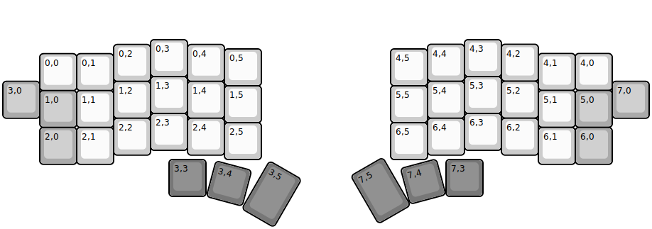
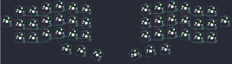

## jorne/jorne

[layout](jorne-kle.json) - [PCB](jorne.kicad_pcb)

{:loading="lazy"}

[Open in keyboard-layout-editor](http://www.keyboard-layout-editor.com/##@@_x:4&y:1;&=0,3&_x:7.5;&=4,3;&@_x:11.5&y:-0.875;&=4,4&_x:1.0;&=4,2;&@_x:3&y:-0.995;&=0,2&_x:1;&=0,4;&@_x:6&y:-0.88;&=0,5&_x:3.5;&=4,5;&@_x:14.5&y:-0.875;&=4,1&=4,0;&@_x:1&y:-0.995;&=0,0&=0,1;&@_x:4&y:-0.38;&=1,3&_x:7.5;&=5,3;&@_x:13.5&y:-0.875;&=5,2;&@_y:-0.995&c=#aaaaaa;&=3,0&_x:2&c=#cccccc;&=1,2&_x:1;&=1,4&_x:5.5;&=5,4&_x:4.0&c=#aaaaaa;&=7,0;&@_x:6&y:-0.88&c=#cccccc;&=1,5&_x:3.5;&=5,5;&@_x:14.5&y:-0.875;&=5,1&_c=#aaaaaa;&=5,0;&@_x:1&y:-0.995;&=1,0&_c=#cccccc;&=1,1;&@_x:4&y:-0.38;&=2,3&_x:7.5;&=6,3;&@_x:3&y:-0.87;&=2,2&_x:1;&=2,4&_x:5.5;&=6,4&_x:1.0;&=6,2;&@_x:6&y:-0.88;&=2,5&_x:3.5;&=6,5;&@_x:1&y:-0.87&c=#aaaaaa;&=2,0&_c=#cccccc;&=2,1&_x:11.5;&=6,1&_c=#aaaaaa;&=6,0;&@_x:4.5&y:-0.13&c=#777777;&=3,3&_x:6.5;&=7,3;&@_r:15&rx:4.5&ry:9.1&y:-5.0;&=3,4;&@_r:30&rx:5.4&ry:9.3&x:-0.9&y:-5.3&h:1.5;&=3,5;&@_r:-30&rx:11.1&x:0.8&y:-4.8&h:1.5;&=7,5;&@_r:-15&rx:12&ry:9.1&x:-0.02&y:-4.75;&=7,4)

{:loading="lazy"}

