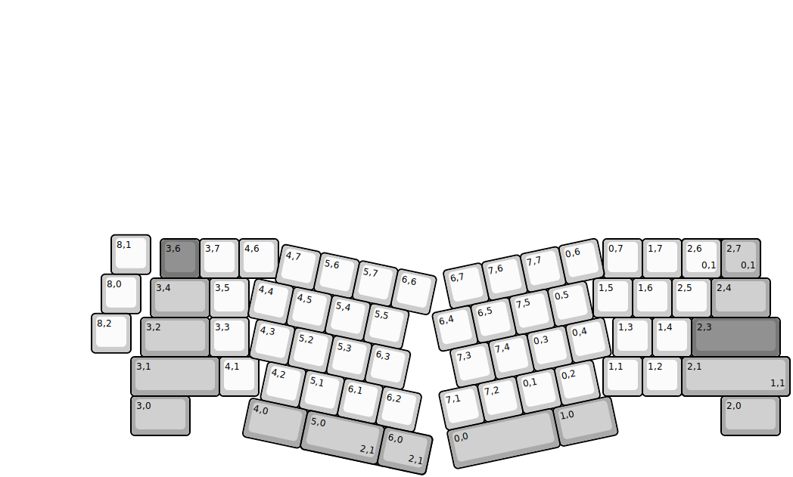
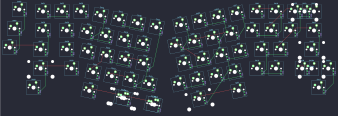

## kapcave/arya

[layout](arya-kle.json) - [PCB](arya.kicad_pcb)

{:loading="lazy"}

[Open in keyboard-layout-editor](http://www.keyboard-layout-editor.com/##@@_x:2.75&y:5.9;&=8,1;&@_x:4&y:-0.9&c=#777777;&=3,6&_c=#cccccc;&=3,7&=4,6&_x:8.25;&=0,7&=1,7&_c=#aaaaaa&w:2;&=2,7%0A%0A%0A0,0;&@_x:2.5&y:-0.1&c=#cccccc;&=8,0;&@_x:3.75&y:-0.9&c=#aaaaaa&w:1.5;&=3,4&_c=#cccccc;&=3,5&_x:8.75;&=1,5&=1,6&=2,5&_c=#aaaaaa&w:1.5;&=2,4;&@_x:2.25&y:-0.1&c=#cccccc;&=8,2;&@_x:3.5&y:-0.9&c=#aaaaaa&w:1.75;&=3,2&_c=#cccccc;&=3,3&_x:9.25;&=1,3&=1,4&_c=#777777&w:2.25;&=2,3;&@_x:3.25&c=#aaaaaa&w:2.25;&=3,1&_c=#cccccc;&=4,1&_x:8.75;&=1,1&=1,2&_c=#aaaaaa&w:1.75;&=2,1%0A%0A%0A1,0&=2,2%0A%0A%0A1,0;&@_x:3.25&w:1.5;&=3,0&_x:13.5&w:1.5;&=2,0;&@_r:12&x:8.25&y:-6.5&c=#cccccc;&=4,7&=5,6&=5,7&=6,6;&@_x:7.75;&=4,4&=4,5&=5,4&=5,5;&@_x:8;&=4,3&=5,2&=5,3&=6,3;&@_x:8.5;&=4,2&=5,1&=6,1&=6,2;&@_x:8.25&c=#aaaaaa&w:1.5;&=4,0&_w:2.25;&=5,0%0A%0A%0A2,0&=6,0%0A%0A%0A2,0;&@_r:-12&x:9.5&y:-0.5&c=#cccccc;&=6,7&=7,6&=7,7&=0,6;&@_x:9;&=6,4&=6,5&=7,5&=0,5;&@_x:9.25;&=7,3&=7,4&=0,3&=0,4;&@_x:8.75;&=7,1&=7,2&=0,1&=0,2;&@_x:8.75&c=#aaaaaa&w:2.75;&=0,0&_w:1.5;&=1,0;&@_r:0&x:17.25&y:-8.0&c=#cccccc;&=2,6%0A%0A%0A0,1&_c=#aaaaaa;&=2,7%0A%0A%0A0,1;&@_x:17.25&y:2.0&w:2.75;&=2,1%0A%0A%0A1,1;&@_r:12&x:9.75&y:-1.5&w:2;&=5,0%0A%0A%0A2,1&_w:1.25;&=6,0%0A%0A%0A2,1)

{:loading="lazy"}

