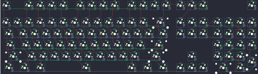

## kb_elmo/aek2_usb

[layout](aek2_usb-kle.json) - [PCB](aek2_usb.kicad_pcb)

{:loading="lazy"}

[Open in keyboard-layout-editor](http://www.keyboard-layout-editor.com/##@@_c=#777777;&=0,0&_x:1&c=#cccccc;&=0,2&=0,3&=0,4&=0,5&_x:0.5&c=#aaaaaa;&=0,6&=0,7&=0,8&=0,9&_x:0.5&c=#cccccc;&=0,11&=0,12&=3,11&=0,13&_x:0.25;&=7,13&=6,13&=6,12&_x:3.25&c=#aaaaaa;&=6,6;&@_y:0.5&c=#cccccc;&=1,0&=1,1&=1,2&=1,3&=1,4&=1,5&=1,6&=1,7&=1,8&=1,9&=1,10&=1,11&=1,12&_c=#aaaaaa&w:2;&=1,13&_x:0.25&c=#cccccc;&=7,12&=6,0&=6,1&_x:0.25&c=#aaaaaa;&=6,2&=6,3&=6,5&=6,7;&@_w:1.5;&=2,0&_c=#cccccc;&=2,1&=2,2&=2,3&=2,4&=2,5&=2,6&=2,7&=2,8&=2,9&=2,10&=2,11&=2,12&_w:1.5;&=2,13&_x:0.25;&=7,0&=7,1&=7,2&_x:0.25;&=7,3&=6,4&=7,5&_c=#aaaaaa;&=7,7;&@_w:1.75;&=3,0&_c=#cccccc;&=3,1&=3,2&=3,3&=3,4&=3,5&=3,6&=3,7&=3,8&=3,9&=3,10&=3,12&_c=#777777&w:2.25;&=3,13&_x:3.5&c=#cccccc;&=6,11&=7,4&=7,6&_c=#aaaaaa;&=6,8;&@_w:2.25;&=4,0&_c=#cccccc;&=4,1&=4,2&=4,3&=4,4&=4,5&=4,6&=4,7&=4,8&=4,9&=4,10&_c=#aaaaaa&w:2.75;&=4,13&_x:1.25&c=#cccccc;&=5,8&_x:1.25;&=7,11&=6,10&=6,9&_c=#aaaaaa&h:2;&=7,8;&@_w:1.5;&=5,0&_w:1.25;&=5,1&_w:1.5;&=5,2&_c=#cccccc&w:6.5;&=5,5&_c=#aaaaaa&w:1.5;&=5,10&_w:1.25;&=5,11&_w:1.5;&=5,13&_x:0.25&c=#cccccc;&=5,7&=5,9&=5,6&_x:0.25&w:2;&=7,10&=7,9)

{:loading="lazy"}

