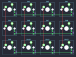

## kb_elmo/twelvekey

[layout](twelvekey-kle.json) - [PCB](twelvekey.kicad_pcb)

{:loading="lazy"}

[Open in keyboard-layout-editor](http://www.keyboard-layout-editor.com/##@@=0,0&=0,1&=0,2&=0,3;&@=1,0&=1,1&=1,2&=1,3;&@=2,0&=2,1&=2,2&=2,3)

{:loading="lazy"}

