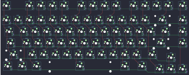
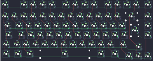

## kbdfans/bella/bella_rgb

[layout](bella_rgb-kle.json) - [PCB](bella_rgb.kicad_pcb)

{:loading="lazy"}

[Open in keyboard-layout-editor](http://www.keyboard-layout-editor.com/##@@_c=#777777;&=0,0&_x:1&c=#cccccc;&=0,2&=0,3&=0,4&=0,5&_x:0.5&c=#aaaaaa;&=0,6&=0,7&=0,8&=0,9&_x:0.5&c=#cccccc;&=0,11&=0,12&=0,13&=0,14&_x:0.25&c=#aaaaaa;&=0,15;&@_y:0.25&c=#cccccc;&=1,0&=1,1&=1,2&=1,3&=1,4&=1,5&=1,6&=1,7&=1,8&=1,9&=1,10&=1,11&=1,12&_w:2;&=1,14&_x:0.25&c=#aaaaaa;&=1,15;&@_w:1.5;&=2,0&_c=#cccccc;&=2,1&=2,2&=2,3&=2,4&=2,5&=2,6&=2,7&=2,8&=2,9&=2,10&=2,11&=2,12&_w:1.5;&=2,13&_x:0.25&c=#aaaaaa;&=2,15;&@_w:1.75;&=3,0&_c=#cccccc;&=3,1&=3,2&=3,3&=3,4&=3,5&=3,6&=3,7&=3,8&=3,9&=3,10&=3,11&_c=#aaaaaa&w:2.25;&=3,13&_x:0.25;&=3,15;&@_w:2.25;&=4,0&_c=#cccccc;&=4,2&=4,3&=4,4&=4,5&=4,6&=4,7&=4,8&=4,9&=4,10&=4,11&_c=#aaaaaa&w:1.75;&=4,12;&@_x:14.25&y:-0.75&c=#cccccc;&=4,14;&@_y:-0.25&c=#aaaaaa&w:1.25;&=5,0&_w:1.25;&=5,1&_w:1.25;&=5,2&_w:6.25;&=5,6&_w:1.5;&=5,10&_w:1.5;&=5,11;&@_x:13.25&y:-0.75&c=#cccccc;&=5,12&=5,14&=5,15)

{:loading="lazy"}

## kbdfans/bella/bella_rgb_iso

[layout](bella_rgb_iso-kle.json) - [PCB](bella_rgb_iso.kicad_pcb)

{:loading="lazy"}

[Open in keyboard-layout-editor](http://www.keyboard-layout-editor.com/##@@_c=#777777;&=0,0&_x:1&c=#cccccc;&=0,2&=0,3&=0,4&=0,5&_x:0.5&c=#aaaaaa;&=0,6&=0,7&=0,8&=0,9&_x:0.5&c=#cccccc;&=0,11&=0,12&=0,13&=0,14&_x:0.25&c=#aaaaaa;&=0,15;&@_y:0.25&c=#cccccc;&=1,0&=1,1&=1,2&=1,3&=1,4&=1,5&=1,6&=1,7&=1,8&=1,9&=1,10&=1,11&=1,12&_w:2;&=1,14&_x:0.25&c=#aaaaaa;&=1,15;&@_w:1.5;&=2,0&_c=#cccccc;&=2,1&=2,2&=2,3&=2,4&=2,5&=2,6&=2,7&=2,8&=2,9&=2,10&=2,11&=2,12&_x:0.25&c=#777777&w:1.25&h:2&w2:1.5&h2:1&x2:-0.25;&=3,13&_x:0.25&c=#aaaaaa;&=2,15;&@_w:1.75;&=3,0&_c=#cccccc;&=3,1&=3,2&=3,3&=3,4&=3,5&=3,6&=3,7&=3,8&=3,9&=3,10&=3,11&=2,13&_x:1.5&c=#aaaaaa;&=3,15;&@_w:1.25;&=4,0&_c=#cccccc;&=4,1&=4,2&=4,3&=4,4&=4,5&=4,6&=4,7&=4,8&=4,9&=4,10&=4,11&_c=#aaaaaa&w:1.75;&=4,12;&@_x:14.25&y:-0.75&c=#cccccc;&=4,14;&@_y:-0.25&c=#aaaaaa&w:1.25;&=5,0&_w:1.25;&=5,1&_w:1.25;&=5,2&_w:6.25;&=5,6&_w:1.5;&=5,10&_w:1.5;&=5,11;&@_x:13.25&y:-0.75&c=#cccccc;&=5,12&=5,14&=5,15)

{:loading="lazy"}

