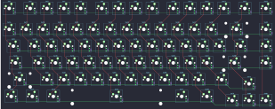
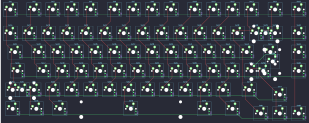
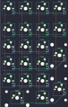

## kbdfans/bounce/bonce75_hotswap

[layout](bonce75_hotswap-kle.json) - [PCB](bonce75_hotswap.kicad_pcb)

{:loading="lazy"}

[Open in keyboard-layout-editor](http://www.keyboard-layout-editor.com/##@@=0,0&_x:0.25;&=0,1&=0,2&=0,3&=0,4&_x:0.25;&=0,5&=0,6&=0,7&=0,8&_x:0.25;&=0,9&=0,10&=0,11&=0,12&_x:0.25;&=0,13&_x:0.25;&=0,14;&@_y:0.25;&=1,0&=1,1&=1,2&=1,3&=1,4&=1,5&=1,6&=1,7&=1,8&=1,9&=1,10&=1,11&=1,12&_w:2;&=1,13&_x:0.25;&=1,14;&@_w:1.5;&=2,0&=2,1&=2,2&=2,3&=2,4&=2,5&=2,6&=2,7&=2,8&=2,9&=2,10&=2,11&=2,12&_w:1.5;&=2,13&_x:0.25;&=2,14;&@_w:1.75;&=3,0&=3,1&=3,2&=3,3&=3,4&=3,5&=3,6&=3,7&=3,8&=3,9&=3,10&=3,11&_w:2.25;&=3,13&_x:0.25;&=3,14;&@_w:2.25;&=4,0&=4,1&=4,2&=4,3&=4,4&=4,5&=4,6&=4,7&=4,8&=4,9&=4,10&_w:1.75;&=4,11;&@_x:14.25&y:-0.75;&=4,13;&@_y:-0.25&w:1.25;&=5,0&_w:1.25;&=5,1&_w:1.25;&=5,2&_w:6.25;&=5,5&_w:1.5;&=5,8&_w:1.5;&=5,10;&@_x:13.25&y:-0.75;&=5,11&=5,13&=5,14)

{:loading="lazy"}

## kbdfans/bounce/bonce75_soldered

[layout](bonce75_soldered-kle.json) - [PCB](bonce75_soldered.kicad_pcb)

{:loading="lazy"}

[Open in keyboard-layout-editor](http://www.keyboard-layout-editor.com/##@@=0,0&_x:0.25;&=0,1&=0,2&=0,3&=0,4&_x:0.25;&=0,5&=0,6&=0,7&=0,8&_x:0.25;&=0,9&=0,10&=0,11&=0,12&_x:0.25;&=0,13&_x:0.25;&=0,14;&@_y:0.25;&=1,0&=1,1&=1,2&=1,3&=1,4&=1,5&=1,6&=1,7&=1,8&=1,9&=1,10&=1,11&=1,12&_w:2;&=1,13%0A%0A%0A0,0&_x:0.25;&=1,14;&@_w:1.5;&=2,0&=2,1&=2,2&=2,3&=2,4&=2,5&=2,6&=2,7&=2,8&=2,9&=2,10&=2,11&=2,12&_w:1.5;&=2,13%0A%0A%0A1,0&_x:0.25;&=2,14;&@_c=#777777&w:1.75;&=3,0&=3,1&=3,2&=3,3&=3,4&=3,5&=3,6&=3,7&=3,8&=3,9&=3,10&=3,11&_w:2.25;&=3,13%0A%0A%0A1,0&_x:0.25;&=3,14;&@_c=#cccccc&w:2.25;&=4,0%0A%0A%0A2,0&=4,2&=4,3&=4,4&=4,5&=4,6&=4,7&=4,8&=4,9&=4,10&=4,11&_w:1.75;&=4,12;&@_x:14.25&y:-0.75;&=4,13;&@_y:-0.25&w:1.25;&=5,0&_w:1.25;&=5,1&_w:1.25;&=5,2&_w:6.25;&=5,6&_w:1.5;&=5,10&_w:1.5;&=5,11;&@_x:13.25&y:-0.75;&=5,12&=5,13&=5,14;&@_x:16.25&y:-5.25;&=3,12%0A%0A%0A0,1&=1,13%0A%0A%0A0,1;&@_x:17.75&c=#777777&w:1.25&h:2&w2:1.5&h2:1&x2:-0.25;&=3,13%0A%0A%0A1,1;&@_x:16.75&c=#cccccc;&=2,13%0A%0A%0A1,1;&@_x:15.25&y:0.25&w:1.25;&=4,0%0A%0A%0A2,1&=4,1%0A%0A%0A2,1)

{:loading="lazy"}

## kbdfans/bounce/bounce_pad

[layout](bounce_pad-kle.json) - [PCB](bounce_pad.kicad_pcb)

{:loading="lazy"}

[Open in keyboard-layout-editor](http://www.keyboard-layout-editor.com/##@@_c=#aaaaaa;&=0,0&=0,1&=0,2&=0,3;&@_y:0.25;&=1,0&=1,1&=1,2&=1,3;&@_c=#cccccc;&=2,0&=2,1&=2,2&_c=#aaaaaa&h:2;&=3,3;&@_c=#cccccc;&=3,0&=3,1&=3,2;&@=4,0&=4,1&=4,2&_c=#aaaaaa&h:2;&=5,3;&@_c=#cccccc&w:2;&=5,1&=5,2)

{:loading="lazy"}

