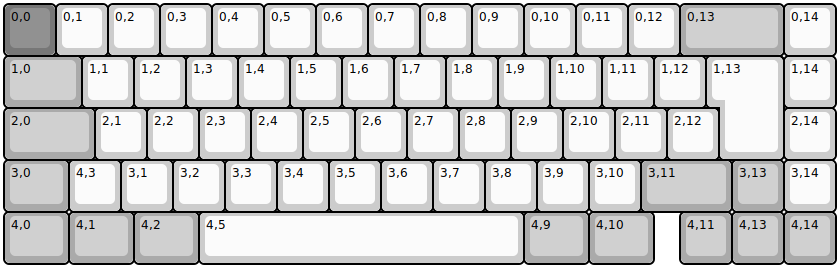
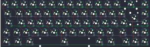
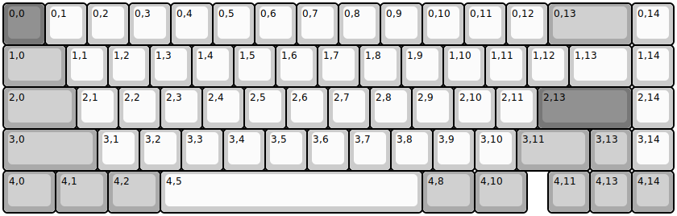
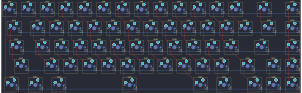
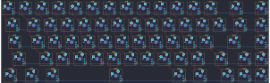
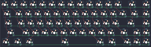
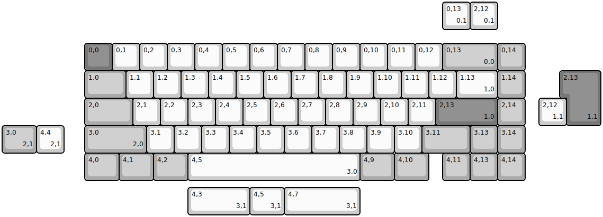
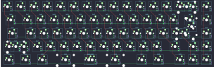

## kbdfans/kbd67mkii/kbd67mkiirgb_iso

[layout](kbd67mkiirgb_iso-kle.json) - [PCB](kbd67mkiirgb_iso.kicad_pcb)

{:loading="lazy"}

[Open in keyboard-layout-editor](http://www.keyboard-layout-editor.com/##@@_c=#777777;&=0,0&_c=#cccccc;&=0,1&=0,2&=0,3&=0,4&=0,5&=0,6&=0,7&=0,8&=0,9&=0,10&=0,11&=0,12&_c=#aaaaaa&w:2;&=0,13&_c=#cccccc;&=0,14;&@_c=#aaaaaa&w:1.5;&=1,0&_c=#cccccc;&=1,1&=1,2&=1,3&=1,4&=1,5&=1,6&=1,7&=1,8&=1,9&=1,10&=1,11&=1,12&_x:0.25&w:1.25&h:2&w2:1.5&h2:1&x2:-0.25;&=1,13&=1,14;&@_c=#aaaaaa&w:1.75;&=2,0&_c=#cccccc;&=2,1&=2,2&=2,3&=2,4&=2,5&=2,6&=2,7&=2,8&=2,9&=2,10&=2,11&=2,12&_x:1.25;&=2,14;&@_c=#aaaaaa&w:1.25;&=3,0&_c=#cccccc;&=4,3&=3,1&=3,2&=3,3&=3,4&=3,5&=3,6&=3,7&=3,8&=3,9&=3,10&_c=#aaaaaa&w:1.75;&=3,11&=3,13&_c=#cccccc;&=3,14;&@_c=#aaaaaa&w:1.25;&=4,0&_w:1.25;&=4,1&_w:1.25;&=4,2&_c=#cccccc&w:6.25;&=4,5&_c=#aaaaaa&w:1.25;&=4,9&_w:1.25;&=4,10&_x:0.5;&=4,11&=4,13&=4,14)

{:loading="lazy"}

## kbdfans/kbd67mkii/kbd67mkiirgbv1

[layout](kbd67mkiirgbv1-kle.json) - [PCB](kbd67mkiirgbv1.kicad_pcb)

{:loading="lazy"}

[Open in keyboard-layout-editor](http://www.keyboard-layout-editor.com/##@@_c=#777777;&=0,0&_c=#cccccc;&=0,1&=0,2&=0,3&=0,4&=0,5&=0,6&=0,7&=0,8&=0,9&=0,10&=0,11&=0,12&_c=#aaaaaa&w:2;&=0,13&_c=#cccccc;&=0,14;&@_c=#aaaaaa&w:1.5;&=1,0&_c=#cccccc;&=1,1&=1,2&=1,3&=1,4&=1,5&=1,6&=1,7&=1,8&=1,9&=1,10&=1,11&=1,12&_w:1.5;&=1,13&=1,14;&@_c=#aaaaaa&w:1.75;&=2,0&_c=#cccccc;&=2,1&=2,2&=2,3&=2,4&=2,5&=2,6&=2,7&=2,8&=2,9&=2,10&=2,11&_c=#777777&w:2.25;&=2,13&_c=#cccccc;&=2,14;&@_c=#aaaaaa&w:2.25;&=3,0&_c=#cccccc;&=3,1&=3,2&=3,3&=3,4&=3,5&=3,6&=3,7&=3,8&=3,9&=3,10&_c=#aaaaaa&w:1.75;&=3,11&=3,13&_c=#cccccc;&=3,14;&@_c=#aaaaaa&w:1.25;&=4,0&_w:1.25;&=4,1&_w:1.25;&=4,2&_c=#cccccc&w:6.25;&=4,5&_c=#aaaaaa&w:1.25;&=4,8&_w:1.25;&=4,10&_x:0.5;&=4,11&=4,13&=4,14)

{:loading="lazy"}

## kbdfans/kbd67mkii/kbd67mkiirgbv2

[layout](kbd67mkiirgbv2-kle.json) - [PCB](kbd67mkiirgbv2.kicad_pcb)

{:loading="lazy"}

[Open in keyboard-layout-editor](http://www.keyboard-layout-editor.com/##@@_c=#777777;&=0,0&_c=#cccccc;&=0,1&=0,2&=0,3&=0,4&=0,5&=0,6&=0,7&=0,8&=0,9&=0,10&=0,11&=0,12&_c=#aaaaaa&w:2;&=0,13&_c=#cccccc;&=0,14;&@_c=#aaaaaa&w:1.5;&=1,0&_c=#cccccc;&=1,1&=1,2&=1,3&=1,4&=1,5&=1,6&=1,7&=1,8&=1,9&=1,10&=1,11&=1,12&_w:1.5;&=1,13&=1,14;&@_c=#aaaaaa&w:1.75;&=2,0&_c=#cccccc;&=2,1&=2,2&=2,3&=2,4&=2,5&=2,6&=2,7&=2,8&=2,9&=2,10&=2,11&_c=#777777&w:2.25;&=2,13&_c=#cccccc;&=2,14;&@_c=#aaaaaa&w:2.25;&=3,0&_c=#cccccc;&=3,1&=3,2&=3,3&=3,4&=3,5&=3,6&=3,7&=3,8&=3,9&=3,10&_c=#aaaaaa&w:1.75;&=3,11&=3,13&_c=#cccccc;&=3,14;&@_c=#aaaaaa&w:1.25;&=4,0&_w:1.25;&=4,1&_w:1.25;&=4,2&_c=#cccccc&w:6.25;&=4,5&_c=#aaaaaa&w:1.25;&=4,8&_w:1.25;&=4,10&_x:0.5;&=4,11&=4,13&=4,14)

{:loading="lazy"}

## kbdfans/kbd67mkii/kbd67mkiirgbv3

[layout](kbd67mkiirgbv3-kle.json) - [PCB](kbd67mkiirgbv3.kicad_pcb)

{:loading="lazy"}

[Open in keyboard-layout-editor](http://www.keyboard-layout-editor.com/##@@_c=#777777;&=0,0&_c=#cccccc;&=0,1&=0,2&=0,3&=0,4&=0,5&=0,6&=0,7&=0,8&=0,9&=0,10&=0,11&=0,12&_c=#aaaaaa&w:2;&=0,13&_c=#cccccc;&=0,14;&@_c=#aaaaaa&w:1.5;&=1,0&_c=#cccccc;&=1,1&=1,2&=1,3&=1,4&=1,5&=1,6&=1,7&=1,8&=1,9&=1,10&=1,11&=1,12&_w:1.5;&=1,13&=1,14;&@_c=#aaaaaa&w:1.75;&=2,0&_c=#cccccc;&=2,1&=2,2&=2,3&=2,4&=2,5&=2,6&=2,7&=2,8&=2,9&=2,10&=2,11&_c=#777777&w:2.25;&=2,13&_c=#cccccc;&=2,14;&@_c=#aaaaaa&w:2.25;&=3,0&_c=#cccccc;&=3,1&=3,2&=3,3&=3,4&=3,5&=3,6&=3,7&=3,8&=3,9&=3,10&_c=#aaaaaa&w:1.75;&=3,11&=3,13&_c=#cccccc;&=3,14;&@_c=#aaaaaa&w:1.25;&=4,0&_w:1.25;&=4,1&_w:1.25;&=4,2&_c=#cccccc&w:6.25;&=4,5&_c=#aaaaaa&w:1.25;&=4,8&_w:1.25;&=4,10&_x:0.5;&=4,11&=4,13&=4,14)

{:loading="lazy"}

## kbdfans/kbd67mkii/kbd67mkiisoldered

[layout](kbd67mkiisoldered-kle.json) - [PCB](kbd67mkiisoldered.kicad_pcb)

{:loading="lazy"}

[Open in keyboard-layout-editor](http://www.keyboard-layout-editor.com/##@@_x:3&y:1.5&c=#777777;&=0,0&_c=#cccccc;&=0,1&=0,2&=0,3&=0,4&=0,5&=0,6&=0,7&=0,8&=0,9&=0,10&=0,11&=0,12&_c=#aaaaaa&w:2;&=0,13%0A%0A%0A0,0&=0,14;&@_x:3&w:1.5;&=1,0&_c=#cccccc;&=1,1&=1,2&=1,3&=1,4&=1,5&=1,6&=1,7&=1,8&=1,9&=1,10&=1,11&=1,12&_w:1.5;&=1,13%0A%0A%0A1,0&_c=#aaaaaa;&=1,14;&@_x:3&w:1.75;&=2,0&_c=#cccccc;&=2,1&=2,2&=2,3&=2,4&=2,5&=2,6&=2,7&=2,8&=2,9&=2,10&=2,11&_c=#777777&w:2.25;&=2,13%0A%0A%0A1,0&_c=#aaaaaa;&=2,14;&@_x:3.0&w:2.25;&=3,0%0A%0A%0A2,0&_c=#cccccc;&=3,1&=3,2&=3,3&=3,4&=3,5&=3,6&=3,7&=3,8&=3,9&=3,10&_c=#aaaaaa&w:1.75;&=3,11&=3,13&=3,14;&@_x:3&w:1.25;&=4,0&_w:1.25;&=4,1&_w:1.25;&=4,2&_c=#cccccc&w:6.26;&=4,5%0A%0A%0A3,0&_x:-0.01&c=#aaaaaa&w:1.25;&=4,9&_w:1.25;&=4,10&_x:0.5;&=4,11&=4,13&=4,14;&@_x:16&y:-6.5&c=#cccccc;&=0,13%0A%0A%0A0,1&=2,12%0A%0A%0A0,1;&@_x:20.5&y:1.5&c=#777777&w:1.25&h:2&w2:1.5&h2:1&x2:-0.25;&=2,13%0A%0A%0A1,1;&@_x:19.5&c=#cccccc;&=2,12%0A%0A%0A1,1;&@_c=#aaaaaa&w:1.25;&=3,0%0A%0A%0A2,1&_c=#cccccc;&=4,4%0A%0A%0A2,1;&@_x:6.75&y:1.25&w:2.25;&=4,3%0A%0A%0A3,1&_w:1.25;&=4,5%0A%0A%0A3,1&_w:2.75;&=4,7%0A%0A%0A3,1)

{:loading="lazy"}

