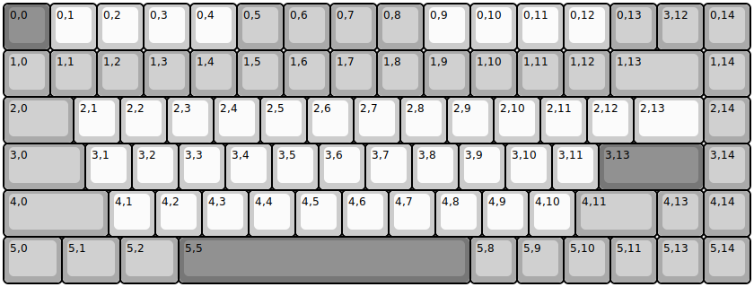
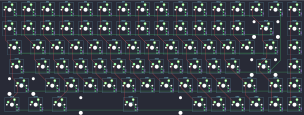
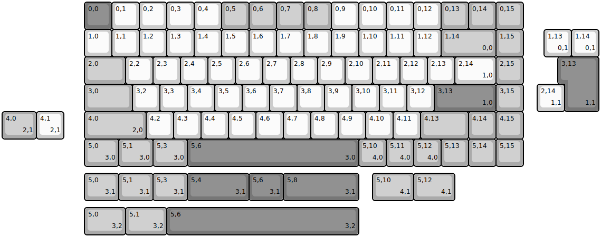
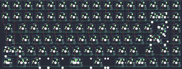
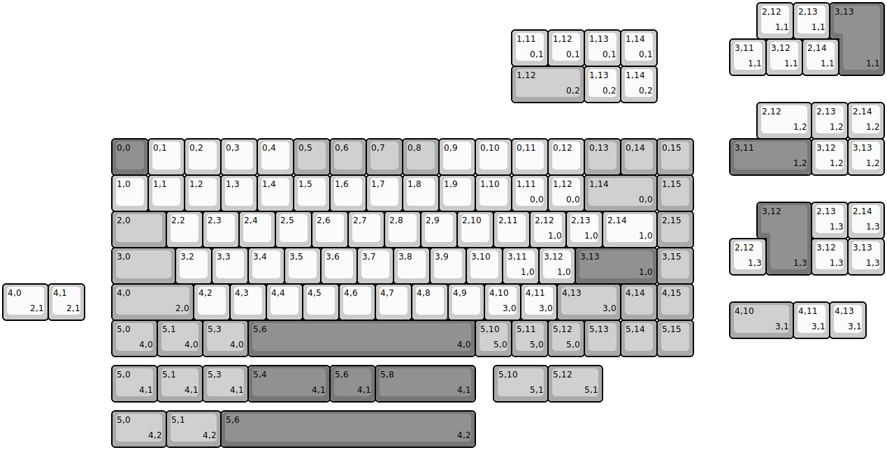
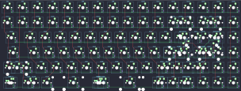
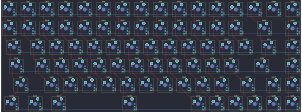

## kbdfans/kbd75/kbd75hs

[layout](kbd75hs-kle.json) - [PCB](kbd75hs.kicad_pcb)

{:loading="lazy"}

[Open in keyboard-layout-editor](http://www.keyboard-layout-editor.com/##@@_c=#777777;&=0,0&_c=#cccccc;&=0,1&=0,2&=0,3&=0,4&_c=#aaaaaa;&=0,5&=0,6&=0,7&=0,8&_c=#cccccc;&=0,9&=0,10&=0,11&=0,12&_c=#aaaaaa;&=0,13&=3,12&=0,14;&@=1,0&=1,1&=1,2&=1,3&=1,4&=1,5&=1,6&=1,7&=1,8&=1,9&=1,10&=1,11&=1,12&_w:2;&=1,13&=1,14;&@_w:1.5;&=2,0&_c=#cccccc;&=2,1&=2,2&=2,3&=2,4&=2,5&=2,6&=2,7&=2,8&=2,9&=2,10&=2,11&=2,12&_w:1.5;&=2,13&_c=#aaaaaa;&=2,14;&@_w:1.75;&=3,0&_c=#cccccc;&=3,1&=3,2&=3,3&=3,4&=3,5&=3,6&=3,7&=3,8&=3,9&=3,10&=3,11&_c=#777777&w:2.25;&=3,13&_c=#aaaaaa;&=3,14;&@_w:2.25;&=4,0&_c=#cccccc;&=4,1&=4,2&=4,3&=4,4&=4,5&=4,6&=4,7&=4,8&=4,9&=4,10&_c=#aaaaaa&w:1.75;&=4,11&=4,13&=4,14;&@_w:1.25;&=5,0&_w:1.25;&=5,1&_w:1.25;&=5,2&_c=#777777&w:6.25;&=5,5&_c=#aaaaaa;&=5,8&=5,9&=5,10&=5,11&=5,13&=5,14)

{:loading="lazy"}

## kbdfans/kbd75/kbd75rev1

[layout](kbd75rev1-kle.json) - [PCB](kbd75rev1.kicad_pcb)

{:loading="lazy"}

[Open in keyboard-layout-editor](http://www.keyboard-layout-editor.com/##@@_x:3&c=#777777;&=0,0&_c=#cccccc;&=0,1&=0,2&=0,3&=0,4&_c=#aaaaaa;&=0,5&=0,6&=0,7&=0,8&_c=#cccccc;&=0,9&=0,10&=0,11&=0,12&_c=#aaaaaa;&=0,13&=0,14&=0,15;&@_x:3&c=#cccccc;&=1,0&=1,1&=1,2&=1,3&=1,4&=1,5&=1,6&=1,7&=1,8&=1,9&=1,10&=1,11&=1,12&_c=#aaaaaa&w:2;&=1,14%0A%0A%0A0,0&=1,15;&@_x:3&w:1.5;&=2,0&_c=#cccccc;&=2,2&=2,3&=2,4&=2,5&=2,6&=2,7&=2,8&=2,9&=2,10&=2,11&=2,12&=2,13&_w:1.5;&=2,14%0A%0A%0A1,0&_c=#aaaaaa;&=2,15;&@_x:3&w:1.75;&=3,0&_c=#cccccc;&=3,2&=3,3&=3,4&=3,5&=3,6&=3,7&=3,8&=3,9&=3,10&=3,11&=3,12&_c=#777777&w:2.25;&=3,13%0A%0A%0A1,0&_c=#aaaaaa;&=3,15;&@_x:3.0&w:2.25;&=4,0%0A%0A%0A2,0&_c=#cccccc;&=4,2&=4,3&=4,4&=4,5&=4,6&=4,7&=4,8&=4,9&=4,10&=4,11&_c=#aaaaaa&w:1.75;&=4,13&=4,14&=4,15;&@_x:3&w:1.25;&=5,0%0A%0A%0A3,0&_w:1.25;&=5,1%0A%0A%0A3,0&_w:1.25;&=5,3%0A%0A%0A3,0&_c=#777777&w:6.25;&=5,6%0A%0A%0A3,0&_c=#aaaaaa;&=5,10%0A%0A%0A4,0&=5,11%0A%0A%0A4,0&=5,12%0A%0A%0A4,0&=5,13&=5,14&=5,15;&@_x:19.75&y:-5&c=#cccccc;&=1,13%0A%0A%0A0,1&=1,14%0A%0A%0A0,1;&@_x:20.5&c=#777777&w:1.25&h:2&w2:1.5&h2:1&x2:-0.25;&=3,13%0A%0A%0A1,1;&@_x:19.5&c=#cccccc;&=2,14%0A%0A%0A1,1;&@_c=#aaaaaa&w:1.25;&=4,0%0A%0A%0A2,1&_c=#cccccc;&=4,1%0A%0A%0A2,1;&@_x:3&y:1.25&c=#aaaaaa&w:1.25;&=5,0%0A%0A%0A3,1&_w:1.25;&=5,1%0A%0A%0A3,1&_w:1.25;&=5,3%0A%0A%0A3,1&_c=#777777&w:2.25;&=5,4%0A%0A%0A3,1&_w:1.25;&=5,6%0A%0A%0A3,1&_w:2.75;&=5,8%0A%0A%0A3,1&_x:0.5&c=#aaaaaa&w:1.5;&=5,10%0A%0A%0A4,1&_w:1.5;&=5,12%0A%0A%0A4,1;&@_x:3&y:0.25&w:1.5;&=5,0%0A%0A%0A3,2&_w:1.5;&=5,1%0A%0A%0A3,2&_c=#777777&w:7;&=5,6%0A%0A%0A3,2)

{:loading="lazy"}

## kbdfans/kbd75/kbd75rev2

[layout](kbd75rev2-kle.json) - [PCB](kbd75rev2.kicad_pcb)

{:loading="lazy"}

[Open in keyboard-layout-editor](http://www.keyboard-layout-editor.com/##@@_x:3&y:3.75&c=#777777;&=0,0&_c=#cccccc;&=0,1&=0,2&=0,3&=0,4&_c=#aaaaaa;&=0,5&=0,6&=0,7&=0,8&_c=#cccccc;&=0,9&=0,10&=0,11&=0,12&_c=#aaaaaa;&=0,13&=0,14&=0,15;&@_x:3&c=#cccccc;&=1,0&=1,1&=1,2&=1,3&=1,4&=1,5&=1,6&=1,7&=1,8&=1,9&=1,10&=1,11%0A%0A%0A0,0&=1,12%0A%0A%0A0,0&_c=#aaaaaa&w:2;&=1,14%0A%0A%0A0,0&=1,15;&@_x:3&w:1.5;&=2,0&_c=#cccccc;&=2,2&=2,3&=2,4&=2,5&=2,6&=2,7&=2,8&=2,9&=2,10&=2,11&=2,12%0A%0A%0A1,0&=2,13%0A%0A%0A1,0&_w:1.5;&=2,14%0A%0A%0A1,0&_c=#aaaaaa;&=2,15;&@_x:3&w:1.75;&=3,0&_c=#cccccc;&=3,2&=3,3&=3,4&=3,5&=3,6&=3,7&=3,8&=3,9&=3,10&=3,11%0A%0A%0A1,0&=3,12%0A%0A%0A1,0&_c=#777777&w:2.25;&=3,13%0A%0A%0A1,0&_c=#aaaaaa;&=3,15;&@_x:3.0&w:2.25;&=4,0%0A%0A%0A2,0&_c=#cccccc;&=4,2&=4,3&=4,4&=4,5&=4,6&=4,7&=4,8&=4,9&=4,10%0A%0A%0A3,0&=4,11%0A%0A%0A3,0&_c=#aaaaaa&w:1.75;&=4,13%0A%0A%0A3,0&=4,14&=4,15;&@_x:3&w:1.25;&=5,0%0A%0A%0A4,0&_w:1.25;&=5,1%0A%0A%0A4,0&_w:1.25;&=5,3%0A%0A%0A4,0&_c=#777777&w:6.25;&=5,6%0A%0A%0A4,0&_c=#aaaaaa;&=5,10%0A%0A%0A5,0&=5,11%0A%0A%0A5,0&=5,12%0A%0A%0A5,0&=5,13&=5,14&=5,15;&@_x:20.75&y:-9.75&c=#cccccc;&=2,12%0A%0A%0A1,1&=2,13%0A%0A%0A1,1&_x:0.25&c=#777777&w:1.25&h:2&w2:1.5&h2:1&x2:-0.25;&=3,13%0A%0A%0A1,1;&@_x:14&y:-0.25&c=#cccccc;&=1,11%0A%0A%0A0,1&=1,12%0A%0A%0A0,1&=1,13%0A%0A%0A0,1&=1,14%0A%0A%0A0,1;&@_x:20&y:-0.75;&=3,11%0A%0A%0A1,1&=3,12%0A%0A%0A1,1&=2,14%0A%0A%0A1,1;&@_x:14&y:-0.25&c=#aaaaaa&w:2;&=1,12%0A%0A%0A0,2&_c=#cccccc;&=1,13%0A%0A%0A0,2&=1,14%0A%0A%0A0,2;&@_x:20.75&w:1.5;&=2,12%0A%0A%0A1,2&=2,13%0A%0A%0A1,2&=2,14%0A%0A%0A1,2;&@_x:20&c=#777777&w:2.25;&=3,11%0A%0A%0A1,2&_c=#cccccc;&=3,12%0A%0A%0A1,2&=3,13%0A%0A%0A1,2;&@_x:21&y:0.75&c=#777777&w:1.25&h:2&w2:1.5&h2:1&x2:-0.25;&=3,12%0A%0A%0A1,3&_c=#cccccc;&=2,13%0A%0A%0A1,3&=2,14%0A%0A%0A1,3;&@_x:20;&=2,12%0A%0A%0A1,3&_x:1.25;&=3,12%0A%0A%0A1,3&=3,13%0A%0A%0A1,3;&@_y:0.25&w:1.25;&=4,0%0A%0A%0A2,1&=4,1%0A%0A%0A2,1;&@_x:20&y:-0.5&c=#aaaaaa&w:1.75;&=4,10%0A%0A%0A3,1&_c=#cccccc;&=4,11%0A%0A%0A3,1&=4,13%0A%0A%0A3,1;&@_x:3&y:0.75&c=#aaaaaa&w:1.25;&=5,0%0A%0A%0A4,1&_w:1.25;&=5,1%0A%0A%0A4,1&_w:1.25;&=5,3%0A%0A%0A4,1&_c=#777777&w:2.25;&=5,4%0A%0A%0A4,1&_w:1.25;&=5,6%0A%0A%0A4,1&_w:2.75;&=5,8%0A%0A%0A4,1&_x:0.5&c=#aaaaaa&w:1.5;&=5,10%0A%0A%0A5,1&_w:1.5;&=5,12%0A%0A%0A5,1;&@_x:3&y:0.25&w:1.5;&=5,0%0A%0A%0A4,2&_w:1.5;&=5,1%0A%0A%0A4,2&_c=#777777&w:7;&=5,6%0A%0A%0A4,2)

{:loading="lazy"}

## kbdfans/kbd75/kbd75rgb

[layout](kbd75rgb-kle.json) - [PCB](kbd75rgb.kicad_pcb)

{:loading="lazy"}

[Open in keyboard-layout-editor](http://www.keyboard-layout-editor.com/##@@_c=#777777;&=0,0&_c=#cccccc;&=0,1&=0,2&=0,3&=0,4&_c=#aaaaaa;&=0,5&=0,6&=0,7&=0,8&_c=#cccccc;&=0,9&=0,10&=0,11&=0,12&_c=#aaaaaa;&=0,13&=3,12&=0,14;&@=1,0&=1,1&=1,2&=1,3&=1,4&=1,5&=1,6&=1,7&=1,8&=1,9&=1,10&=1,11&=1,12&_w:2;&=1,13&=1,14;&@_w:1.5;&=2,0&_c=#cccccc;&=2,1&=2,2&=2,3&=2,4&=2,5&=2,6&=2,7&=2,8&=2,9&=2,10&=2,11&=2,12&_w:1.5;&=2,13&_c=#aaaaaa;&=2,14;&@_w:1.75;&=3,0&_c=#cccccc;&=3,1&=3,2&=3,3&=3,4&=3,5&=3,6&=3,7&=3,8&=3,9&=3,10&=3,11&_c=#777777&w:2.25;&=3,13&_c=#aaaaaa;&=3,14;&@_w:2.25;&=4,0&_c=#cccccc;&=4,1&=4,2&=4,3&=4,4&=4,5&=4,6&=4,7&=4,8&=4,9&=4,10&_c=#aaaaaa&w:1.75;&=4,11&=4,13&=4,14;&@_w:1.25;&=5,0&_w:1.25;&=5,1&_w:1.25;&=5,2&_c=#777777&w:6.25;&=5,5&_c=#aaaaaa;&=5,8&=5,9&=5,10&=5,11&=5,13&=5,14)

{:loading="lazy"}

