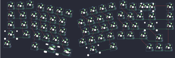

## kbdfans/maja_soldered

[layout](maja_soldered-kle.json) - [PCB](maja_soldered.kicad_pcb)

{:loading="lazy"}

[Open in keyboard-layout-editor](http://www.keyboard-layout-editor.com/##@@_x:2.75&y:0.13;&=0,2&_x:8.75;&=0,11;&@_x:0.75&y:-0.88&c=#777777;&=0,0&_c=#cccccc;&=0,1;&@_x:13.5&y:-0.885;&=0,12&_c=#aaaaaa&w:2;&=0,13%0A%0A%0A0,0&_x:0.88;&=0,14;&@_x:0.5&y:-0.115&w:1.5;&=1,0&_c=#cccccc;&=1,1&_x:9.25;&=1,10;&@_x:13.25&y:-0.885;&=1,11&=1,12&_w:1.5;&=1,13&_x:0.63&c=#aaaaaa;&=1,14;&@_x:0.365&y:-0.115&w:1.75;&=2,0&_x:0.01&c=#cccccc;&=2,1;&@_x:12.75&y:-0.885;&=2,10&=2,11&_c=#777777&w:2.25;&=2,13&_x:0.38&c=#aaaaaa;&=2,14;&@_x:0.125&y:-0.115&w:2.25;&=3,0&_x:-0.01&c=#cccccc;&=3,1;&@_x:12.25&y:-0.885;&=3,10&=3,11&_c=#aaaaaa&w:1.75;&=3,12;&@_x:16.25&y:-0.74&c=#777777;&=3,13;&@_x:0.125&y:-0.375&c=#aaaaaa&w:1.5;&=4,0;&@_x:15.25&y:-0.625&c=#777777;&=4,12&=4,13&=4,14;&@_r:12&rx:4.75&ry:1.5&x:-1.0&y:-1.0&c=#cccccc;&=0,3&=0,4&=0,5&=0,6;&@_x:-1.5;&=1,2&=1,3&=1,4&=1,5;&@_x:-1.25;&=2,2&=2,3&=2,4&=2,5;&@_x:-0.75;&=3,2&=3,3&=3,4&=3,5;&@_x:0.5&w:2;&=4,3%0A%0A%0A1,0&_c=#aaaaaa&w:1.25;&=4,5%0A%0A%0A1,0;&@_x:-1.0&y:-0.87&w:1.5;&=4,2;&@_r:-12&rx:13.5&x:-5.0&y:-1.5&c=#cccccc;&=0,7&=0,8&=0,9&=0,10;&@_x:-5.5;&=1,6&=1,7&=1,8&=1,9;&@_x:-5.25;&=2,6&=2,7&=2,8&=2,9;&@_x:-5.75&y:1.0&w:2.75;&=4,7;&@_x:-3.0&y:-0.87&c=#aaaaaa&w:1.5;&=4,9;&@_ry:1.75&x:-5.75&y:1.25&c=#cccccc;&=3,6&=3,7&=3,8&=3,9;&@_r:0&rx:0&ry:0&x:14&y:5.88;&=0,13%0A%0A%0A0,1&=3,14%0A%0A%0A0,1;&@_r:12&rx:4.75&ry:1.5&x:0.25&y:4.38&w:2.25;&=4,3%0A%0A%0A1,1&_c=#aaaaaa;&=4,5%0A%0A%0A1,1)

{:loading="lazy"}

