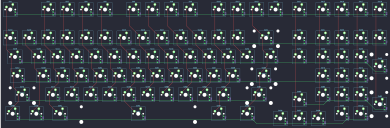
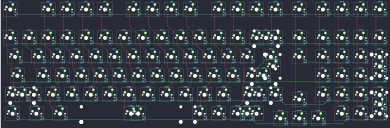

## kbdfans/odin/odin_rgb

[layout](odin_rgb-kle.json) - [PCB](odin_rgb.kicad_pcb)

{:loading="lazy"}

[Open in keyboard-layout-editor](http://www.keyboard-layout-editor.com/##@@=0,0&_x:1;&=0,2&=0,3&=0,4&=0,5&_x:0.5;&=0,7&=0,8&=0,9&=0,10&_x:0.5;&=0,11&=0,12&=0,13&=0,14&_x:0.25;&=0,15&_x:0.25;&=0,16&=0,17&=0,18&=0,19;&@_y:0.5;&=1,0&=1,1&=1,2&=1,3&=1,4&=1,5&=1,6&=1,7&=1,8&=1,9&=1,10&=1,11&=1,12&_w:2;&=1,13&_x:0.25;&=1,15&_x:0.25;&=1,16&=1,17&=1,18&=1,19;&@_w:1.5;&=2,0&=2,1&=2,2&=2,3&=2,4&=2,5&=2,6&=2,7&=2,8&=2,9&=2,10&=2,11&=2,12&_w:1.5;&=2,13&_x:0.25;&=2,15&_x:0.25;&=2,16&=2,17&=2,18&_h:2;&=2,19;&@_w:1.75;&=3,0&=3,1&=3,2&=3,3&=3,4&=3,5&=3,6&=3,7&=3,8&=3,9&=3,10&=3,11&_w:2.25;&=3,13&_x:1.5;&=3,16&=3,17&=3,18;&@_w:2.25;&=4,0&=4,2&=4,3&=4,4&=4,5&=4,6&=4,7&=4,8&=4,9&=4,10&=4,11&_w:2.75;&=4,13&_x:1.5;&=4,16&=4,17&=4,18&_h:2;&=4,19;&@_x:15.25&y:-0.75;&=4,15;&@_y:-0.25&w:1.25;&=5,0&_w:1.25;&=5,1&_w:1.25;&=5,2&_w:7;&=5,6&_w:1.5;&=5,11&_w:1.5;&=5,13&_x:3.75;&=5,17&=5,18;&@_x:14.25&y:-0.75;&=5,14&=5,15&=5,16)

{:loading="lazy"}

## kbdfans/odin/odin_soldered

[layout](odin_soldered-kle.json) - [PCB](odin_soldered.kicad_pcb)

{:loading="lazy"}

[Open in keyboard-layout-editor](http://www.keyboard-layout-editor.com/##@@=0,0&_x:1;&=0,2&=0,3&=0,4&=0,5&_x:0.5;&=0,7&=0,8&=0,9&=0,10&_x:0.5;&=0,11&=0,12&=0,13&=0,14&_x:0.25;&=0,15&_x:0.25;&=0,16&=0,17&=0,18&=0,19;&@_y:0.5;&=1,0&=1,1&=1,2&=1,3&=1,4&=1,5&=1,6&=1,7&=1,8&=1,9&=1,10&=1,11&=1,12&_w:2;&=1,13%0A%0A%0A0,0&_x:0.25;&=1,15&_x:0.25;&=1,16&=1,17&=1,18&=1,19;&@_w:1.5;&=2,0&=2,1&=2,2&=2,3&=2,4&=2,5&=2,6&=2,7&=2,8&=2,9&=2,10&=2,11&=2,12&_w:1.5;&=2,13%0A%0A%0A1,0&_x:0.25;&=2,15&_x:0.25;&=2,16&=2,17&=2,18&_h:2;&=2,19%0A%0A%0A4,0;&@_c=#777777&w:1.75;&=3,0&=3,1&=3,2&=3,3&=3,4&=3,5&=3,6&=3,7&=3,8&=3,9&=3,10&=3,11&_w:2.25;&=3,13%0A%0A%0A1,0&_x:1.5;&=3,16&=3,17&=3,18&=3,19;&@_c=#cccccc&w:2.25;&=4,0%0A%0A%0A2,0&=4,2&=4,3&=4,4&=4,5&=4,6&=4,7&=4,8&=4,9&=4,10&=4,11&_w:2.75;&=4,13%0A%0A%0A3,0&_x:1.5;&=4,16&=4,17&=4,18&_h:2;&=4,19%0A%0A%0A5,0;&@_x:15.25&y:-0.75;&=4,15;&@_y:-0.25&w:1.25;&=5,0&_w:1.25;&=5,1&_w:1.25;&=5,2&_w:7;&=5,6%0A%0A%0A6,0&_w:1.5;&=5,11%0A%0A%0A6,0&_w:1.5;&=5,13%0A%0A%0A6,0&_x:3.75;&=5,17&=5,18;&@_x:14.25&y:-0.75;&=5,14&=5,15&=5,16;&@_x:20.5&y:-5.25;&=1,13%0A%0A%0A0,1&=1,14%0A%0A%0A0,1;&@_x:22.0&c=#777777&w:1.25&h:2&w2:1.5&h2:1&x2:-0.25;&=3,13%0A%0A%0A1,1&=2,19%0A%0A%0A4,1;&@_x:21.0&c=#cccccc;&=2,13%0A%0A%0A1,1;&@_x:20.5&w:1.25;&=4,0%0A%0A%0A2,1&=4,1%0A%0A%0A2,1&_w:1.75;&=4,13%0A%0A%0A3,1&=4,14%0A%0A%0A3,1&=4,19%0A%0A%0A5,1;&@_x:13.75&w:6.25;&=5,6%0A%0A%0A6,1&=5,10%0A%0A%0A6,1&=5,11%0A%0A%0A6,1&=5,12%0A%0A%0A6,1&=5,13%0A%0A%0A6,1&_x:1.5;&=5,19%0A%0A%0A5,1)

{:loading="lazy"}

