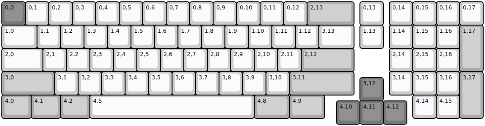
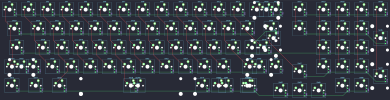

## kbdfans/odinmini

[layout](odinmini-kle.json) - [PCB](odinmini.kicad_pcb)

{:loading="lazy"}

[Open in keyboard-layout-editor](http://www.keyboard-layout-editor.com/##@@_c=#777777;&=0,0&_c=#cccccc;&=0,1&=0,2&=0,3&=0,4&=0,5&=0,6&=0,7&=0,8&=0,9&=0,10&=0,11&=0,12&_c=#aaaaaa&w:2;&=2,13&_x:0.25&c=#cccccc;&=0,13&_x:0.25;&=0,14&=0,15&=0,16&=0,17;&@_w:1.5;&=1,0&=1,1&=1,2&=1,3&=1,4&=1,5&=1,6&=1,7&=1,8&=1,9&=1,10&=1,11&=1,12&_w:1.5;&=3,13&_x:0.25;&=1,13&_x:0.25;&=1,14&=1,15&=1,16&_c=#aaaaaa&h:2;&=1,17;&@_c=#cccccc&w:1.75;&=2,0&=2,1&=2,2&=2,3&=2,4&=2,5&=2,6&=2,7&=2,8&=2,9&=2,10&=2,11&_c=#aaaaaa&w:2.25;&=2,12&_x:1.5&c=#cccccc;&=2,14&=2,15&=2,16%0A%E2%86%92;&@_c=#aaaaaa&w:2.25;&=3,0&_c=#cccccc;&=3,1&=3,2&=3,3&=3,4&=3,5&=3,6&=3,7&=3,8&=3,9&=3,10&_c=#aaaaaa&w:2.75;&=3,11&_x:1.5&c=#cccccc;&=3,14&=3,15&=3,16&_c=#aaaaaa&h:2;&=3,17;&@_x:15.25&y:-0.75&c=#777777;&=3,12;&@_y:-0.25&c=#aaaaaa&w:1.25;&=4,0&_w:1.25;&=4,1&_w:1.25;&=4,2&_c=#cccccc&w:7;&=4,5&_c=#aaaaaa&w:1.5;&=4,8&_w:1.5;&=4,9&_x:3.75&c=#cccccc;&=4,14&=4,15;&@_x:14.25&y:-0.75&c=#777777;&=4,10&=4,11&=4,12)

{:loading="lazy"}

