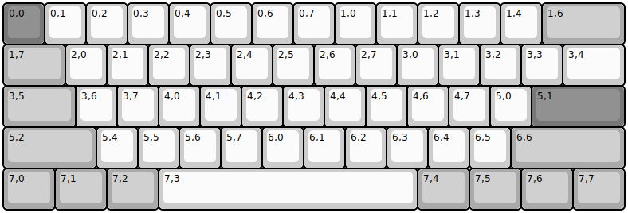
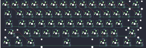

## kbparadise/v60_type_r

[layout](v60_type_r-kle.json) - [PCB](v60_type_r.kicad_pcb)

{:loading="lazy"}

[Open in keyboard-layout-editor](http://www.keyboard-layout-editor.com/##@@_c=#777777;&=0,0&_c=#cccccc;&=0,1&=0,2&=0,3&=0,4&=0,5&=0,6&=0,7&=1,0&=1,1&=1,2&=1,3&=1,4&_c=#aaaaaa&w:2;&=1,6;&@_w:1.5;&=1,7&_c=#cccccc;&=2,0&=2,1&=2,2&=2,3&=2,4&=2,5&=2,6&=2,7&=3,0&=3,1&=3,2&=3,3&_w:1.5;&=3,4;&@_c=#aaaaaa&w:1.75;&=3,5&_c=#cccccc;&=3,6&=3,7&=4,0&=4,1&=4,2&=4,3&=4,4&=4,5&=4,6&=4,7&=5,0&_c=#777777&w:2.25;&=5,1;&@_c=#aaaaaa&w:2.25;&=5,2&_c=#cccccc;&=5,4&=5,5&=5,6&=5,7&=6,0&=6,1&=6,2&=6,3&=6,4&=6,5&_c=#aaaaaa&w:2.75;&=6,6;&@_w:1.25;&=7,0&_w:1.25;&=7,1&_w:1.25;&=7,2&_c=#cccccc&w:6.25;&=7,3&_c=#aaaaaa&w:1.25;&=7,4&_w:1.25;&=7,5&_w:1.25;&=7,6&_w:1.25;&=7,7)

{:loading="lazy"}

