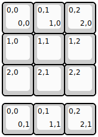
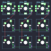
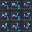

## keebio/bdn9/bdn9-rev1

[layout](bdn9-rev1-kle.json) - [PCB](bdn9-rev1.kicad_pcb)

{:loading="lazy"}

[Open in keyboard-layout-editor](http://www.keyboard-layout-editor.com/##@@=0,0%0A%0A%0A0,0&=0,1%0A%0A%0A1,0&=0,2%0A%0A%0A2,0;&@=1,0&=1,1&=1,2;&@=2,0&=2,1&=2,2;&@_y:0.25;&=0,0%0A%0A%0A0,1%0A%0A%0A%0A%0A%0Ae0&=0,1%0A%0A%0A1,1%0A%0A%0A%0A%0A%0Ae2&=0,2%0A%0A%0A2,1%0A%0A%0A%0A%0A%0Ae1)

{:loading="lazy"}

## keebio/bdn9/bdn9-rev2

[layout](bdn9-rev2-kle.json) - [PCB](bdn9-rev2.kicad_pcb)

{:loading="lazy"}

[Open in keyboard-layout-editor](http://www.keyboard-layout-editor.com/##@@=0,0%0A%0A%0A0,0&=0,1%0A%0A%0A1,0&=0,2%0A%0A%0A2,0;&@=1,0&=1,1&=1,2;&@=2,0&=2,1&=2,2;&@_y:0.25;&=0,0%0A%0A%0A0,1%0A%0A%0A%0A%0A%0Ae0&=0,1%0A%0A%0A1,1%0A%0A%0A%0A%0A%0Ae2&=0,2%0A%0A%0A2,1%0A%0A%0A%0A%0A%0Ae1)

{:loading="lazy"}

