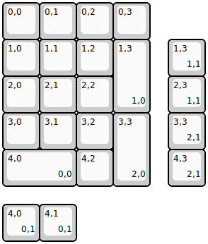
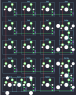

## keebio/choconum/choconum-rev1

[layout](choconum-rev1-kle.json) - [PCB](choconum-rev1.kicad_pcb)

{:loading="lazy"}

[Open in keyboard-layout-editor](http://www.keyboard-layout-editor.com/##@@=0,0&=0,1&=0,2&=0,3;&@=1,0&=1,1&=1,2&_h:2;&=1,3%0A%0A%0A1,0;&@=2,0&=2,1&=2,2;&@=3,0&=3,1&=3,2&_h:2;&=3,3%0A%0A%0A2,0;&@_w:2;&=4,0%0A%0A%0A0,0&=4,2;&@_x:4.5&y:-4;&=1,3%0A%0A%0A1,1;&@_x:4.5;&=2,3%0A%0A%0A1,1;&@_x:4.5;&=3,3%0A%0A%0A2,1;&@_x:4.5;&=4,3%0A%0A%0A2,1;&@_y:0.5;&=4,0%0A%0A%0A0,1&=4,1%0A%0A%0A0,1)

{:loading="lazy"}

