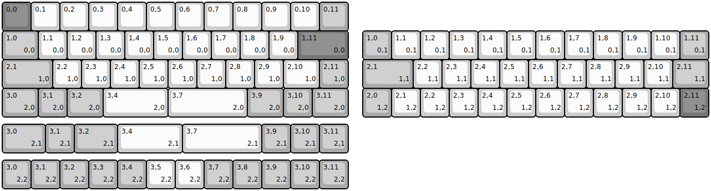
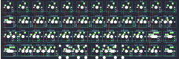

## keebio/dsp40/dsp40-rev1

[layout](dsp40-rev1-kle.json) - [PCB](dsp40-rev1.kicad_pcb)

{:loading="lazy"}

[Open in keyboard-layout-editor](http://www.keyboard-layout-editor.com/##@@_c=#777777;&=0,0&_c=#cccccc;&=0,1&=0,2&=0,3&=0,4&=0,5&=0,6&=0,7&=0,8&=0,9&=0,10&_c=#aaaaaa;&=0,11;&@_w:1.25;&=1,0%0A%0A%0A0,0&_c=#cccccc;&=1,1%0A%0A%0A0,0&=1,2%0A%0A%0A0,0&=1,3%0A%0A%0A0,0&=1,4%0A%0A%0A0,0&=1,5%0A%0A%0A0,0&=1,6%0A%0A%0A0,0&=1,7%0A%0A%0A0,0&=1,8%0A%0A%0A0,0&=1,9%0A%0A%0A0,0&_c=#777777&w:1.75;&=1,11%0A%0A%0A0,0;&@_c=#aaaaaa&w:1.75;&=2,1%0A%0A%0A1,0&_c=#cccccc;&=2,2%0A%0A%0A1,0&=2,3%0A%0A%0A1,0&=2,4%0A%0A%0A1,0&=2,5%0A%0A%0A1,0&=2,6%0A%0A%0A1,0&=2,7%0A%0A%0A1,0&=2,8%0A.%0A%0A1,0&=2,9%0A%0A%0A1,0&_w:1.25;&=2,10%0A%0A%0A1,0&_c=#aaaaaa;&=2,11%0A%0A%0A1,0;&@_w:1.25;&=3,0%0A%0A%0A2,0&=3,1%0A%0A%0A2,0&_w:1.25;&=3,2%0A%0A%0A2,0&_c=#cccccc&w:2.25;&=3,4%0A%0A%0A2,0&_w:2.75;&=3,7%0A%0A%0A2,0&_c=#aaaaaa&w:1.25;&=3,9%0A%0A%0A2,0&=3,10%0A%0A%0A2,0&_w:1.25;&=3,11%0A%0A%0A2,0;&@_x:12.5&y:-3;&=1,0%0A%0A%0A0,1&_c=#cccccc;&=1,1%0A%0A%0A0,1&=1,2%0A%0A%0A0,1&=1,3%0A%0A%0A0,1&=1,4%0A%0A%0A0,1&=1,5%0A%0A%0A0,1&=1,6%0A%0A%0A0,1&=1,7%0A%0A%0A0,1&=1,8%0A%0A%0A0,1&=1,9%0A%0A%0A0,1&=1,10%0A%0A%0A0,1&_c=#aaaaaa;&=1,11%0A%0A%0A0,1;&@_x:12.5&w:1.75;&=2,1%0A%0A%0A1,1&_c=#cccccc;&=2,2%0A%0A%0A1,1&=2,3%0A%0A%0A1,1&=2,4%0A%0A%0A1,1&=2,5%0A%0A%0A1,1&=2,6%0A%0A%0A1,1&=2,7%0A%0A%0A1,1&=2,8%0A.%0A%0A1,1&=2,9%0A%0A%0A1,1&=2,10%0A%0A%0A1,1&_c=#aaaaaa&w:1.25;&=2,11%0A%0A%0A1,1;&@_x:12.5;&=2,0%0A%0A%0A1,2&_c=#cccccc;&=2,1%0A%0A%0A1,2&=2,2%0A%0A%0A1,2&=2,3%0A%0A%0A1,2&=2,4%0A%0A%0A1,2&=2,5%0A%0A%0A1,2&=2,6%0A%0A%0A1,2&=2,7%0A%0A%0A1,2&=2,8%0A%0A%0A1,2&=2,9%0A%0A%0A1,2&=2,10%0A%0A%0A1,2&_c=#777777;&=2,11%0A%0A%0A1,2;&@_y:0.25&c=#aaaaaa&w:1.5;&=3,0%0A%0A%0A2,1&=3,1%0A%0A%0A2,1&_w:1.5;&=3,2%0A%0A%0A2,1&_c=#cccccc&w:2.25;&=3,4%0A%0A%0A2,1&_w:2.75;&=3,7%0A%0A%0A2,1&_c=#aaaaaa;&=3,9%0A%0A%0A2,1&=3,10%0A%0A%0A2,1&=3,11%0A%0A%0A2,1;&@_y:0.25;&=3,0%0A%0A%0A2,2&=3,1%0A%0A%0A2,2&=3,2%0A%0A%0A2,2&=3,3%0A%0A%0A2,2&=3,4%0A%0A%0A2,2&_c=#cccccc;&=3,5%0A%0A%0A2,2&=3,6%0A%0A%0A2,2&_c=#aaaaaa;&=3,7%0A%0A%0A2,2&=3,8%0A%0A%0A2,2&=3,9%0A%0A%0A2,2&=3,10%0A%0A%0A2,2&=3,11%0A%0A%0A2,2)

{:loading="lazy"}

