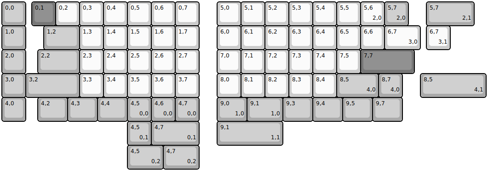
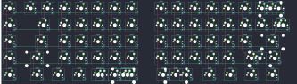

## keebio/foldkb/foldkb-rev1

[layout](foldkb-rev1-kle.json) - [PCB](foldkb-rev1.kicad_pcb)

{:loading="lazy"}

[Open in keyboard-layout-editor](http://www.keyboard-layout-editor.com/##@@_c=#aaaaaa;&=0,0&_x:0.25&c=#777777;&=0,1&_c=#cccccc;&=0,2&=0,3&=0,4&=0,5&=0,6&=0,7&_x:0.75;&=5,0&=5,1&=5,2&=5,3&=5,4&=5,5&=5,6%0A%0A%0A2,0&_c=#aaaaaa;&=5,7%0A%0A%0A2,0;&@=1,0&_x:0.75&w:1.5;&=1,2&_c=#cccccc;&=1,3&=1,4&=1,5&=1,6&=1,7&_x:0.75;&=6,0&=6,1&=6,2&=6,3&=6,4&=6,5&=6,6&_w:1.5;&=6,7%0A%0A%0A3,0;&@_c=#aaaaaa;&=2,0&_x:0.5&w:1.75;&=2,2&_c=#cccccc;&=2,3&=2,4&=2,5&=2,6&=2,7&_x:0.75;&=7,0&=7,1&=7,2&=7,3&=7,4&=7,5&_c=#777777&w:2.25;&=7,7;&@_c=#aaaaaa;&=3,0&_w:2.25;&=3,2&_c=#cccccc;&=3,3&=3,4&=3,5&=3,6&=3,7&_x:0.75;&=8,0&=8,1&=8,2&=8,3&=8,4&_c=#aaaaaa&w:1.75;&=8,5%0A%0A%0A4,0&=8,7%0A%0A%0A4,0;&@=4,0&_x:0.5&w:1.25;&=4,2&_w:1.25;&=4,3&_w:1.25;&=4,4&=4,5%0A%0A%0A0,0&=4,6%0A%0A%0A0,0&=4,7%0A%0A%0A0,0&_x:0.75&w:1.25;&=9,0%0A%0A%0A1,0&_w:1.5;&=9,1%0A%0A%0A1,0&_w:1.25;&=9,3&_w:1.25;&=9,4&_w:1.25;&=9,5&_w:1.25;&=9,7;&@_x:17.75&y:-5&w:2;&=5,7%0A%0A%0A2,1;&@_x:17.75&c=#cccccc;&=6,7%0A%0A%0A3,1;&@_x:17.5&y:1&c=#aaaaaa&w:2.75;&=8,5%0A%0A%0A4,1;&@_x:5.25&y:1;&=4,5%0A%0A%0A0,1&_w:2;&=4,7%0A%0A%0A0,1&_x:0.75&w:2.75;&=9,1%0A%0A%0A1,1;&@_x:5.25&w:1.5;&=4,5%0A%0A%0A0,2&_w:1.5;&=4,7%0A%0A%0A0,2)

{:loading="lazy"}

