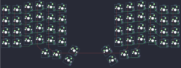
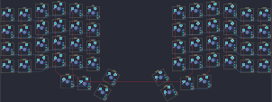
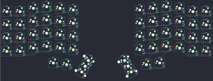
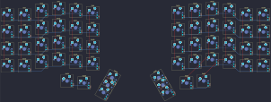
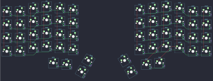
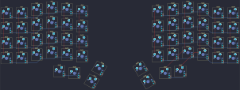
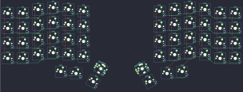
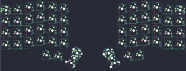

## keebio/iris/iris-rev2

[layout](iris-rev2-kle.json) - [PCB](iris-rev2.kicad_pcb)

{:loading="lazy"}

[Open in keyboard-layout-editor](http://www.keyboard-layout-editor.com/##@@_x:3;&=0,3&_x:8;&=5,3;&@_x:2&y:-0.875;&=0,2&_x:1;&=0,4&_x:6;&=5,4&_x:1;&=5,2;&@_x:5&y:-0.875;&=0,5&_x:4;&=5,5;&@_y:-0.875&c=#777777;&=0,0&_c=#cccccc;&=0,1&_x:12;&=5,1&_c=#aaaaaa;&=5,0;&@_x:3&y:-0.375&c=#cccccc;&=1,3&_x:8;&=6,3;&@_x:2&y:-0.875;&=1,2&_x:1;&=1,4&_x:6;&=6,4&_x:1;&=6,2;&@_x:5&y:-0.875;&=1,5&_x:4;&=6,5;&@_y:-0.875&c=#aaaaaa;&=1,0&_c=#cccccc;&=1,1&_x:12;&=6,1&_c=#aaaaaa;&=6,0;&@_x:3&y:-0.375&c=#cccccc;&=2,3&_x:8;&=7,3;&@_x:2&y:-0.875;&=2,2&_x:1;&=2,4&_x:6;&=7,4&_x:1;&=7,2;&@_x:5&y:-0.875;&=2,5&_x:4;&=7,5;&@_y:-0.875&c=#aaaaaa;&=2,0&_c=#cccccc;&=2,1&_x:12;&=7,1&_c=#aaaaaa;&=7,0;&@_x:3&y:-0.375&c=#cccccc;&=3,3&_x:8;&=8,3;&@_x:2&y:-0.875;&=3,2&_x:1;&=3,4&_x:6;&=8,4&_x:1;&=8,2;&@_x:5&y:-0.875;&=3,5&_x:4;&=8,5;&@_y:-0.875&c=#aaaaaa;&=3,0&_c=#cccccc;&=3,1&_x:12;&=8,1&_c=#aaaaaa;&=8,0;&@_x:3.5&y:-0.125;&=4,3&_x:7.0;&=9,3;&@_x:4.5&y:-0.875;&=4,4&_x:5.0;&=9,4;&@_r:30&rx:8&x:0.5&y:4.13&c=#777777;&=4,2;&@_x:0.5;&=4,5;&@_r:-30&x:-1.5&y:-2.0;&=9,2;&@_x:-1.5;&=9,5)

{:loading="lazy"}

## keebio/iris/iris-rev3

[layout](iris-rev3-kle.json) - [PCB](iris-rev3.kicad_pcb)

{:loading="lazy"}

[Open in keyboard-layout-editor](http://www.keyboard-layout-editor.com/##@@_x:3;&=0,3&_x:8;&=5,3;&@_x:2&y:-0.875;&=0,2&_x:1;&=0,4&_x:6;&=5,4&_x:1;&=5,2;&@_x:5&y:-0.875;&=0,5&_x:4;&=5,5;&@_y:-0.875&c=#777777;&=0,0&_c=#cccccc;&=0,1&_x:12;&=5,1&_c=#aaaaaa;&=5,0;&@_x:3&y:-0.375&c=#cccccc;&=1,3&_x:8;&=6,3;&@_x:2&y:-0.875;&=1,2&_x:1;&=1,4&_x:6;&=6,4&_x:1;&=6,2;&@_x:5&y:-0.875;&=1,5&_x:4;&=6,5;&@_y:-0.875&c=#aaaaaa;&=1,0&_c=#cccccc;&=1,1&_x:12;&=6,1&_c=#aaaaaa;&=6,0;&@_x:3&y:-0.375&c=#cccccc;&=2,3&_x:8;&=7,3;&@_x:2&y:-0.875;&=2,2&_x:1;&=2,4&_x:6;&=7,4&_x:1;&=7,2;&@_x:5&y:-0.875;&=2,5&_x:4;&=7,5;&@_y:-0.875&c=#aaaaaa;&=2,0&_c=#cccccc;&=2,1&_x:12;&=7,1&_c=#aaaaaa;&=7,0;&@_x:3&y:-0.375&c=#cccccc;&=3,3&_x:8;&=8,3;&@_x:2&y:-0.875;&=3,2&_x:1;&=3,4&_x:6;&=8,4&_x:1;&=8,2;&@_x:5&y:-0.875;&=3,5&_x:4;&=8,5;&@_y:-0.875&c=#aaaaaa;&=3,0&_c=#cccccc;&=3,1&_x:12;&=8,1&_c=#aaaaaa;&=8,0;&@_x:3.5&y:-0.125;&=4,3&_x:7.0;&=9,3;&@_x:4.5&y:-0.875;&=4,4&_x:5.0;&=9,4;&@_r:30&rx:8&x:0.5&y:4.13&c=#777777;&=4,2;&@_x:0.5;&=4,5;&@_r:-30&x:-1.5&y:-2.0;&=9,2;&@_x:-1.5;&=9,5)

{:loading="lazy"}

## keebio/iris/iris-rev4

[layout](iris-rev4-kle.json) - [PCB](iris-rev4.kicad_pcb)

{:loading="lazy"}

[Open in keyboard-layout-editor](http://www.keyboard-layout-editor.com/##@@_x:3;&=0,3&_x:8;&=5,3;&@_x:2&y:-0.875;&=0,2&_x:1;&=0,4&_x:6;&=5,4&_x:1;&=5,2;&@_x:5&y:-0.875;&=0,5&_x:4;&=5,5;&@_y:-0.875&c=#777777;&=0,0&_c=#cccccc;&=0,1&_x:12;&=5,1&_c=#aaaaaa;&=5,0;&@_x:3&y:-0.375&c=#cccccc;&=1,3&_x:8;&=6,3;&@_x:2&y:-0.875;&=1,2&_x:1;&=1,4&_x:6;&=6,4&_x:1;&=6,2;&@_x:5&y:-0.875;&=1,5&_x:4;&=6,5;&@_y:-0.875&c=#aaaaaa;&=1,0&_c=#cccccc;&=1,1&_x:12;&=6,1&_c=#aaaaaa;&=6,0;&@_x:3&y:-0.375&c=#cccccc;&=2,3&_x:8;&=7,3;&@_x:2&y:-0.875;&=2,2&_x:1;&=2,4&_x:6;&=7,4&_x:1;&=7,2;&@_x:5&y:-0.875;&=2,5&_x:4;&=7,5;&@_y:-0.875&c=#aaaaaa;&=2,0&_c=#cccccc;&=2,1&_x:12;&=7,1&_c=#aaaaaa;&=7,0;&@_x:3&y:-0.375&c=#cccccc;&=3,3&_x:8;&=8,3;&@_x:2&y:-0.875;&=3,2&_x:1;&=3,4&_x:6;&=8,4&_x:1;&=8,2;&@_x:5&y:-0.875;&=3,5&_x:4;&=8,5;&@_y:-0.875&c=#aaaaaa;&=3,0&_c=#cccccc;&=3,1&_x:12;&=8,1&_c=#aaaaaa;&=8,0;&@_x:3.5&y:-0.125;&=4,2&_x:7.0;&=9,2;&@_x:4.5&y:-0.875;&=4,3&_x:5.0;&=9,3;&@_r:30&rx:8&x:0.6&y:4.13&c=#777777;&=4,5%0A%0A%0A0,0;&@_x:0.6;&=4,4%0A%0A%0A0,0;&@_r:-30&x:-1.6&y:-2.0;&=9,5%0A%0A%0A1,0;&@_x:-1.6;&=9,4%0A%0A%0A1,0;&@_r:30&x:1.6&y:-2.0&h:2;&=4,5%0A%0A%0A0,1;&@_r:-30&x:-2.6&y:-1.0&h:2;&=9,4%0A%0A%0A1,1)

{:loading="lazy"}

## keebio/iris/iris-rev5

[layout](iris-rev5-kle.json) - [PCB](iris-rev5.kicad_pcb)

{:loading="lazy"}

[Open in keyboard-layout-editor](http://www.keyboard-layout-editor.com/##@@_x:3;&=0,3&_x:8;&=5,3;&@_x:2&y:-0.875;&=0,2&_x:1;&=0,4&_x:6;&=5,4&_x:1;&=5,2;&@_x:5&y:-0.875;&=0,5&_x:4;&=5,5;&@_y:-0.875&c=#777777;&=0,0&_c=#cccccc;&=0,1&_x:12;&=5,1&_c=#aaaaaa;&=5,0;&@_x:3&y:-0.375&c=#cccccc;&=1,3&_x:8;&=6,3;&@_x:2&y:-0.875;&=1,2&_x:1;&=1,4&_x:6;&=6,4&_x:1;&=6,2;&@_x:5&y:-0.875;&=1,5&_x:4;&=6,5;&@_y:-0.875&c=#aaaaaa;&=1,0&_c=#cccccc;&=1,1&_x:12;&=6,1&_c=#aaaaaa;&=6,0;&@_x:3&y:-0.375&c=#cccccc;&=2,3&_x:8;&=7,3;&@_x:2&y:-0.875;&=2,2&_x:1;&=2,4&_x:6;&=7,4&_x:1;&=7,2;&@_x:5&y:-0.875;&=2,5&_x:4;&=7,5;&@_y:-0.875&c=#aaaaaa;&=2,0&_c=#cccccc;&=2,1&_x:12;&=7,1&_c=#aaaaaa;&=7,0;&@_x:3&y:-0.375&c=#cccccc;&=3,3&_x:8;&=8,3;&@_x:2&y:-0.875;&=3,2&_x:1;&=3,4&_x:6;&=8,4&_x:1;&=8,2;&@_x:5&y:-0.875;&=3,5&_x:4;&=8,5;&@_y:-0.875&c=#aaaaaa;&=3,0&_c=#cccccc;&=3,1&_x:12;&=8,1&_c=#aaaaaa;&=8,0;&@_x:3.5&y:-0.125;&=4,2&_x:7.0;&=9,2;&@_x:4.5&y:-0.875;&=4,3&_x:5.0;&=9,3;&@_r:30&rx:8&x:0.6&y:4.13&c=#777777;&=4,5%0A%0A%0A0,0;&@_x:0.6;&=4,4%0A%0A%0A0,0;&@_r:-30&x:-1.6&y:-2.0;&=9,5%0A%0A%0A1,0;&@_x:-1.6;&=9,4%0A%0A%0A1,0;&@_r:30&x:1.6&y:-2.0&h:2;&=4,5%0A%0A%0A0,1;&@_r:-30&x:-2.6&y:-1.0&h:2;&=9,4%0A%0A%0A1,1)

{:loading="lazy"}

## keebio/iris/iris-rev6

[layout](iris-rev6-kle.json) - [PCB](iris-rev6.kicad_pcb)

{:loading="lazy"}

[Open in keyboard-layout-editor](http://www.keyboard-layout-editor.com/##@@_x:3;&=0,3&_x:8;&=5,3;&@_x:2&y:-0.875;&=0,2&_x:1;&=0,4&_x:6;&=5,4&_x:1;&=5,2;&@_x:5&y:-0.875;&=0,5&_x:4;&=5,5;&@_y:-0.875&c=#777777;&=0,0&_c=#cccccc;&=0,1&_x:12;&=5,1&_c=#aaaaaa;&=5,0;&@_x:3&y:-0.375&c=#cccccc;&=1,3&_x:8;&=6,3;&@_x:2&y:-0.875;&=1,2&_x:1;&=1,4&_x:6;&=6,4&_x:1;&=6,2;&@_x:5&y:-0.875;&=1,5&_x:4;&=6,5;&@_y:-0.875&c=#aaaaaa;&=1,0&_c=#cccccc;&=1,1&_x:12;&=6,1&_c=#aaaaaa;&=6,0;&@_x:3&y:-0.375&c=#cccccc;&=2,3&_x:8;&=7,3;&@_x:2&y:-0.875;&=2,2&_x:1;&=2,4&_x:6;&=7,4&_x:1;&=7,2;&@_x:5&y:-0.875;&=2,5&_x:4;&=7,5;&@_y:-0.875&c=#aaaaaa;&=2,0&_c=#cccccc;&=2,1&_x:12;&=7,1&_c=#aaaaaa;&=7,0;&@_x:3&y:-0.375&c=#cccccc;&=3,3&_x:8;&=8,3;&@_x:2&y:-0.875;&=3,2&_x:1;&=3,4&_x:6;&=8,4&_x:1;&=8,2;&@_x:5&y:-0.875;&=3,5&_x:4;&=8,5;&@_y:-0.875&c=#aaaaaa;&=3,0&_c=#cccccc;&=3,1&_x:12;&=8,1&_c=#aaaaaa;&=8,0;&@_x:3.5&y:-0.125;&=4,2&_x:7.0;&=9,2;&@_x:4.5&y:-0.875;&=4,3&_x:5.0;&=9,3;&@_r:30&rx:8&x:0.6&y:4.13&c=#777777;&=4,5;&@_x:0.6;&=4,4;&@_r:-30&x:-1.6&y:-2.0;&=9,5;&@_x:-1.6;&=9,4)

{:loading="lazy"}

## keebio/iris/iris-rev6a

[layout](iris-rev6a-kle.json) - [PCB](iris-rev6a.kicad_pcb)

{:loading="lazy"}

[Open in keyboard-layout-editor](http://www.keyboard-layout-editor.com/##@@_x:3;&=0,3&_x:8;&=5,3;&@_x:2&y:-0.875;&=0,2&_x:1;&=0,4&_x:6;&=5,4&_x:1;&=5,2;&@_x:5&y:-0.875;&=0,5&_x:4;&=5,5;&@_y:-0.875&c=#777777;&=0,0&_c=#cccccc;&=0,1&_x:12;&=5,1&_c=#aaaaaa;&=5,0;&@_x:3&y:-0.375&c=#cccccc;&=1,3&_x:8;&=6,3;&@_x:2&y:-0.875;&=1,2&_x:1;&=1,4&_x:6;&=6,4&_x:1;&=6,2;&@_x:5&y:-0.875;&=1,5&_x:4;&=6,5;&@_y:-0.875&c=#aaaaaa;&=1,0&_c=#cccccc;&=1,1&_x:12;&=6,1&_c=#aaaaaa;&=6,0;&@_x:3&y:-0.375&c=#cccccc;&=2,3&_x:8;&=7,3;&@_x:2&y:-0.875;&=2,2&_x:1;&=2,4&_x:6;&=7,4&_x:1;&=7,2;&@_x:5&y:-0.875;&=2,5&_x:4;&=7,5;&@_y:-0.875&c=#aaaaaa;&=2,0&_c=#cccccc;&=2,1&_x:12;&=7,1&_c=#aaaaaa;&=7,0;&@_x:3&y:-0.375&c=#cccccc;&=3,3&_x:8;&=8,3;&@_x:2&y:-0.875;&=3,2&_x:1;&=3,4&_x:6;&=8,4&_x:1;&=8,2;&@_x:5&y:-0.875;&=3,5&_x:4;&=8,5;&@_y:-0.875&c=#aaaaaa;&=3,0&_c=#cccccc;&=3,1&_x:12;&=8,1&_c=#aaaaaa;&=8,0;&@_x:3.5&y:-0.125;&=4,2&_x:7.0;&=9,2;&@_x:4.5&y:-0.875;&=4,3&_x:5.0;&=9,3;&@_r:30&rx:8&x:0.6&y:4.13&c=#777777;&=4,5;&@_x:0.6;&=4,4;&@_r:-30&x:-1.6&y:-2.0;&=9,5;&@_x:-1.6;&=9,4)

{:loading="lazy"}

## keebio/iris/iris-rev6b

[layout](iris-rev6b-kle.json) - [PCB](iris-rev6b.kicad_pcb)

{:loading="lazy"}

[Open in keyboard-layout-editor](http://www.keyboard-layout-editor.com/##@@_x:3;&=0,3&_x:8;&=5,3;&@_x:2&y:-0.87;&=0,2&_x:1;&=0,4&_x:6;&=5,4&_x:1;&=5,2;&@_x:5&y:-0.88;&=0,5&_x:4;&=5,5;&@_y:-0.87&c=#777777;&=0,0&_c=#cccccc;&=0,1&_x:12;&=5,1&_c=#aaaaaa;&=5,0;&@_x:3&y:-0.38&c=#cccccc;&=1,3&_x:8;&=6,3;&@_x:2&y:-0.87;&=1,2&_x:1;&=1,4&_x:6;&=6,4&_x:1;&=6,2;&@_x:5&y:-0.88;&=1,5&_x:4;&=6,5;&@_y:-0.87&c=#aaaaaa;&=1,0&_c=#cccccc;&=1,1&_x:12;&=6,1&_c=#aaaaaa;&=6,0;&@_x:3&y:-0.38&c=#cccccc;&=2,3&_x:8;&=7,3;&@_x:2&y:-0.87;&=2,2&_x:1;&=2,4&_x:6;&=7,4&_x:1;&=7,2;&@_x:5&y:-0.88;&=2,5&_x:4;&=7,5;&@_y:-0.87&c=#aaaaaa;&=2,0&_c=#cccccc;&=2,1&_x:12;&=7,1&_c=#aaaaaa;&=7,0;&@_x:3&y:-0.38&c=#cccccc;&=3,3&_x:8;&=8,3;&@_x:2&y:-0.87;&=3,2&_x:1;&=3,4&_x:6;&=8,4&_x:1;&=8,2;&@_x:5&y:-0.88;&=3,5&_x:4;&=8,5;&@_y:-0.87&c=#aaaaaa;&=3,0&_c=#cccccc;&=3,1&_x:12;&=8,1&_c=#aaaaaa;&=8,0;&@_x:3.5&y:-0.13;&=4,2&_x:7.0;&=9,2;&@_x:4.5&y:-0.87;&=4,3&_x:5.0;&=9,3;&@_r:30&rx:8&x:0.6&y:4.13&c=#777777;&=4,5%0A%0A%0A0,0;&@_x:0.6;&=4,4%0A%0A%0A0,0;&@_r:-30&x:-1.6&y:-2.0;&=9,5%0A%0A%0A1,0;&@_x:-1.6;&=9,4%0A%0A%0A1,0;&@_r:30&x:1.6&y:-2.0;&=4,5%0A%0A%0A0,1%0A%0A%0A%0A%0A%0Ae0;&@_x:1.6;&=4,4%0A%0A%0A0,1;&@_r:-30&x:-2.6&y:-2.0;&=9,5%0A%0A%0A1,1%0A%0A%0A%0A%0A%0Ae1;&@_x:-2.6;&=9,4%0A%0A%0A1,1)

{:loading="lazy"}

## keebio/iris/iris-rev7

[layout](iris-rev7-kle.json) - [PCB](iris-rev7.kicad_pcb)

{:loading="lazy"}

[Open in keyboard-layout-editor](http://www.keyboard-layout-editor.com/##@@_x:3;&=0,3&_x:8;&=5,3;&@_x:2&y:-0.87;&=0,2&_x:1;&=0,4&_x:6;&=5,4&_x:1;&=5,2;&@_x:5&y:-0.88;&=0,5&_x:4;&=5,5;&@_y:-0.87&c=#777777;&=0,0%0A%0A%0A2,0&_c=#cccccc;&=0,1&_x:12.0;&=5,1&_c=#aaaaaa;&=5,0%0A%0A%0A3,0;&@_x:3&y:-0.38&c=#cccccc;&=1,3&_x:8;&=6,3;&@_x:2&y:-0.87;&=1,2&_x:1;&=1,4&_x:6;&=6,4&_x:1;&=6,2;&@_x:5&y:-0.88;&=1,5&_x:4;&=6,5;&@_y:-0.87&c=#aaaaaa;&=1,0&_c=#cccccc;&=1,1&_x:12;&=6,1&_c=#aaaaaa;&=6,0;&@_x:3&y:-0.38&c=#cccccc;&=2,3&_x:8;&=7,3;&@_x:2&y:-0.87;&=2,2&_x:1;&=2,4&_x:6;&=7,4&_x:1;&=7,2;&@_x:5&y:-0.88;&=2,5&_x:4;&=7,5;&@_y:-0.87&c=#aaaaaa;&=2,0&_c=#cccccc;&=2,1&_x:12;&=7,1&_c=#aaaaaa;&=7,0;&@_x:3&y:-0.38&c=#cccccc;&=3,3&_x:8;&=8,3;&@_x:2&y:-0.87;&=3,2&_x:1;&=3,4&_x:6;&=8,4&_x:1;&=8,2;&@_x:5&y:-0.88;&=3,5&_x:4;&=8,5;&@_y:-0.87&c=#aaaaaa;&=3,0&_c=#cccccc;&=3,1&_x:12;&=8,1&_c=#aaaaaa;&=8,0;&@_x:3.5&y:-0.13;&=4,2&_x:7.0;&=9,2;&@_x:4.5&y:-0.87;&=4,3&_x:5.0;&=9,3;&@_r:30&rx:8&x:0.6&y:4.13&c=#777777;&=4,5%0A%0A%0A0,0;&@_x:0.6;&=4,4%0A%0A%0A0,0;&@_r:-30&x:-1.6&y:-2.0;&=9,5%0A%0A%0A1,0;&@_x:-1.6;&=9,4%0A%0A%0A1,0;&@_r:0&rx:0&x:6.25&y:0.38;&=0,0%0A%0A%0A2,1%0A%0A%0A%0A%0A%0Ae1&_x:1.25&c=#aaaaaa;&=5,0%0A%0A%0A3,1%0A%0A%0A%0A%0A%0Ae3;&@_r:30&rx:8&x:1.6&y:4.13&c=#777777;&=4,5%0A%0A%0A0,1%0A%0A%0A%0A%0A%0Ae0&_h:2;&=4,4%0A%0A%0A0,2;&@_x:1.6;&=4,4%0A%0A%0A0,1;&@_r:-30&x:-3.6&y:-2.0&h:2;&=9,4%0A%0A%0A1,2&=9,5%0A%0A%0A1,1%0A%0A%0A%0A%0A%0Ae2;&@_x:-2.6;&=9,4%0A%0A%0A1,1)

{:loading="lazy"}

