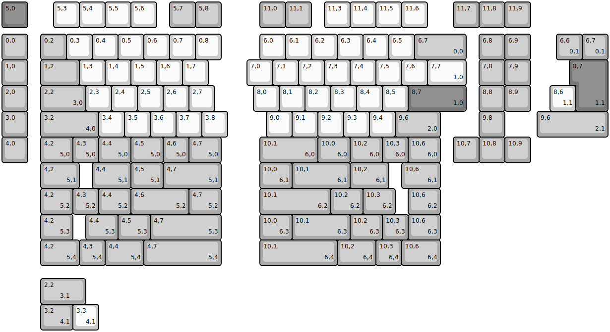
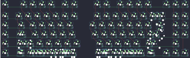

## keebio/kbo-5000/kbo-5000-rev1

[layout](kbo-5000-rev1-kle.json) - [PCB](kbo-5000-rev1.kicad_pcb)

{:loading="lazy"}

[Open in keyboard-layout-editor](http://www.keyboard-layout-editor.com/##@@_c=#777777;&=5,0&_x:1&c=#cccccc;&=5,3&=5,4&=5,5&=5,6&_x:0.5&c=#aaaaaa;&=5,7&=5,8&_x:1.5;&=11,0&=11,1&_x:0.5&c=#cccccc;&=11,3&=11,4&=11,5&=11,6&_x:1.0&c=#aaaaaa;&=11,7&=11,8&=11,9;&@_y:0.25;&=0,0&_x:0.5;&=0,2&_c=#cccccc;&=0,3&=0,4&=0,5&=0,6&=0,7&=0,8&_x:1.5;&=6,0&=6,1&=6,2&=6,3&=6,4&=6,5&_c=#aaaaaa&w:2;&=6,7%0A%0A%0A0,0&_x:0.5;&=6,8&=6,9;&@=1,0&_x:0.5&w:1.5;&=1,2&_c=#cccccc;&=1,3&=1,4&=1,5&=1,6&=1,7&_x:1.5;&=7,0&=7,1&=7,2&=7,3&=7,4&=7,5&=7,6&_w:1.5;&=7,7%0A%0A%0A1,0&_x:0.5&c=#aaaaaa;&=7,8&=7,9;&@=2,0&_x:0.5&w:1.75;&=2,2%0A%0A%0A3,0&_c=#cccccc;&=2,3&=2,4&=2,5&=2,6&=2,7&_x:1.5;&=8,0&=8,1&=8,2&=8,3&=8,4&=8,5&_c=#777777&w:2.25;&=8,7%0A%0A%0A1,0&_x:0.5&c=#aaaaaa;&=8,8&=8,9;&@=3,0&_x:0.5&w:2.25;&=3,2%0A%0A%0A4,0&_c=#cccccc;&=3,4&=3,5&=3,6&=3,7&=3,8&_x:1.5;&=9,0&=9,1&=9,2&=9,3&=9,4&_c=#aaaaaa&w:1.75;&=9,6%0A%0A%0A2,0&_x:1.5;&=9,8;&@=4,0&_x:0.5&w:1.25;&=4,2%0A%0A%0A5,0&=4,3%0A%0A%0A5,0&_w:1.25;&=4,4%0A%0A%0A5,0&_w:1.25;&=4,5%0A%0A%0A5,0&=4,6%0A%0A%0A5,0&_w:1.25;&=4,7%0A%0A%0A5,0&_x:1.5&w:2.25;&=10,1%0A%0A%0A6,0&_w:1.25;&=10,0%0A%0A%0A6,0&_w:1.25;&=10,2%0A%0A%0A6,0&=10,3%0A%0A%0A6,0&_w:1.25;&=10,6%0A%0A%0A6,0&_x:0.5;&=10,7&=10,8&=10,9;&@_x:21.5&y:-5.0;&=6,6%0A%0A%0A0,1&=6,7%0A%0A%0A0,1;&@_x:22.25&c=#777777&w:1.25&h:2&w2:1.5&h2:1&x2:-0.25;&=8,7%0A%0A%0A1,1;&@_x:21.25&c=#cccccc;&=8,6%0A%0A%0A1,1;&@_x:20.75&c=#aaaaaa&w:2.75;&=9,6%0A%0A%0A2,1;&@_x:1.5&y:1.0&w:1.5;&=4,2%0A%0A%0A5,1&_x:0.5&w:1.5;&=4,4%0A%0A%0A5,1&_w:1.25;&=4,5%0A%0A%0A5,1&_w:2.25;&=4,7%0A%0A%0A5,1&_x:1.5&w:1.25;&=10,0%0A%0A%0A6,1&_w:2.25;&=10,1%0A%0A%0A6,1&_w:1.5;&=10,2%0A%0A%0A6,1&_x:0.5&w:1.5;&=10,6%0A%0A%0A6,1;&@_x:1.5&w:1.25;&=4,2%0A%0A%0A5,2&=4,3%0A%0A%0A5,2&_w:1.25;&=4,4%0A%0A%0A5,2&_w:2.25;&=4,6%0A%0A%0A5,2&_w:1.25;&=4,7%0A%0A%0A5,2&_x:1.5&w:2.75;&=10,1%0A%0A%0A6,2&_w:1.25;&=10,2%0A%0A%0A6,2&_w:1.25;&=10,3%0A%0A%0A6,2&_x:0.5&w:1.25;&=10,6%0A%0A%0A6,2;&@_x:1.5&w:1.25;&=4,2%0A%0A%0A5,3&_x:0.5&w:1.25;&=4,4%0A%0A%0A5,3&_w:1.25;&=4,5%0A%0A%0A5,3&_w:2.75;&=4,7%0A%0A%0A5,3&_x:1.5&w:1.25;&=10,0%0A%0A%0A6,3&_w:2.25;&=10,1%0A%0A%0A6,3&_w:1.25;&=10,2%0A%0A%0A6,3&=10,3%0A%0A%0A6,3&_w:1.25;&=10,6%0A%0A%0A6,3;&@_x:1.5&w:1.5;&=4,2%0A%0A%0A5,4&=4,3%0A%0A%0A5,4&_w:1.5;&=4,4%0A%0A%0A5,4&_w:3;&=4,7%0A%0A%0A5,4&_x:1.5&w:3;&=10,1%0A%0A%0A6,4&_w:1.5;&=10,2%0A%0A%0A6,4&=10,3%0A%0A%0A6,4&_w:1.5;&=10,6%0A%0A%0A6,4;&@_x:1.5&y:0.5&w:1.25&w2:1.75&l:true;&=2,2%0A%0A%0A3,1;&@_x:1.5&w:1.25;&=3,2%0A%0A%0A4,1&_c=#cccccc;&=3,3%0A%0A%0A4,1)

{:loading="lazy"}

