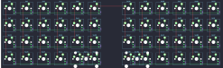
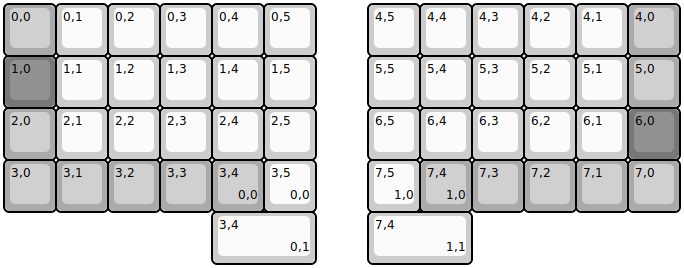
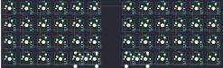

## keebio/levinson/levinson-rev2

[layout](levinson-rev2-kle.json) - [PCB](levinson-rev2.kicad_pcb)

{:loading="lazy"}

[Open in keyboard-layout-editor](http://www.keyboard-layout-editor.com/##@@_c=#aaaaaa;&=0,0&_c=#cccccc;&=0,1&=0,2&=0,3&=0,4&=0,5&_x:1;&=4,5&=4,4&=4,3&=4,2&=4,1&_c=#aaaaaa;&=4,0;&@_c=#777777;&=1,0&_c=#cccccc;&=1,1&=1,2&=1,3&=1,4&=1,5&_x:1;&=5,5&=5,4&=5,3&=5,2&=5,1&_c=#aaaaaa;&=5,0;&@=2,0&_c=#cccccc;&=2,1&=2,2&=2,3&=2,4&=2,5&_x:1;&=6,5&=6,4&=6,3&=6,2&=6,1&_c=#777777;&=6,0;&@_c=#aaaaaa;&=3,0&=3,1&=3,2&=3,3&=3,4%0A%0A%0A0,0&_c=#cccccc;&=3,5%0A%0A%0A0,0&_x:1;&=7,5%0A%0A%0A1,0&_c=#aaaaaa;&=7,4%0A%0A%0A1,0&=7,3&=7,2&=7,1&=7,0;&@_x:4&c=#cccccc&w:2;&=3,5%0A%0A%0A0,1&_x:1&w:2;&=7,5%0A%0A%0A1,1)

{:loading="lazy"}

## keebio/levinson/levinson-rev3

[layout](levinson-rev3-kle.json) - [PCB](levinson-rev3.kicad_pcb)

{:loading="lazy"}

[Open in keyboard-layout-editor](http://www.keyboard-layout-editor.com/##@@_c=#aaaaaa;&=0,0&_c=#cccccc;&=0,1&=0,2&=0,3&=0,4&=0,5&_x:1;&=4,5&=4,4&=4,3&=4,2&=4,1&_c=#aaaaaa;&=4,0;&@_c=#777777;&=1,0&_c=#cccccc;&=1,1&=1,2&=1,3&=1,4&=1,5&_x:1;&=5,5&=5,4&=5,3&=5,2&=5,1&_c=#aaaaaa;&=5,0;&@=2,0&_c=#cccccc;&=2,1&=2,2&=2,3&=2,4&=2,5&_x:1;&=6,5&=6,4&=6,3&=6,2&=6,1&_c=#777777;&=6,0;&@_c=#aaaaaa;&=3,0&=3,1&=3,2&=3,3&=3,4%0A%0A%0A0,0&_c=#cccccc;&=3,5%0A%0A%0A0,0&_x:1;&=7,5%0A%0A%0A1,0&_c=#aaaaaa;&=7,4%0A%0A%0A1,0&=7,3&=7,2&=7,1&=7,0;&@_x:4&c=#cccccc&w:2;&=3,4%0A%0A%0A0,1&_x:1&w:2;&=7,4%0A%0A%0A1,1)

{:loading="lazy"}

