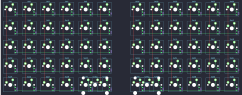
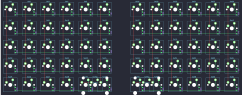

## keebio/nyquist/nyquist-rev2

[layout](nyquist-rev2-kle.json) - [PCB](nyquist-rev2.kicad_pcb)

{:loading="lazy"}

[Open in keyboard-layout-editor](http://www.keyboard-layout-editor.com/##@@=0,0&=0,1&=0,2&=0,3&=0,4&=0,5&_x:0.75;&=5,0&=5,1&=5,2&=5,3&=5,4&_c=#aaaaaa;&=5,5;&@=1,0&_c=#cccccc;&=1,1&=1,2&=1,3&=1,4&=1,5&_x:0.75;&=6,0&=6,1&=6,2&=6,3&=6,4&_c=#aaaaaa;&=6,5;&@_c=#777777;&=2,0&_c=#cccccc;&=2,1&=2,2&=2,3&=2,4&=2,5&_x:0.75;&=7,0&=7,1&=7,2&=7,3&=7,4&=7,5;&@_c=#aaaaaa;&=3,0&_c=#cccccc;&=3,1&=3,2&=3,3&=3,4&=3,5&_x:0.75;&=8,0&=8,1&=8,2&=8,3&=8,4&_c=#777777;&=8,5;&@_c=#aaaaaa;&=4,0&=4,1&=4,2&=4,3&=4,4%0A%0A%0A0,0&_c=#cccccc;&=4,5%0A%0A%0A0,0&_x:0.75;&=9,0%0A%0A%0A1,0&_c=#aaaaaa;&=9,1%0A%0A%0A1,0&_c=#777777;&=9,2&=9,3&=9,4&=9,5;&@_x:4&c=#cccccc&w:2;&=4,5%0A%0A%0A0,1&_x:0.75&w:2;&=9,0%0A%0A%0A1,1)

{:loading="lazy"}

## keebio/nyquist/nyquist-rev3

[layout](nyquist-rev3-kle.json) - [PCB](nyquist-rev3.kicad_pcb)

{:loading="lazy"}

[Open in keyboard-layout-editor](http://www.keyboard-layout-editor.com/##@@=0,0&=0,1&=0,2&=0,3&=0,4&=0,5&_x:0.75;&=5,0&=5,1&=5,2&=5,3&=5,4&_c=#aaaaaa;&=5,5;&@=1,0&_c=#cccccc;&=1,1&=1,2&=1,3&=1,4&=1,5&_x:0.75;&=6,0&=6,1&=6,2&=6,3&=6,4&_c=#aaaaaa;&=6,5;&@_c=#777777;&=2,0&_c=#cccccc;&=2,1&=2,2&=2,3&=2,4&=2,5&_x:0.75;&=7,0&=7,1&=7,2&=7,3&=7,4&=7,5;&@_c=#aaaaaa;&=3,0&_c=#cccccc;&=3,1&=3,2&=3,3&=3,4&=3,5&_x:0.75;&=8,0&=8,1&=8,2&=8,3&=8,4&_c=#777777;&=8,5;&@_c=#aaaaaa;&=4,0&=4,1&=4,2&=4,3&=4,4%0A%0A%0A0,0&_c=#cccccc;&=4,5%0A%0A%0A0,0&_x:0.75;&=9,0%0A%0A%0A1,0&_c=#aaaaaa;&=9,1%0A%0A%0A1,0&_c=#777777;&=9,2&=9,3&=9,4&=9,5;&@_x:4&c=#cccccc&w:2;&=4,4%0A%0A%0A0,1&_x:0.75&w:2;&=9,0%0A%0A%0A1,1)

{:loading="lazy"}

