## keebio/quefrency/quefrency-rev1

[layout](quefrency-rev1-kle.json) - [PCB](quefrency-rev1.kicad_pcb)

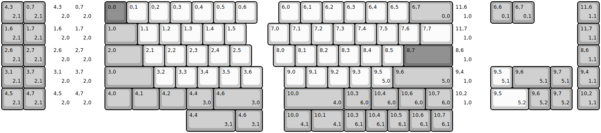{:loading="lazy"}

[Open in keyboard-layout-editor](http://www.keyboard-layout-editor.com/##@@_x:2.25&d:true;&=4,3%0A%0A%0A2,0&_d:true;&=0,7%0A%0A%0A2,0&_x:0.5&c=#777777;&=0,0&_c=#cccccc;&=0,1&=0,2&=0,3&=0,4&=0,5&=0,6&_x:1.0;&=6,0&=6,1&=6,2&=6,3&=6,4&=6,5&_c=#aaaaaa&w:2;&=6,7%0A%0A%0A0,0&_c=#cccccc&d:true;&=11,6%0A%0A%0A1,0;&@_x:2.25&d:true;&=1,6%0A%0A%0A2,0&_d:true;&=1,7%0A%0A%0A2,0&_x:0.5&c=#aaaaaa&w:1.5;&=1,0&_c=#cccccc;&=1,1&=1,2&=1,3&=1,4&=1,5&_x:1.0;&=7,0&=7,1&=7,2&=7,3&=7,4&=7,5&=7,6&_w:1.5;&=7,7&_d:true;&=11,7%0A%0A%0A1,0;&@_x:2.25&d:true;&=2,6%0A%0A%0A2,0&_d:true;&=2,7%0A%0A%0A2,0&_x:0.5&c=#aaaaaa&w:1.75;&=2,0&_c=#cccccc;&=2,1&=2,2&=2,3&=2,4&=2,5&_x:1.0;&=8,0&=8,1&=8,2&=8,3&=8,4&=8,5&_c=#777777&w:2.25;&=8,7&_c=#cccccc&d:true;&=8,6%0A%0A%0A1,0;&@_x:2.25&d:true;&=3,1%0A%0A%0A2,0&_d:true;&=3,7%0A%0A%0A2,0&_x:0.5&c=#aaaaaa&w:2.25;&=3,0&_c=#cccccc;&=3,2&=3,3&=3,4&=3,5&=3,6&_x:1.0;&=9,0&=9,1&=9,2&=9,3&=9,5%0A%0A%0A5,0&_c=#aaaaaa&w:2.75;&=9,6%0A%0A%0A5,0&_c=#cccccc&d:true;&=9,4%0A%0A%0A1,0;&@_x:2.25&d:true;&=4,5%0A%0A%0A2,0&_d:true;&=4,7%0A%0A%0A2,0&_x:0.5&c=#aaaaaa&w:1.25;&=4,0&_w:1.25;&=4,1&_w:1.25;&=4,2&_w:1.25;&=4,4%0A%0A%0A3,0&_w:2.25;&=4,6%0A%0A%0A3,0&_x:1.0&w:2.75;&=10,0%0A%0A%0A4,0&_w:1.25;&=10,3%0A%0A%0A6,0&_w:1.25;&=10,4%0A%0A%0A6,0&_w:1.25;&=10,6%0A%0A%0A6,0&_w:1.25;&=10,7%0A%0A%0A6,0&_c=#cccccc&d:true;&=10,2%0A%0A%0A1,0;&@_y:-5&c=#aaaaaa;&=4,3%0A%0A%0A2,1&=0,7%0A%0A%0A2,1&_x:20.5;&=6,6%0A%0A%0A0,1&=6,7%0A%0A%0A0,1&_x:2.0;&=11,6%0A%0A%0A1,1;&@=1,6%0A%0A%0A2,1&=1,7%0A%0A%0A2,1&_x:24.5;&=11,7%0A%0A%0A1,1;&@=2,6%0A%0A%0A2,1&=2,7%0A%0A%0A2,1&_x:24.5;&=8,6%0A%0A%0A1,1;&@=3,1%0A%0A%0A2,1&=3,7%0A%0A%0A2,1&_x:20.5&c=#cccccc;&=9,5%0A%0A%0A5,1&_c=#aaaaaa&w:1.75;&=9,6%0A%0A%0A5,1&=9,7%0A%0A%0A5,1&_x:0.25;&=9,4%0A%0A%0A1,1;&@=4,5%0A%0A%0A2,1&=4,7%0A%0A%0A2,1&_x:20.5&c=#cccccc&w:1.75;&=9,5%0A%0A%0A5,2&_c=#aaaaaa;&=9,6%0A%0A%0A5,2&=9,7%0A%0A%0A5,2&_x:0.25;&=10,2%0A%0A%0A1,1;&@_x:8.5&w:2.25;&=4,4%0A%0A%0A3,1&_w:1.25;&=4,6%0A%0A%0A3,1&_x:1.0&w:1.25;&=10,0%0A%0A%0A4,1&_w:1.5;&=10,1%0A%0A%0A4,1&=10,3%0A%0A%0A6,1&=10,4%0A%0A%0A6,1&=10,5%0A%0A%0A6,1&=10,6%0A%0A%0A6,1&=10,7%0A%0A%0A6,1)

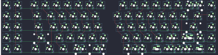{:loading="lazy"}

## keebio/quefrency/quefrency-rev2

[layout](quefrency-rev2-kle.json) - [PCB](quefrency-rev2.kicad_pcb)

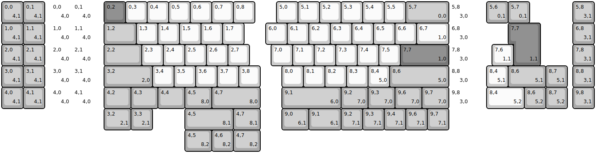{:loading="lazy"}

[Open in keyboard-layout-editor](http://www.keyboard-layout-editor.com/##@@_x:2.25&d:true;&=0,0%0A%0A%0A4,0&_d:true;&=0,1%0A%0A%0A4,0&_x:0.5&c=#777777;&=0,2&_c=#cccccc;&=0,3&=0,4&=0,5&=0,6&=0,7&=0,8&_x:1.0;&=5,0&=5,1&=5,2&=5,3&=5,4&=5,5&_c=#aaaaaa&w:2;&=5,7%0A%0A%0A0,0&_c=#cccccc&d:true;&=5,8%0A%0A%0A3,0;&@_x:2.25&d:true;&=1,0%0A%0A%0A4,0&_d:true;&=1,1%0A%0A%0A4,0&_x:0.5&c=#aaaaaa&w:1.5;&=1,2&_c=#cccccc;&=1,3&=1,4&=1,5&=1,6&=1,7&_x:1.0;&=6,0&=6,1&=6,2&=6,3&=6,4&=6,5&=6,6&_w:1.5;&=6,7%0A%0A%0A1,0&_d:true;&=6,8%0A%0A%0A3,0;&@_x:2.25&d:true;&=2,0%0A%0A%0A4,0&_d:true;&=2,1%0A%0A%0A4,0&_x:0.5&c=#aaaaaa&w:1.75;&=2,2&_c=#cccccc;&=2,3&=2,4&=2,5&=2,6&=2,7&_x:1.0;&=7,0&=7,1&=7,2&=7,3&=7,4&=7,5&_c=#777777&w:2.25;&=7,7%0A%0A%0A1,0&_c=#cccccc&d:true;&=7,8%0A%0A%0A3,0;&@_x:2.25&d:true;&=3,0%0A%0A%0A4,0&_d:true;&=3,1%0A%0A%0A4,0&_x:0.5&c=#aaaaaa&w:2.25;&=3,2%0A%0A%0A2,0&_c=#cccccc;&=3,4&=3,5&=3,6&=3,7&=3,8&_x:1.0;&=8,0&=8,1&=8,2&=8,3&=8,4%0A%0A%0A5,0&_c=#aaaaaa&w:2.75;&=8,6%0A%0A%0A5,0&_c=#cccccc&d:true;&=8,8%0A%0A%0A3,0;&@_x:2.25&d:true;&=4,0%0A%0A%0A4,0&_d:true;&=4,1%0A%0A%0A4,0&_x:0.5&c=#aaaaaa&w:1.25;&=4,2&_w:1.25;&=4,3&_w:1.25;&=4,4&_w:1.25;&=4,5%0A%0A%0A8,0&_w:2.25;&=4,7%0A%0A%0A8,0&_x:1.0&w:2.75;&=9,1%0A%0A%0A6,0&_w:1.25;&=9,2%0A%0A%0A7,0&_w:1.25;&=9,3%0A%0A%0A7,0&_w:1.25;&=9,6%0A%0A%0A7,0&_w:1.25;&=9,7%0A%0A%0A7,0&_c=#cccccc&d:true;&=9,8%0A%0A%0A3,0;&@_y:-5&c=#aaaaaa;&=0,0%0A%0A%0A4,1&=0,1%0A%0A%0A4,1&_x:20.5;&=5,6%0A%0A%0A0,1&=5,7%0A%0A%0A0,1&_x:2.0;&=5,8%0A%0A%0A3,1;&@=1,0%0A%0A%0A4,1&=1,1%0A%0A%0A4,1&_x:21.75&c=#777777&w:1.25&h:2&w2:1.5&h2:1&x2:-0.25;&=7,7%0A%0A%0A1,1&_x:1.5&c=#aaaaaa;&=6,8%0A%0A%0A3,1;&@=2,0%0A%0A%0A4,1&=2,1%0A%0A%0A4,1&_x:20.75&c=#cccccc;&=7,6%0A%0A%0A1,1&_x:2.75&c=#aaaaaa;&=7,8%0A%0A%0A3,1;&@=3,0%0A%0A%0A4,1&=3,1%0A%0A%0A4,1&_x:20.5&c=#cccccc;&=8,4%0A%0A%0A5,1&_c=#aaaaaa&w:1.75;&=8,6%0A%0A%0A5,1&=8,7%0A%0A%0A5,1&_x:0.25;&=8,8%0A%0A%0A3,1;&@=4,0%0A%0A%0A4,1&=4,1%0A%0A%0A4,1&_x:20.5&c=#cccccc&w:1.75;&=8,4%0A%0A%0A5,2&_c=#aaaaaa;&=8,6%0A%0A%0A5,2&=8,7%0A%0A%0A5,2&_x:0.25;&=9,8%0A%0A%0A3,1;&@_x:4.75&w:1.25;&=3,2%0A%0A%0A2,1&=3,3%0A%0A%0A2,1&_x:1.5&w:2.25;&=4,5%0A%0A%0A8,1&_w:1.25;&=4,7%0A%0A%0A8,1&_x:1.0&w:1.25;&=9,0%0A%0A%0A6,1&_w:1.5;&=9,1%0A%0A%0A6,1&=9,2%0A%0A%0A7,1&=9,3%0A%0A%0A7,1&=9,4%0A%0A%0A7,1&=9,6%0A%0A%0A7,1&=9,7%0A%0A%0A7,1;&@_x:8.5&w:1.25;&=4,5%0A%0A%0A8,2&=4,6%0A%0A%0A8,2&_w:1.25;&=4,7%0A%0A%0A8,2)

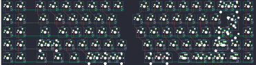{:loading="lazy"}

## keebio/quefrency/quefrency-rev3

[layout](quefrency-rev3-kle.json) - [PCB](quefrency-rev3.kicad_pcb)

{:loading="lazy"}

[Open in keyboard-layout-editor](http://www.keyboard-layout-editor.com/##@@_x:2.25&d:true;&=0,0%0A%0A%0A4,0&_d:true;&=0,1%0A%0A%0A4,0&_x:0.5&c=#777777;&=0,2&_c=#cccccc;&=0,3&=0,4&=0,5&=0,6&=0,7&=0,8&_x:1.0;&=5,0&=5,1&=5,2&=5,3&=5,4&=5,5&_c=#aaaaaa&w:2;&=5,7%0A%0A%0A0,0&_c=#cccccc&d:true;&=5,8%0A%0A%0A3,0;&@_x:2.25&d:true;&=1,0%0A%0A%0A4,0&_d:true;&=1,1%0A%0A%0A4,0&_x:0.5&c=#aaaaaa&w:1.5;&=1,2&_c=#cccccc;&=1,3&=1,4&=1,5&=1,6&=1,7&_x:1.0;&=6,0&=6,1&=6,2&=6,3&=6,4&=6,5&=6,6&_w:1.5;&=6,7%0A%0A%0A1,0&_d:true;&=6,8%0A%0A%0A3,0;&@_x:2.25&d:true;&=2,0%0A%0A%0A4,0&_d:true;&=2,1%0A%0A%0A4,0&_x:0.5&c=#aaaaaa&w:1.75;&=2,2&_c=#cccccc;&=2,3&=2,4&=2,5&=2,6&=2,7&_x:1.0;&=7,0&=7,1&=7,2&=7,3&=7,4&=7,5&_c=#777777&w:2.25;&=7,7%0A%0A%0A1,0&_c=#cccccc&d:true;&=7,8%0A%0A%0A3,0;&@_x:2.25&d:true;&=3,0%0A%0A%0A4,0&_d:true;&=3,1%0A%0A%0A4,0&_x:0.5&c=#aaaaaa&w:2.25;&=3,2%0A%0A%0A2,0&_c=#cccccc;&=3,4&=3,5&=3,6&=3,7&=3,8&_x:1.0;&=8,0&=8,1&=8,2&=8,3&=8,4%0A%0A%0A5,0&_c=#aaaaaa&w:2.75;&=8,6%0A%0A%0A5,0&_c=#cccccc&d:true;&=8,8%0A%0A%0A3,0;&@_x:2.25&d:true;&=4,0%0A%0A%0A4,0&_d:true;&=4,1%0A%0A%0A4,0&_x:0.5&c=#aaaaaa&w:1.25;&=4,2&_w:1.25;&=4,3&_w:1.25;&=4,4&_w:1.25;&=4,5%0A%0A%0A8,0&_w:2.25;&=4,7%0A%0A%0A8,0&_x:1.0&w:2.75;&=9,1%0A%0A%0A6,0&_w:1.25;&=9,2%0A%0A%0A7,0&_w:1.25;&=9,3%0A%0A%0A7,0&_w:1.25;&=9,6%0A%0A%0A7,0&_w:1.25;&=9,7%0A%0A%0A7,0&_c=#cccccc&d:true;&=9,8%0A%0A%0A3,0;&@_y:-5&c=#aaaaaa;&=0,0%0A%0A%0A4,1&=0,1%0A%0A%0A4,1&_x:20.5;&=5,6%0A%0A%0A0,1&=5,7%0A%0A%0A0,1&_x:2.0;&=5,8%0A%0A%0A3,1;&@=1,0%0A%0A%0A4,1&=1,1%0A%0A%0A4,1&_x:21.75&c=#777777&w:1.25&h:2&w2:1.5&h2:1&x2:-0.25;&=7,7%0A%0A%0A1,1&_x:1.5&c=#aaaaaa;&=6,8%0A%0A%0A3,1;&@=2,0%0A%0A%0A4,1&=2,1%0A%0A%0A4,1&_x:20.75&c=#cccccc;&=7,6%0A%0A%0A1,1&_x:2.75&c=#aaaaaa;&=7,8%0A%0A%0A3,1;&@=3,0%0A%0A%0A4,1&=3,1%0A%0A%0A4,1&_x:20.5&c=#cccccc;&=8,4%0A%0A%0A5,1&_c=#aaaaaa&w:1.75;&=8,6%0A%0A%0A5,1&=8,7%0A%0A%0A5,1&_x:0.25;&=8,8%0A%0A%0A3,1;&@=4,0%0A%0A%0A4,1&=4,1%0A%0A%0A4,1&_x:20.5&c=#cccccc&w:1.75;&=8,4%0A%0A%0A5,2&_c=#aaaaaa;&=8,6%0A%0A%0A5,2&=8,7%0A%0A%0A5,2&_x:0.25;&=9,8%0A%0A%0A3,1;&@_x:4.75&w:1.25;&=3,2%0A%0A%0A2,1&=3,3%0A%0A%0A2,1&_x:1.5&w:2.25;&=4,5%0A%0A%0A8,1&_w:1.25;&=4,7%0A%0A%0A8,1&_x:1.0&w:1.25;&=9,0%0A%0A%0A6,1&_w:1.5;&=9,1%0A%0A%0A6,1&=9,2%0A%0A%0A7,1&=9,3%0A%0A%0A7,1&=9,4%0A%0A%0A7,1&=9,6%0A%0A%0A7,1&=9,7%0A%0A%0A7,1;&@_x:8.5&w:1.25;&=4,5%0A%0A%0A8,2&=4,6%0A%0A%0A8,2&_w:1.25;&=4,7%0A%0A%0A8,2)

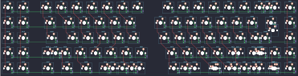{:loading="lazy"}

## keebio/quefrency/quefrency-rev3a

[layout](quefrency-rev3a-kle.json) - [PCB](quefrency-rev3a.kicad_pcb)

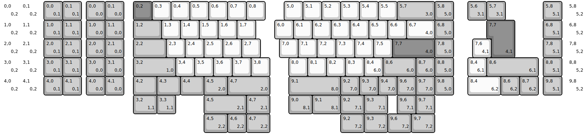{:loading="lazy"}

[Open in keyboard-layout-editor](http://www.keyboard-layout-editor.com/##@@_x:4.5&c=#aaaaaa;&=0,0%0A%0A%0A0,0&=0,1%0A%0A%0A0,0&_x:0.5&c=#777777;&=0,2&_c=#cccccc;&=0,3&=0,4&=0,5&=0,6&=0,7&=0,8&_x:1.0;&=5,0&=5,1&=5,2&=5,3&=5,4&=5,5&_c=#aaaaaa&w:2;&=5,7%0A%0A%0A3,0&=5,8%0A%0A%0A5,0;&@_x:4.5;&=1,0%0A%0A%0A0,0&=1,1%0A%0A%0A0,0&_x:0.5&w:1.5;&=1,2&_c=#cccccc;&=1,3&=1,4&=1,5&=1,6&=1,7&_x:1.0;&=6,0&=6,1&=6,2&=6,3&=6,4&=6,5&=6,6&_w:1.5;&=6,7%0A%0A%0A4,0&_c=#aaaaaa;&=6,8%0A%0A%0A5,0;&@_x:4.5;&=2,0%0A%0A%0A0,0&=2,1%0A%0A%0A0,0&_x:0.5&w:1.75;&=2,2&_c=#cccccc;&=2,3&=2,4&=2,5&=2,6&=2,7&_x:1.0;&=7,0&=7,1&=7,2&=7,3&=7,4&=7,5&_c=#777777&w:2.25;&=7,7%0A%0A%0A4,0&_c=#aaaaaa;&=7,8%0A%0A%0A5,0;&@_x:4.5;&=3,0%0A%0A%0A0,0&=3,1%0A%0A%0A0,0&_x:0.5&w:2.25;&=3,2%0A%0A%0A1,0&_c=#cccccc;&=3,4&=3,5&=3,6&=3,7&=3,8&_x:1.0;&=8,0&=8,1&=8,2&=8,3&=8,4%0A%0A%0A6,0&_c=#aaaaaa&w:1.75;&=8,6%0A%0A%0A6,0&=8,7%0A%0A%0A6,0&=8,8%0A%0A%0A5,0;&@_x:4.5;&=4,0%0A%0A%0A0,0&=4,1%0A%0A%0A0,0&_x:0.5&w:1.25;&=4,2&_w:1.25;&=4,3&_w:1.25;&=4,4&_w:1.25;&=4,5%0A%0A%0A2,0&_w:2.25;&=4,7%0A%0A%0A2,0&_x:1.0&w:2.75;&=9,1%0A%0A%0A8,0&=9,2%0A%0A%0A7,0&=9,3%0A%0A%0A7,0&=9,4%0A%0A%0A7,0&=9,6%0A%0A%0A7,0&=9,7%0A%0A%0A7,0&=9,8%0A%0A%0A5,0;&@_y:-5&c=#cccccc&d:true;&=0,0%0A%0A%0A0,2&_d:true;&=0,1%0A%0A%0A0,2&_x:0.25&c=#aaaaaa;&=0,0%0A%0A%0A0,1%0A%0A%0A%0A%0A%0Ae0&=0,1%0A%0A%0A0,1&_x:20.5;&=5,6%0A%0A%0A3,1&=5,7%0A%0A%0A3,1&_x:2.0;&=5,8%0A%0A%0A5,1%0A%0A%0A%0A%0A%0Ae1&_x:0.25&c=#cccccc&d:true;&=5,8%0A%0A%0A5,2;&@_d:true;&=1,0%0A%0A%0A0,2&_d:true;&=1,1%0A%0A%0A0,2&_x:0.25&c=#aaaaaa;&=1,0%0A%0A%0A0,1&=1,1%0A%0A%0A0,1&_x:21.75&c=#777777&w:1.25&h:2&w2:1.5&h2:1&x2:-0.25;&=7,7%0A%0A%0A4,1&_x:1.5&c=#aaaaaa;&=6,8%0A%0A%0A5,1&_x:0.25&c=#cccccc&d:true;&=6,8%0A%0A%0A5,2;&@_d:true;&=2,0%0A%0A%0A0,2&_d:true;&=2,1%0A%0A%0A0,2&_x:0.25&c=#aaaaaa;&=2,0%0A%0A%0A0,1&=2,1%0A%0A%0A0,1&_x:20.75&c=#cccccc;&=7,6%0A%0A%0A4,1&_x:2.75&c=#aaaaaa;&=7,8%0A%0A%0A5,1&_x:0.25&c=#cccccc&d:true;&=7,8%0A%0A%0A5,2;&@_d:true;&=3,0%0A%0A%0A0,2&_d:true;&=3,1%0A%0A%0A0,2&_x:0.25&c=#aaaaaa;&=3,0%0A%0A%0A0,1&=3,1%0A%0A%0A0,1&_x:20.5&c=#cccccc;&=8,4%0A%0A%0A6,1&_c=#aaaaaa&w:2.75;&=8,6%0A%0A%0A6,1&_x:0.25;&=8,8%0A%0A%0A5,1&_x:0.25&c=#cccccc&d:true;&=8,8%0A%0A%0A5,2;&@_d:true;&=4,0%0A%0A%0A0,2&_d:true;&=4,1%0A%0A%0A0,2&_x:0.25&c=#aaaaaa;&=4,0%0A%0A%0A0,1&=4,1%0A%0A%0A0,1&_x:20.5&c=#cccccc&w:1.75;&=8,4%0A%0A%0A6,2&_c=#aaaaaa;&=8,6%0A%0A%0A6,2&=8,7%0A%0A%0A6,2&_x:0.25;&=9,8%0A%0A%0A5,1&_x:0.25&c=#cccccc&d:true;&=9,8%0A%0A%0A5,2;&@_x:7&c=#aaaaaa&w:1.25;&=3,2%0A%0A%0A1,1&=3,3%0A%0A%0A1,1&_x:1.5&w:2.25;&=4,5%0A%0A%0A2,1&_w:1.25;&=4,7%0A%0A%0A2,1&_x:1.0&w:1.25;&=9,0%0A%0A%0A8,1&_w:1.5;&=9,1%0A%0A%0A8,1&_w:1.25;&=9,2%0A%0A%0A7,1&_w:1.25;&=9,3%0A%0A%0A7,1&_x:0.5;&=9,6%0A%0A%0A7,1&=9,7%0A%0A%0A7,1;&@_x:10.75&w:1.25;&=4,5%0A%0A%0A2,2&=4,6%0A%0A%0A2,2&_w:1.25;&=4,7%0A%0A%0A2,2&_x:3.75&w:1.25;&=9,2%0A%0A%0A7,2&_w:1.25;&=9,3%0A%0A%0A7,2&_w:1.25;&=9,6%0A%0A%0A7,2&_w:1.25;&=9,7%0A%0A%0A7,2)

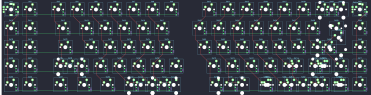{:loading="lazy"}

## keebio/quefrency/quefrency-rev4

[layout](quefrency-rev4-kle.json) - [PCB](quefrency-rev4.kicad_pcb)

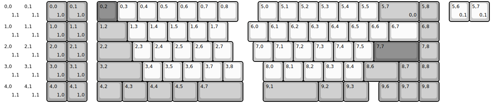{:loading="lazy"}

[Open in keyboard-layout-editor](http://www.keyboard-layout-editor.com/##@@_x:2.25&c=#aaaaaa;&=0,0%0A%0A%0A1,0&=0,1%0A%0A%0A1,0&_x:0.5&c=#777777;&=0,2&_c=#cccccc;&=0,3&=0,4&=0,5&=0,6&=0,7&=0,8&_x:1.0;&=5,0&=5,1&=5,2&=5,3&=5,4&=5,5&_c=#aaaaaa&w:2;&=5,7%0A%0A%0A0,0&=5,8;&@_x:2.25;&=1,0%0A%0A%0A1,0&=1,1%0A%0A%0A1,0&_x:0.5&w:1.5;&=1,2&_c=#cccccc;&=1,3&=1,4&=1,5&=1,6&=1,7&_x:1.0;&=6,0&=6,1&=6,2&=6,3&=6,4&=6,5&=6,6&_w:1.5;&=6,7&_c=#aaaaaa;&=6,8;&@_x:2.25;&=2,0%0A%0A%0A1,0&=2,1%0A%0A%0A1,0&_x:0.5&w:1.75;&=2,2&_c=#cccccc;&=2,3&=2,4&=2,5&=2,6&=2,7&_x:1.0;&=7,0&=7,1&=7,2&=7,3&=7,4&=7,5&_c=#777777&w:2.25;&=7,7&_c=#aaaaaa;&=7,8;&@_x:2.25;&=3,0%0A%0A%0A1,0&=3,1%0A%0A%0A1,0&_x:0.5&w:2.25;&=3,2&_c=#cccccc;&=3,4&=3,5&=3,6&=3,7&=3,8&_x:1.0;&=8,0&=8,1&=8,2&=8,3&=8,4&_c=#aaaaaa&w:1.75;&=8,6&=8,7&=8,8;&@_x:2.25;&=4,0%0A%0A%0A1,0&=4,1%0A%0A%0A1,0&_x:0.5&w:1.25;&=4,2&_w:1.25;&=4,3&_w:1.25;&=4,4&_w:1.25;&=4,5&_w:2.25;&=4,7&_x:1.0&w:2.75;&=9,1&_w:1.25;&=9,2&_w:1.25;&=9,3&_x:0.5;&=9,6&=9,7&=9,8;&@_y:-5&c=#cccccc&d:true;&=0,0%0A%0A%0A1,1&_d:true;&=0,1%0A%0A%0A1,1&_x:20.25;&=5,6%0A%0A%0A0,1&=5,7%0A%0A%0A0,1;&@_d:true;&=1,0%0A%0A%0A1,1&_d:true;&=1,1%0A%0A%0A1,1;&@_d:true;&=2,0%0A%0A%0A1,1&_d:true;&=2,1%0A%0A%0A1,1;&@_d:true;&=3,0%0A%0A%0A1,1&_d:true;&=3,1%0A%0A%0A1,1;&@_d:true;&=4,0%0A%0A%0A1,1&_d:true;&=4,1%0A%0A%0A1,1)

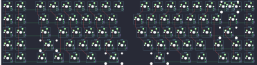{:loading="lazy"}

## keebio/quefrency/quefrency-rev4a

[layout](quefrency-rev4a-kle.json) - [PCB](quefrency-rev4a.kicad_pcb)

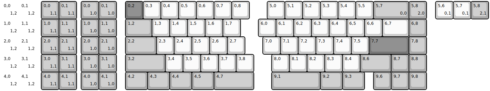{:loading="lazy"}

[Open in keyboard-layout-editor](http://www.keyboard-layout-editor.com/##@@_x:4.5&c=#aaaaaa;&=0,0%0A%0A%0A1,0&=0,1%0A%0A%0A1,0&_x:0.5&c=#777777;&=0,2&_c=#cccccc;&=0,3&=0,4&=0,5&=0,6&=0,7&=0,8&_x:1.0;&=5,0&=5,1&=5,2&=5,3&=5,4&=5,5&_c=#aaaaaa&w:2;&=5,7%0A%0A%0A0,0&=5,8%0A%0A%0A2,0;&@_x:4.5;&=1,0%0A%0A%0A1,0&=1,1%0A%0A%0A1,0&_x:0.5&w:1.5;&=1,2&_c=#cccccc;&=1,3&=1,4&=1,5&=1,6&=1,7&_x:1.0;&=6,0&=6,1&=6,2&=6,3&=6,4&=6,5&=6,6&_w:1.5;&=6,7&_c=#aaaaaa;&=6,8;&@_x:4.5;&=2,0%0A%0A%0A1,0&=2,1%0A%0A%0A1,0&_x:0.5&w:1.75;&=2,2&_c=#cccccc;&=2,3&=2,4&=2,5&=2,6&=2,7&_x:1.0;&=7,0&=7,1&=7,2&=7,3&=7,4&=7,5&_c=#777777&w:2.25;&=7,7&_c=#aaaaaa;&=7,8;&@_x:4.5;&=3,0%0A%0A%0A1,0&=3,1%0A%0A%0A1,0&_x:0.5&w:2.25;&=3,2&_c=#cccccc;&=3,4&=3,5&=3,6&=3,7&=3,8&_x:1.0;&=8,0&=8,1&=8,2&=8,3&=8,4&_c=#aaaaaa&w:1.75;&=8,6&=8,7&=8,8;&@_x:4.5;&=4,0%0A%0A%0A1,0&=4,1%0A%0A%0A1,0&_x:0.5&w:1.25;&=4,2&_w:1.25;&=4,3&_w:1.25;&=4,4&_w:1.25;&=4,5&_w:2.25;&=4,7&_x:1.0&w:2.75;&=9,1&_w:1.25;&=9,2&_w:1.25;&=9,3&_x:0.5;&=9,6&=9,7&=9,8;&@_y:-5&c=#cccccc&d:true;&=0,0%0A%0A%0A1,2&_d:true;&=0,1%0A%0A%0A1,2&_x:0.25&c=#aaaaaa;&=0,0%0A%0A%0A1,1%0A%0A%0A%0A%0A%0Ae0&=0,1%0A%0A%0A1,1&_x:20.25&c=#cccccc;&=5,6%0A%0A%0A0,1&=5,7%0A%0A%0A0,1&_c=#aaaaaa;&=5,8%0A%0A%0A2,1%0A%0A%0A%0A%0A%0Ae1;&@_c=#cccccc&d:true;&=1,0%0A%0A%0A1,2&_d:true;&=1,1%0A%0A%0A1,2&_x:0.25&c=#aaaaaa;&=1,0%0A%0A%0A1,1&=1,1%0A%0A%0A1,1;&@_c=#cccccc&d:true;&=2,0%0A%0A%0A1,2&_d:true;&=2,1%0A%0A%0A1,2&_x:0.25&c=#aaaaaa;&=2,0%0A%0A%0A1,1&=2,1%0A%0A%0A1,1;&@_c=#cccccc&d:true;&=3,0%0A%0A%0A1,2&_d:true;&=3,1%0A%0A%0A1,2&_x:0.25&c=#aaaaaa;&=3,0%0A%0A%0A1,1&=3,1%0A%0A%0A1,1;&@_c=#cccccc&d:true;&=4,0%0A%0A%0A1,2&_d:true;&=4,1%0A%0A%0A1,2&_x:0.25&c=#aaaaaa;&=4,0%0A%0A%0A1,1&=4,1%0A%0A%0A1,1)

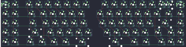{:loading="lazy"}

## keebio/quefrency/quefrency-rev5

[layout](quefrency-rev5-kle.json) - [PCB](quefrency-rev5.kicad_pcb)

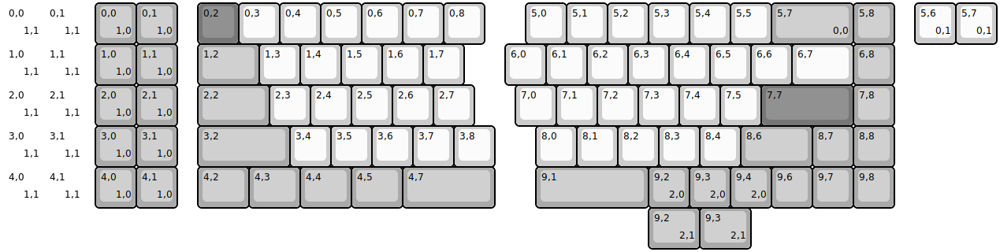{:loading="lazy"}

[Open in keyboard-layout-editor](http://www.keyboard-layout-editor.com/##@@_x:2.25&c=#aaaaaa;&=0,0%0A%0A%0A1,0&=0,1%0A%0A%0A1,0&_x:0.5&c=#777777;&=0,2&_c=#cccccc;&=0,3&=0,4&=0,5&=0,6&=0,7&=0,8&_x:1.0;&=5,0&=5,1&=5,2&=5,3&=5,4&=5,5&_c=#aaaaaa&w:2;&=5,7%0A%0A%0A0,0&=5,8;&@_x:2.25;&=1,0%0A%0A%0A1,0&=1,1%0A%0A%0A1,0&_x:0.5&w:1.5;&=1,2&_c=#cccccc;&=1,3&=1,4&=1,5&=1,6&=1,7&_x:1.0;&=6,0&=6,1&=6,2&=6,3&=6,4&=6,5&=6,6&_w:1.5;&=6,7&_c=#aaaaaa;&=6,8;&@_x:2.25;&=2,0%0A%0A%0A1,0&=2,1%0A%0A%0A1,0&_x:0.5&w:1.75;&=2,2&_c=#cccccc;&=2,3&=2,4&=2,5&=2,6&=2,7&_x:1.0;&=7,0&=7,1&=7,2&=7,3&=7,4&=7,5&_c=#777777&w:2.25;&=7,7&_c=#aaaaaa;&=7,8;&@_x:2.25;&=3,0%0A%0A%0A1,0&=3,1%0A%0A%0A1,0&_x:0.5&w:2.25;&=3,2&_c=#cccccc;&=3,4&=3,5&=3,6&=3,7&=3,8&_x:1.0;&=8,0&=8,1&=8,2&=8,3&=8,4&_c=#aaaaaa&w:1.75;&=8,6&=8,7&=8,8;&@_x:2.25;&=4,0%0A%0A%0A1,0&=4,1%0A%0A%0A1,0&_x:0.5&w:1.25;&=4,2&_w:1.25;&=4,3&_w:1.25;&=4,4&_w:1.25;&=4,5&_w:2.25;&=4,7&_x:1.0&w:2.75;&=9,1&=9,2%0A%0A%0A2,0&=9,3%0A%0A%0A2,0&=9,4%0A%0A%0A2,0&=9,6&=9,7&=9,8;&@_y:-5&c=#cccccc&d:true;&=0,0%0A%0A%0A1,1&_d:true;&=0,1%0A%0A%0A1,1&_x:20.25;&=5,6%0A%0A%0A0,1&=5,7%0A%0A%0A0,1;&@_d:true;&=1,0%0A%0A%0A1,1&_d:true;&=1,1%0A%0A%0A1,1;&@_d:true;&=2,0%0A%0A%0A1,1&_d:true;&=2,1%0A%0A%0A1,1;&@_d:true;&=3,0%0A%0A%0A1,1&_d:true;&=3,1%0A%0A%0A1,1;&@_d:true;&=4,0%0A%0A%0A1,1&_d:true;&=4,1%0A%0A%0A1,1;&@_x:15.75&c=#aaaaaa&w:1.25;&=9,2%0A%0A%0A2,1&_w:1.25;&=9,3%0A%0A%0A2,1)

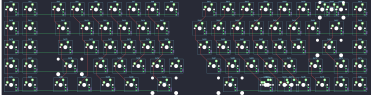{:loading="lazy"}

## keebio/quefrency/quefrency-rev5a

[layout](quefrency-rev5a-kle.json) - [PCB](quefrency-rev5a.kicad_pcb)

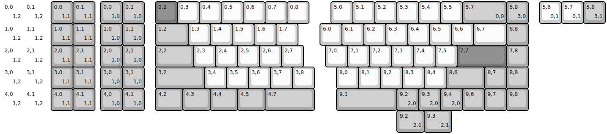{:loading="lazy"}

[Open in keyboard-layout-editor](http://www.keyboard-layout-editor.com/##@@_x:4.5&c=#aaaaaa;&=0,0%0A%0A%0A1,0&=0,1%0A%0A%0A1,0&_x:0.5&c=#777777;&=0,2&_c=#cccccc;&=0,3&=0,4&=0,5&=0,6&=0,7&=0,8&_x:1.0;&=5,0&=5,1&=5,2&=5,3&=5,4&=5,5&_c=#aaaaaa&w:2;&=5,7%0A%0A%0A0,0&=5,8%0A%0A%0A3,0;&@_x:4.5;&=1,0%0A%0A%0A1,0&=1,1%0A%0A%0A1,0&_x:0.5&w:1.5;&=1,2&_c=#cccccc;&=1,3&=1,4&=1,5&=1,6&=1,7&_x:1.0;&=6,0&=6,1&=6,2&=6,3&=6,4&=6,5&=6,6&_w:1.5;&=6,7&_c=#aaaaaa;&=6,8;&@_x:4.5;&=2,0%0A%0A%0A1,0&=2,1%0A%0A%0A1,0&_x:0.5&w:1.75;&=2,2&_c=#cccccc;&=2,3&=2,4&=2,5&=2,6&=2,7&_x:1.0;&=7,0&=7,1&=7,2&=7,3&=7,4&=7,5&_c=#777777&w:2.25;&=7,7&_c=#aaaaaa;&=7,8;&@_x:4.5;&=3,0%0A%0A%0A1,0&=3,1%0A%0A%0A1,0&_x:0.5&w:2.25;&=3,2&_c=#cccccc;&=3,4&=3,5&=3,6&=3,7&=3,8&_x:1.0;&=8,0&=8,1&=8,2&=8,3&=8,4&_c=#aaaaaa&w:1.75;&=8,6&=8,7&=8,8;&@_x:4.5;&=4,0%0A%0A%0A1,0&=4,1%0A%0A%0A1,0&_x:0.5&w:1.25;&=4,2&_w:1.25;&=4,3&_w:1.25;&=4,4&_w:1.25;&=4,5&_w:2.25;&=4,7&_x:1.0&w:2.75;&=9,1&=9,2%0A%0A%0A2,0&=9,3%0A%0A%0A2,0&=9,4%0A%0A%0A2,0&=9,6&=9,7&=9,8;&@_y:-5&c=#cccccc&d:true;&=0,0%0A%0A%0A1,2&_d:true;&=0,1%0A%0A%0A1,2&_x:0.25&c=#aaaaaa;&=0,0%0A%0A%0A1,1%0A%0A%0A%0A%0A%0Ae0&=0,1%0A%0A%0A1,1&_x:20.25&c=#cccccc;&=5,6%0A%0A%0A0,1&=5,7%0A%0A%0A0,1&_c=#aaaaaa;&=5,8%0A%0A%0A3,1%0A%0A%0A%0A%0A%0Ae1;&@_c=#cccccc&d:true;&=1,0%0A%0A%0A1,2&_d:true;&=1,1%0A%0A%0A1,2&_x:0.25&c=#aaaaaa;&=1,0%0A%0A%0A1,1&=1,1%0A%0A%0A1,1;&@_c=#cccccc&d:true;&=2,0%0A%0A%0A1,2&_d:true;&=2,1%0A%0A%0A1,2&_x:0.25&c=#aaaaaa;&=2,0%0A%0A%0A1,1&=2,1%0A%0A%0A1,1;&@_c=#cccccc&d:true;&=3,0%0A%0A%0A1,2&_d:true;&=3,1%0A%0A%0A1,2&_x:0.25&c=#aaaaaa;&=3,0%0A%0A%0A1,1&=3,1%0A%0A%0A1,1;&@_c=#cccccc&d:true;&=4,0%0A%0A%0A1,2&_d:true;&=4,1%0A%0A%0A1,2&_x:0.25&c=#aaaaaa;&=4,0%0A%0A%0A1,1&=4,1%0A%0A%0A1,1;&@_x:18&w:1.25;&=9,2%0A%0A%0A2,1&_w:1.25;&=9,3%0A%0A%0A2,1)

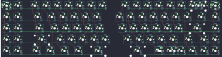{:loading="lazy"}

