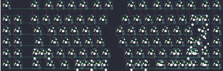
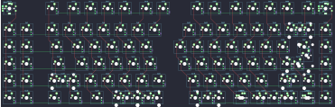
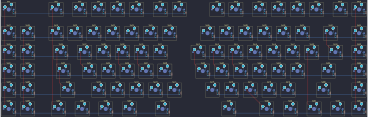
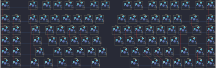
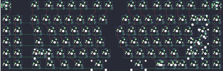

## keebio/sinc/sinc-rev1

[layout](sinc-rev1-kle.json) - [PCB](sinc-rev1.kicad_pcb)

{:loading="lazy"}

[Open in keyboard-layout-editor](http://www.keyboard-layout-editor.com/##@@_x:2.25&d:true;&=5,0%0A%0A%0A4,0&_x:1.5&c=#777777;&=5,2&_x:0.25&c=#cccccc;&=5,3&=5,4&=5,5&=5,6&_x:0.25&c=#aaaaaa;&=5,7&=5,8&_x:1.0;&=11,1&=11,2&_x:0.25&c=#cccccc;&=11,3&=11,4&=11,5&=11,6&_x:0.25;&=11,7&_d:true;&=11,8%0A%0A%0A3,0;&@_x:2.25&y:0.25&d:true;&=0,0%0A%0A%0A4,0&_d:true;&=0,1%0A%0A%0A4,0&_x:0.5&c=#aaaaaa;&=0,2&_c=#cccccc;&=0,3&=0,4&=0,5&=0,6&=0,7&=0,8&_x:1.0;&=6,0&=6,1&=6,2&=6,3&=6,4&=6,5&_c=#aaaaaa&w:2;&=6,7%0A%0A%0A0,0&_c=#cccccc&d:true;&=6,8%0A%0A%0A3,0;&@_x:2.25&d:true;&=1,0%0A%0A%0A4,0&_d:true;&=1,1%0A%0A%0A4,0&_x:0.5&c=#aaaaaa&w:1.5;&=1,2&_c=#cccccc;&=1,3&=1,4&=1,5&=1,6&=1,7&_x:1.0;&=7,0&=7,1&=7,2&=7,3&=7,4&=7,5&=7,6&_w:1.5;&=7,7%0A%0A%0A1,0&_d:true;&=7,8%0A%0A%0A3,0;&@_x:2.25&d:true;&=2,0%0A%0A%0A4,0&_d:true;&=2,1%0A%0A%0A4,0&_x:0.5&c=#aaaaaa&w:1.75;&=2,2&_c=#cccccc;&=2,3&=2,4&=2,5&=2,6&=2,7&_x:1.0;&=8,0&=8,1&=8,2&=8,3&=8,4&=8,5&_c=#777777&w:2.25;&=8,7%0A%0A%0A1,0&_c=#cccccc&d:true;&=8,8%0A%0A%0A3,0;&@_x:2.25&d:true;&=3,0%0A%0A%0A4,0&_d:true;&=3,1%0A%0A%0A4,0&_x:0.5&c=#aaaaaa&w:2.25;&=3,2%0A%0A%0A2,0&_c=#cccccc;&=3,4&=3,5&=3,6&=3,7&=3,8&_x:1.0;&=9,0&=9,1&=9,2&=9,3&=9,4%0A%0A%0A5,0&_c=#aaaaaa&w:2.75;&=9,6%0A%0A%0A5,0&_c=#cccccc&d:true;&=9,8%0A%0A%0A3,0;&@_x:2.25&d:true;&=4,0%0A%0A%0A4,0&_d:true;&=4,1%0A%0A%0A4,0&_x:0.5&c=#aaaaaa&w:1.25;&=4,2&_w:1.25;&=4,3&_w:1.25;&=4,4&_w:1.25;&=4,5%0A%0A%0A8,0&_c=#cccccc&w:2.25;&=4,7%0A%0A%0A8,0&_x:1.0&w:2.75;&=10,1%0A%0A%0A6,0&_c=#aaaaaa&w:1.25;&=10,2%0A%0A%0A7,0&_w:1.25;&=10,3%0A%0A%0A7,0&_w:1.25;&=10,6%0A%0A%0A7,0&_w:1.25;&=10,7%0A%0A%0A7,0&_c=#cccccc&d:true;&=10,8%0A%0A%0A3,0;&@_y:-6.25&c=#aaaaaa;&=5,0%0A%0A%0A4,1&_x:25.75&c=#cccccc;&=11,8%0A%0A%0A3,1;&@_y:0.25&c=#aaaaaa;&=0,0%0A%0A%0A4,1&=0,1%0A%0A%0A4,1&_x:20.5;&=6,6%0A%0A%0A0,1&=6,7%0A%0A%0A0,1&_x:2.25;&=6,8%0A%0A%0A3,1;&@=1,0%0A%0A%0A4,1&=1,1%0A%0A%0A4,1&_x:21.75&c=#777777&w:1.25&h:2&w2:1.5&h2:1&x2:-0.25;&=8,7%0A%0A%0A1,1&_x:1.75&c=#aaaaaa;&=7,8%0A%0A%0A3,1;&@=2,0%0A%0A%0A4,1&=2,1%0A%0A%0A4,1&_x:20.75&c=#cccccc;&=8,6%0A%0A%0A1,1&_x:3.0&c=#aaaaaa;&=8,8%0A%0A%0A3,1;&@=3,0%0A%0A%0A4,1&=3,1%0A%0A%0A4,1&_x:20.5&c=#cccccc;&=9,4%0A%0A%0A5,1&_c=#aaaaaa&w:1.75;&=9,6%0A%0A%0A5,1&=9,7%0A%0A%0A5,1&_x:0.5;&=9,8%0A%0A%0A3,1;&@=4,0%0A%0A%0A4,1&=4,1%0A%0A%0A4,1&_x:20.5&w:1.75;&=9,4%0A%0A%0A5,2&=9,6%0A%0A%0A5,2&=9,7%0A%0A%0A5,2&_x:0.5;&=10,8%0A%0A%0A3,1;&@_x:4.75&w:1.25;&=3,2%0A%0A%0A2,1&=3,3%0A%0A%0A2,1&_x:1.5&w:2.25;&=4,5%0A%0A%0A8,1&_w:1.25;&=4,7%0A%0A%0A8,1&_x:1.0&w:1.25;&=10,0%0A%0A%0A6,1&_w:1.5;&=10,1%0A%0A%0A6,1&=10,2%0A%0A%0A7,1&=10,3%0A%0A%0A7,1&=10,4%0A%0A%0A7,1&=10,6%0A%0A%0A7,1&=10,7%0A%0A%0A7,1;&@_x:8.5&w:1.25;&=4,5%0A%0A%0A8,2&=4,6%0A%0A%0A8,2&_w:1.25;&=4,7%0A%0A%0A8,2)

{:loading="lazy"}

## keebio/sinc/sinc-rev1a

[layout](sinc-rev1a-kle.json) - [PCB](sinc-rev1a.kicad_pcb)

{:loading="lazy"}

[Open in keyboard-layout-editor](http://www.keyboard-layout-editor.com/##@@_x:2.25&c=#aaaaaa;&=5,0%0A%0A%0A1,0%0A%0A%0A%0A%0A%0Ae0&_x:1.5&c=#777777;&=5,2&_x:0.25&c=#cccccc;&=5,3&=5,4&=5,5&=5,6&_x:0.25&c=#aaaaaa;&=5,7&=5,8&_x:1.0;&=11,1&=11,2&_x:0.25&c=#cccccc;&=11,3&=11,4&=11,5&=11,6&_x:0.25;&=11,7&=11,8%0A%0A%0A4,0%0A%0A%0A%0A%0A%0Ae1;&@_x:2.25&y:0.25&c=#aaaaaa;&=0,0%0A%0A%0A0,0&=0,1%0A%0A%0A0,0&_x:0.5;&=0,2&_c=#cccccc;&=0,3&=0,4&=0,5&=0,6&=0,7&=0,8&_x:1.0;&=6,0&=6,1&=6,2&=6,3&=6,4&=6,5&_c=#aaaaaa&w:2;&=6,7%0A%0A%0A5,0&=6,8;&@_x:2.25;&=1,0%0A%0A%0A0,0&=1,1%0A%0A%0A0,0&_x:0.5&w:1.5;&=1,2&_c=#cccccc;&=1,3&=1,4&=1,5&=1,6&=1,7&_x:1.0;&=7,0&=7,1&=7,2&=7,3&=7,4&=7,5&=7,6&_w:1.5;&=7,7%0A%0A%0A6,0&_c=#aaaaaa;&=7,8;&@_x:2.25;&=2,0%0A%0A%0A0,0&=2,1%0A%0A%0A0,0&_x:0.5&w:1.75;&=2,2&_c=#cccccc;&=2,3&=2,4&=2,5&=2,6&=2,7&_x:1.0;&=8,0&=8,1&=8,2&=8,3&=8,4&=8,5&_c=#777777&w:2.25;&=8,7%0A%0A%0A6,0&_c=#aaaaaa;&=8,8;&@_x:2.25;&=3,0%0A%0A%0A0,0&=3,1%0A%0A%0A0,0&_x:0.5&w:2.25;&=3,2%0A%0A%0A2,0&_c=#cccccc;&=3,4&=3,5&=3,6&=3,7&=3,8&_x:1.0;&=9,0&=9,1&=9,2&=9,3&=9,4&_c=#aaaaaa&w:1.75;&=9,6%0A%0A%0A7,0&=9,7%0A%0A%0A7,0&=9,8;&@_x:2.25;&=4,0%0A%0A%0A0,0&=4,1%0A%0A%0A0,0&_x:0.5&w:1.25;&=4,2&_w:1.25;&=4,3&_w:1.25;&=4,4&_w:1.25;&=4,5%0A%0A%0A3,0&_c=#cccccc&w:2.25;&=4,7%0A%0A%0A3,0&_x:1.0&w:2.75;&=10,1%0A%0A%0A9,0&_c=#aaaaaa;&=10,2%0A%0A%0A8,0&=10,3%0A%0A%0A8,0&=10,4%0A%0A%0A8,0&=10,6%0A%0A%0A8,0&=10,7%0A%0A%0A8,0&=10,8;&@_y:-6.25&c=#cccccc&d:true;&=5,0%0A%0A%0A1,2&_x:2.25&c=#aaaaaa;&=5,0%0A%0A%0A1,1&_x:18.25&c=#cccccc;&=11,8%0A%0A%0A4,1;&@_y:0.25&d:true;&=0,0%0A%0A%0A0,1&_d:true;&=0,1%0A%0A%0A0,1&_x:20.5&c=#aaaaaa;&=6,6%0A%0A%0A5,1&=6,7%0A%0A%0A5,1;&@_c=#cccccc&d:true;&=1,0%0A%0A%0A0,1&_d:true;&=1,1%0A%0A%0A0,1&_x:21.75&c=#777777&w:1.25&h:2&w2:1.5&h2:1&x2:-0.25;&=8,7%0A%0A%0A6,1;&@_c=#cccccc&d:true;&=2,0%0A%0A%0A0,1&_d:true;&=2,1%0A%0A%0A0,1&_x:20.75;&=8,6%0A%0A%0A6,1;&@_d:true;&=3,0%0A%0A%0A0,1&_d:true;&=3,1%0A%0A%0A0,1&_x:20.25&c=#aaaaaa&w:2.75;&=9,6%0A%0A%0A7,1;&@_c=#cccccc&d:true;&=4,0%0A%0A%0A0,1&_d:true;&=4,1%0A%0A%0A0,1;&@_x:4.75&c=#aaaaaa&w:1.25;&=3,2%0A%0A%0A2,1&=3,3%0A%0A%0A2,1&_x:1.5&w:2.25;&=4,5%0A%0A%0A3,1&_w:1.25;&=4,7%0A%0A%0A3,1&_x:1.0&w:1.25;&=10,0%0A%0A%0A9,1&_w:1.5;&=10,1%0A%0A%0A9,1&_w:1.25;&=10,2%0A%0A%0A8,1&_w:1.25;&=10,3%0A%0A%0A8,1&_w:1.25;&=10,6%0A%0A%0A8,1&_w:1.25;&=10,7%0A%0A%0A8,1;&@_x:8.5&w:1.25;&=4,5%0A%0A%0A3,2&=4,6%0A%0A%0A3,2&_w:1.25;&=4,7%0A%0A%0A3,2)

{:loading="lazy"}

## keebio/sinc/sinc-rev2

[layout](sinc-rev2-kle.json) - [PCB](sinc-rev2.kicad_pcb)

{:loading="lazy"}

[Open in keyboard-layout-editor](http://www.keyboard-layout-editor.com/##@@_x:2.25&d:true;&=5,0%0A%0A%0A4,0&_x:1.5&c=#777777;&=5,2&_x:0.25&c=#cccccc;&=5,3&=5,4&=5,5&=5,6&_x:0.25&c=#aaaaaa;&=5,7&=5,8&_x:1.0;&=11,1&=11,2&_x:0.25&c=#cccccc;&=11,3&=11,4&=11,5&=11,6&_x:0.25;&=11,7&_d:true;&=11,8%0A%0A%0A3,0;&@_x:2.25&y:0.25&d:true;&=0,0%0A%0A%0A4,0&_d:true;&=0,1%0A%0A%0A4,0&_x:0.5&c=#aaaaaa;&=0,2&_c=#cccccc;&=0,3&=0,4&=0,5&=0,6&=0,7&=0,8&_x:1.0;&=6,0&=6,1&=6,2&=6,3&=6,4&=6,5&_c=#aaaaaa&w:2;&=6,7%0A%0A%0A0,0&_c=#cccccc&d:true;&=6,8%0A%0A%0A3,0;&@_x:2.25&d:true;&=1,0%0A%0A%0A4,0&_d:true;&=1,1%0A%0A%0A4,0&_x:0.5&c=#aaaaaa&w:1.5;&=1,2&_c=#cccccc;&=1,3&=1,4&=1,5&=1,6&=1,7&_x:1.0;&=7,0&=7,1&=7,2&=7,3&=7,4&=7,5&=7,6&_w:1.5;&=7,7%0A%0A%0A1,0&_d:true;&=7,8%0A%0A%0A3,0;&@_x:2.25&d:true;&=2,0%0A%0A%0A4,0&_d:true;&=2,1%0A%0A%0A4,0&_x:0.5&c=#aaaaaa&w:1.75;&=2,2&_c=#cccccc;&=2,3&=2,4&=2,5&=2,6&=2,7&_x:1.0;&=8,0&=8,1&=8,2&=8,3&=8,4&=8,5&_c=#777777&w:2.25;&=8,7%0A%0A%0A1,0&_c=#cccccc&d:true;&=8,8%0A%0A%0A3,0;&@_x:2.25&d:true;&=3,0%0A%0A%0A4,0&_d:true;&=3,1%0A%0A%0A4,0&_x:0.5&c=#aaaaaa&w:2.25;&=3,2%0A%0A%0A2,0&_c=#cccccc;&=3,4&=3,5&=3,6&=3,7&=3,8&_x:1.0;&=9,0&=9,1&=9,2&=9,3&=9,4%0A%0A%0A5,0&_c=#aaaaaa&w:2.75;&=9,6%0A%0A%0A5,0&_c=#cccccc&d:true;&=9,8%0A%0A%0A3,0;&@_x:2.25&d:true;&=4,0%0A%0A%0A4,0&_d:true;&=4,1%0A%0A%0A4,0&_x:0.5&c=#aaaaaa&w:1.25;&=4,2&_w:1.25;&=4,3&_w:1.25;&=4,4&_w:1.25;&=4,5%0A%0A%0A8,0&_c=#cccccc&w:2.25;&=4,7%0A%0A%0A8,0&_x:1.0&w:2.75;&=10,1%0A%0A%0A6,0&_c=#aaaaaa&w:1.25;&=10,2%0A%0A%0A7,0&_w:1.25;&=10,3%0A%0A%0A7,0&_w:1.25;&=10,6%0A%0A%0A7,0&_w:1.25;&=10,7%0A%0A%0A7,0&_c=#cccccc&d:true;&=10,8%0A%0A%0A3,0;&@_y:-6.25&c=#aaaaaa;&=5,0%0A%0A%0A4,1&_x:25.75&c=#cccccc;&=11,8%0A%0A%0A3,1;&@_y:0.25&c=#aaaaaa;&=0,0%0A%0A%0A4,1&=0,1%0A%0A%0A4,1&_x:20.5;&=6,6%0A%0A%0A0,1&=6,7%0A%0A%0A0,1&_x:2.25;&=6,8%0A%0A%0A3,1;&@=1,0%0A%0A%0A4,1&=1,1%0A%0A%0A4,1&_x:21.75&c=#777777&w:1.25&h:2&w2:1.5&h2:1&x2:-0.25;&=8,7%0A%0A%0A1,1&_x:1.75&c=#aaaaaa;&=7,8%0A%0A%0A3,1;&@=2,0%0A%0A%0A4,1&=2,1%0A%0A%0A4,1&_x:20.75&c=#cccccc;&=8,6%0A%0A%0A1,1&_x:3.0&c=#aaaaaa;&=8,8%0A%0A%0A3,1;&@=3,0%0A%0A%0A4,1&=3,1%0A%0A%0A4,1&_x:20.5&c=#cccccc;&=9,4%0A%0A%0A5,1&_c=#aaaaaa&w:1.75;&=9,6%0A%0A%0A5,1&=9,7%0A%0A%0A5,1&_x:0.5;&=9,8%0A%0A%0A3,1;&@=4,0%0A%0A%0A4,1&=4,1%0A%0A%0A4,1&_x:20.5&w:1.75;&=9,4%0A%0A%0A5,2&=9,6%0A%0A%0A5,2&=9,7%0A%0A%0A5,2&_x:0.5;&=10,8%0A%0A%0A3,1;&@_x:4.75&w:1.25;&=3,2%0A%0A%0A2,1&=3,3%0A%0A%0A2,1&_x:1.5&w:2.25;&=4,5%0A%0A%0A8,1&_w:1.25;&=4,7%0A%0A%0A8,1&_x:1.0&w:1.25;&=10,0%0A%0A%0A6,1&_w:1.5;&=10,1%0A%0A%0A6,1&=10,2%0A%0A%0A7,1&=10,3%0A%0A%0A7,1&=10,4%0A%0A%0A7,1&=10,6%0A%0A%0A7,1&=10,7%0A%0A%0A7,1;&@_x:8.5&w:1.25;&=4,5%0A%0A%0A8,2&=4,6%0A%0A%0A8,2&_w:1.25;&=4,7%0A%0A%0A8,2)

{:loading="lazy"}

## keebio/sinc/sinc-rev2a

[layout](sinc-rev2a-kle.json) - [PCB](sinc-rev2a.kicad_pcb)

{:loading="lazy"}

[Open in keyboard-layout-editor](http://www.keyboard-layout-editor.com/##@@_x:2.25&c=#aaaaaa;&=5,0%0A%0A%0A1,0%0A%0A%0A%0A%0A%0Ae0&_x:1.5&c=#777777;&=5,2&_x:0.25&c=#cccccc;&=5,3&=5,4&=5,5&=5,6&_x:0.25&c=#aaaaaa;&=5,7&=5,8&_x:1.0;&=11,1&=11,2&_x:0.25&c=#cccccc;&=11,3&=11,4&=11,5&=11,6&_x:0.25;&=11,7&=11,8%0A%0A%0A4,0%0A%0A%0A%0A%0A%0Ae1;&@_x:2.25&y:0.25&c=#aaaaaa;&=0,0%0A%0A%0A0,0&=0,1%0A%0A%0A0,0&_x:0.5;&=0,2&_c=#cccccc;&=0,3&=0,4&=0,5&=0,6&=0,7&=0,8&_x:1.0;&=6,0&=6,1&=6,2&=6,3&=6,4&=6,5&_c=#aaaaaa&w:2;&=6,7%0A%0A%0A5,0&=6,8;&@_x:2.25;&=1,0%0A%0A%0A0,0&=1,1%0A%0A%0A0,0&_x:0.5&w:1.5;&=1,2&_c=#cccccc;&=1,3&=1,4&=1,5&=1,6&=1,7&_x:1.0;&=7,0&=7,1&=7,2&=7,3&=7,4&=7,5&=7,6&_w:1.5;&=7,7%0A%0A%0A6,0&_c=#aaaaaa;&=7,8;&@_x:2.25;&=2,0%0A%0A%0A0,0&=2,1%0A%0A%0A0,0&_x:0.5&w:1.75;&=2,2&_c=#cccccc;&=2,3&=2,4&=2,5&=2,6&=2,7&_x:1.0;&=8,0&=8,1&=8,2&=8,3&=8,4&=8,5&_c=#777777&w:2.25;&=8,7%0A%0A%0A6,0&_c=#aaaaaa;&=8,8;&@_x:2.25;&=3,0%0A%0A%0A0,0&=3,1%0A%0A%0A0,0&_x:0.5&w:2.25;&=3,2%0A%0A%0A2,0&_c=#cccccc;&=3,4&=3,5&=3,6&=3,7&=3,8&_x:1.0;&=9,0&=9,1&=9,2&=9,3&=9,4&_c=#aaaaaa&w:1.75;&=9,6%0A%0A%0A7,0&=9,7%0A%0A%0A7,0&=9,8;&@_x:2.25;&=4,0%0A%0A%0A0,0&=4,1%0A%0A%0A0,0&_x:0.5&w:1.25;&=4,2&_w:1.25;&=4,3&_w:1.25;&=4,4&_w:1.25;&=4,5%0A%0A%0A3,0&_c=#cccccc&w:2.25;&=4,7%0A%0A%0A3,0&_x:1.0&w:2.75;&=10,1%0A%0A%0A9,0&_c=#aaaaaa;&=10,2%0A%0A%0A8,0&=10,3%0A%0A%0A8,0&=10,4%0A%0A%0A8,0&=10,6%0A%0A%0A8,0&=10,7%0A%0A%0A8,0&=10,8;&@_y:-6.25&c=#cccccc&d:true;&=5,0%0A%0A%0A1,2&_x:2.25&c=#aaaaaa;&=5,0%0A%0A%0A1,1&_x:18.25&c=#cccccc;&=11,8%0A%0A%0A4,1;&@_y:0.25&d:true;&=0,0%0A%0A%0A0,1&_d:true;&=0,1%0A%0A%0A0,1&_x:20.5&c=#aaaaaa;&=6,6%0A%0A%0A5,1&=6,7%0A%0A%0A5,1;&@_c=#cccccc&d:true;&=1,0%0A%0A%0A0,1&_d:true;&=1,1%0A%0A%0A0,1&_x:21.75&c=#777777&w:1.25&h:2&w2:1.5&h2:1&x2:-0.25;&=8,7%0A%0A%0A6,1;&@_c=#cccccc&d:true;&=2,0%0A%0A%0A0,1&_d:true;&=2,1%0A%0A%0A0,1&_x:20.75;&=8,6%0A%0A%0A6,1;&@_d:true;&=3,0%0A%0A%0A0,1&_d:true;&=3,1%0A%0A%0A0,1&_x:20.25&c=#aaaaaa&w:2.75;&=9,6%0A%0A%0A7,1;&@_c=#cccccc&d:true;&=4,0%0A%0A%0A0,1&_d:true;&=4,1%0A%0A%0A0,1;&@_x:4.75&c=#aaaaaa&w:1.25;&=3,2%0A%0A%0A2,1&=3,3%0A%0A%0A2,1&_x:1.5&w:2.25;&=4,5%0A%0A%0A3,1&_w:1.25;&=4,7%0A%0A%0A3,1&_x:1.0&w:1.25;&=10,0%0A%0A%0A9,1&_w:1.5;&=10,1%0A%0A%0A9,1&_w:1.25;&=10,2%0A%0A%0A8,1&_w:1.25;&=10,3%0A%0A%0A8,1&_w:1.25;&=10,6%0A%0A%0A8,1&_w:1.25;&=10,7%0A%0A%0A8,1;&@_x:8.5&w:1.25;&=4,5%0A%0A%0A3,2&=4,6%0A%0A%0A3,2&_w:1.25;&=4,7%0A%0A%0A3,2)

{:loading="lazy"}

## keebio/sinc/sinc-rev3

[layout](sinc-rev3-kle.json) - [PCB](sinc-rev3.kicad_pcb)

{:loading="lazy"}

[Open in keyboard-layout-editor](http://www.keyboard-layout-editor.com/##@@_x:2.25&c=#aaaaaa;&=5,0%0A%0A%0A1,0%0A%0A%0A%0A%0A%0Ae0&_x:1.5&c=#777777;&=5,2&_x:0.25&c=#cccccc;&=5,3&=5,4&=5,5&=5,6&_x:0.25&c=#aaaaaa;&=5,7&=5,8&_x:1.0;&=11,1&=11,2&_x:0.25&c=#cccccc;&=11,3&=11,4&=11,5&=11,6&_x:0.25;&=11,7&=11,8%0A%0A%0A3,0%0A%0A%0A%0A%0A%0Ae1;&@_x:2.25&y:0.25&c=#aaaaaa;&=0,0%0A%0A%0A0,0&=0,1%0A%0A%0A0,0&_x:0.5;&=0,2&_c=#cccccc;&=0,3&=0,4&=0,5&=0,6&=0,7&=0,8&_x:1.0;&=6,0&=6,1&=6,2&=6,3&=6,4&=6,5&_c=#aaaaaa;&=6,6%0A%0A%0A4,0&=6,7%0A%0A%0A4,0&=6,8;&@_x:2.25;&=1,0%0A%0A%0A0,0&=1,1%0A%0A%0A0,0&_x:0.5&w:1.5;&=1,2&_c=#cccccc;&=1,3&=1,4&=1,5&=1,6&=1,7&_x:1.0;&=7,0&=7,1&=7,2&=7,3&=7,4&=7,5&=7,6&_w:1.5;&=7,7%0A%0A%0A5,0&_c=#aaaaaa;&=7,8;&@_x:2.25;&=2,0%0A%0A%0A0,0&=2,1%0A%0A%0A0,0&_x:0.5&w:1.75;&=2,2&_c=#cccccc;&=2,3&=2,4&=2,5&=2,6&=2,7&_x:1.0;&=8,0&=8,1&=8,2&=8,3&=8,4&=8,5&_c=#777777&w:2.25;&=8,7%0A%0A%0A5,0&_c=#aaaaaa;&=8,8;&@_x:2.25;&=3,0%0A%0A%0A0,0&=3,1%0A%0A%0A0,0&_x:0.5&w:2.25;&=3,2%0A%0A%0A2,0&_c=#cccccc;&=3,4&=3,5&=3,6&=3,7&=3,8&_x:1.0;&=9,0&=9,1&=9,2&=9,3&=9,4&_c=#aaaaaa&w:1.75;&=9,6%0A%0A%0A6,0&=9,7%0A%0A%0A6,0&=9,8;&@_x:2.25;&=4,0%0A%0A%0A0,0&=4,1%0A%0A%0A0,0&_x:0.5&w:1.25;&=4,2&_w:1.25;&=4,3&_w:1.25;&=4,4&_w:1.25;&=4,5&_c=#cccccc&w:2.25;&=4,7&_x:1.0&w:2.75;&=10,1&_c=#aaaaaa;&=10,2%0A%0A%0A7,0&=10,3%0A%0A%0A7,0&=10,4%0A%0A%0A7,0&=10,6&=10,7&=10,8;&@_y:-6.25&c=#cccccc&d:true;&=5,0%0A%0A%0A1,2&_c=#aaaaaa;&=5,0%0A%0A%0A1,1&_x:20.5&c=#cccccc;&=11,8%0A%0A%0A3,1;&@_y:0.25&d:true;&=0,0%0A%0A%0A0,1&_d:true;&=0,1%0A%0A%0A0,1&_x:20.5&c=#aaaaaa&w:2;&=6,7%0A%0A%0A4,1;&@_c=#cccccc&d:true;&=1,0%0A%0A%0A0,1&_d:true;&=1,1%0A%0A%0A0,1&_x:21.25&c=#aaaaaa&w:1.25&h:2&w2:1.5&h2:1&x2:-0.25;&=7,7%0A%0A%0A5,1;&@_c=#cccccc&d:true;&=2,0%0A%0A%0A0,1&_d:true;&=2,1%0A%0A%0A0,1&_x:20.25;&=8,6%0A%0A%0A5,1;&@_d:true;&=3,0%0A%0A%0A0,1&_d:true;&=3,1%0A%0A%0A0,1&_x:20.25&c=#aaaaaa&w:2.75;&=9,6%0A%0A%0A6,1;&@_c=#cccccc&d:true;&=4,0%0A%0A%0A0,1&_d:true;&=4,1%0A%0A%0A0,1;&@_x:4.75&c=#aaaaaa&w:1.25;&=3,2%0A%0A%0A2,1&=3,3%0A%0A%0A2,1&_x:8.75&w:1.25;&=10,2%0A%0A%0A7,1&_w:1.25;&=10,3%0A%0A%0A7,1)

{:loading="lazy"}

