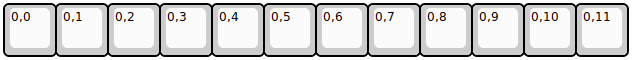

## keebio/stick/stick-rev1

[layout](stick-rev1-kle.json) - [PCB](stick-rev1.kicad_pcb)

{:loading="lazy"}

[Open in keyboard-layout-editor](http://www.keyboard-layout-editor.com/##@@=0,0&=0,1&=0,2&=0,3&=0,4&=0,5&=0,6&=0,7&=0,8&=0,9&=0,10&=0,11)

{:loading="lazy"}

