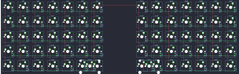

## keebio/viterbi/viterbi-rev2

[layout](viterbi-rev2-kle.json) - [PCB](viterbi-rev2.kicad_pcb)

{:loading="lazy"}

[Open in keyboard-layout-editor](http://www.keyboard-layout-editor.com/##@@_c=#aaaaaa;&=0,0&_c=#cccccc;&=0,1&=0,2&=0,3&=0,4&=0,5&=0,6&_x:2;&=5,6&=5,5&=5,4&=5,3&=5,2&_c=#aaaaaa;&=5,1&=5,0;&@_c=#cccccc;&=1,0&_c=#aaaaaa;&=1,1&_c=#cccccc;&=1,2&=1,3&=1,4&=1,5&=1,6&_x:2;&=6,6&=6,5&=6,4&=6,3&=6,2&=6,1&=6,0;&@=2,0&_c=#777777;&=2,1&_c=#cccccc;&=2,2&=2,3&=2,4&=2,5&=2,6&_x:2;&=7,6&=7,5&=7,4&=7,3&=7,2&=7,1&_c=#777777;&=7,0;&@_c=#aaaaaa;&=3,0&=3,1&_c=#cccccc;&=3,2&=3,3&=3,4&=3,5&=3,6&_x:2;&=8,6&=8,5&=8,4&=8,3&=8,2&_c=#aaaaaa;&=8,1&=8,0;&@=4,0&=4,1&=4,2&=4,3&=4,4&_c=#cccccc&w:2;&=4,6%0A%0A%0A0,0&_x:2&w:2;&=9,6%0A%0A%0A0,0&_c=#777777;&=9,4&=9,3&=9,2&=9,1&_c=#cccccc;&=9,0;&@_x:5&c=#aaaaaa;&=4,5%0A%0A%0A0,1&_c=#cccccc;&=4,6%0A%0A%0A0,1&_x:2;&=9,6%0A%0A%0A0,1&_c=#aaaaaa;&=9,5%0A%0A%0A0,1)

{:loading="lazy"}

