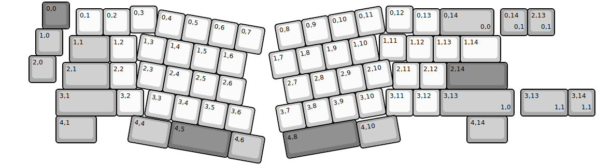
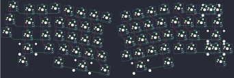

## keebsforall/coarse60

[layout](coarse60-kle.json) - [PCB](coarse60.kicad_pcb)

{:loading="lazy"}

[Open in keyboard-layout-editor](http://www.keyboard-layout-editor.com/##@@_x:1.5&c=#777777;&=0,0;&@_x:4.75&y:-0.85&c=#cccccc;&=0,3&_x:8.5;&=0,12;&@_x:2.75&y:-0.9;&=0,1&=0,2&_x:10.5;&=0,13&_c=#aaaaaa&w:2;&=0,14%0A%0A%0A0,0;&@_x:1.25&y:-0.25;&=1,0;&@_x:14&y:-0.8&c=#cccccc;&=1,11;&@_x:2.5&y:-0.95&c=#aaaaaa&w:1.5;&=1,1&_c=#cccccc;&=1,2&_x:10.0;&=1,12&=1,13&_w:1.5;&=1,14;&@_x:1&y:-0.25&c=#aaaaaa;&=2,0;&@_x:2.25&y:-0.75&w:1.75;&=2,1&_c=#cccccc;&=2,2&_x:9.5;&=2,11&=2,12&_c=#777777&w:2.25;&=2,14;&@_x:2&c=#aaaaaa&w:2.25;&=3,1&_c=#cccccc;&=3,2&_x:9.0;&=3,11&=3,12&_c=#aaaaaa&w:2.75;&=3,13%0A%0A%0A1,0;&@_x:2&w:1.5;&=4,1&_x:13.75&w:1.5;&=4,14;&@_r:10&x:5.8&y:-6.0&c=#cccccc;&=0,4&=0,5&=0,6&=0,7;&@_x:5.3;&=1,3&=1,4&=1,5&=1,6;&@_x:5.45;&=2,3&=2,4&=2,5&=2,6;&@_x:5.95;&=3,3&=3,4&=3,5&=3,6;&@_x:7&c=#777777&w:2.25;&=4,5&_c=#aaaaaa&w:1.25;&=4,6;&@_x:5.5&y:-0.95&w:1.5;&=4,4;&@_r:-10&x:9.8&y:-1.7&c=#cccccc;&=0,8&=0,9&=0,10&=0,11;&@_x:9.4;&=1,7&=1,8&=1,9&=1,10;&@_x:9.75;&=2,7&=2,8&=2,9&=2,10;&@_x:9.3;&=3,7&=3,8&=3,9&=3,10;&@_x:9.4&c=#777777&w:2.75;&=4,8;&@_x:12.15&y:-0.9&c=#aaaaaa&w:1.5;&=4,10;&@_r:0&x:18.5&y:-7.45;&=0,14%0A%0A%0A0,1&=2,13%0A%0A%0A0,1;&@_x:19.25&y:2.0&w:1.75;&=3,13%0A%0A%0A1,1&=3,14%0A%0A%0A1,1)

{:loading="lazy"}

