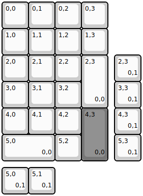
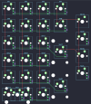

## keebsforall/freebirdNP/pro/freebirdnp_pro

[layout](freebirdnp_pro-kle.json) - [PCB](freebirdnp_pro.kicad_pcb)

{:loading="lazy"}

[Open in keyboard-layout-editor](http://www.keyboard-layout-editor.com/##@@=0,0&=0,1&=0,2&=0,3;&@=1,0&=1,1&=1,2&=1,3;&@=2,0&=2,1&=2,2&_h:2;&=2,3%0A%0A%0A0,0;&@=3,0&=3,1&=3,2;&@=4,0&=4,1&=4,2&_c=#777777&h:2;&=4,3%0A%0A%0A0,0;&@_c=#cccccc&w:2;&=5,0%0A%0A%0A0,0&=5,2;&@_x:4.25&y:-4;&=2,3%0A%0A%0A0,1;&@_x:4.25;&=3,3%0A%0A%0A0,1;&@_x:4.25;&=4,3%0A%0A%0A0,1;&@_x:4.25;&=5,3%0A%0A%0A0,1;&@_y:0.25;&=5,0%0A%0A%0A0,1&=5,1%0A%0A%0A0,1)

{:loading="lazy"}

