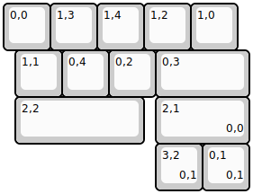

## keebzdotnet/fme

[layout](fme-kle.json) - [PCB](fme.kicad_pcb)

{:loading="lazy"}

[Open in keyboard-layout-editor](http://www.keyboard-layout-editor.com/##@@=0,0&=1,3&=1,4&=1,2&=1,0;&@_x:0.25;&=1,1&=0,4&=0,2&_w:2;&=0,3;&@_x:0.25&w:2.75;&=2,2&_x:0.25&w:2;&=2,1%0A%0A%0A0,0;&@_x:3.25;&=3,2%0A%0A%0A0,1&=0,1%0A%0A%0A0,1)

{:loading="lazy"}

