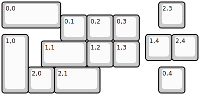

## keebzdotnet/wazowski2319/wazowski-23-19-rev0

[layout](wazowski-23-19-rev0-kle.json) - [PCB](wazowski-23-19-rev0.kicad_pcb)

{:loading="lazy"}

[Open in keyboard-layout-editor](http://www.keyboard-layout-editor.com/##@@_w:2.25;&=0,0&_x:3.75;&=2,3;&@_x:2.25&y:-0.5;&=0,1&=0,2&=0,3;&@_y:-0.25&h:2.25;&=1,0&_x:4.5;&=1,4&=2,4;&@_x:1.5&y:-0.75&w:1.75;&=1,1&=1,2&=1,3;&@_x:1;&=2,0&_w:1.75;&=2,1&_x:2.25;&=0,4)

{:loading="lazy"}

