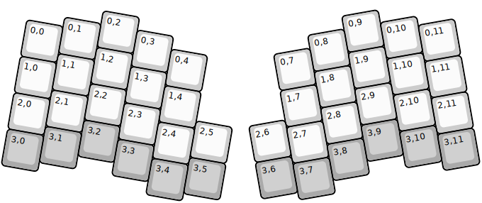
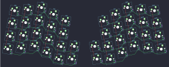

## keyboardio/atreus

[layout](atreus-kle.json) - [PCB](atreus.kicad_pcb)

{:loading="lazy"}

[Open in keyboard-layout-editor](http://www.keyboard-layout-editor.com/##@@_r:10&rx:1&x:1.75&y:-0.1;&=0,2;&@_x:0.75&y:-0.65;&=0,1&_x:1.0;&=0,3;&@_x:-0.25&y:-0.75;&=0,0;&@_x:3.75&y:-0.9;&=0,4;&@_x:1.75&y:-0.7;&=1,2;&@_x:0.75&y:-0.65;&=1,1&_x:1.0;&=1,3;&@_x:-0.25&y:-0.75;&=1,0;&@_x:3.75&y:-0.9;&=1,4;&@_x:1.75&y:-0.7;&=2,2;&@_x:0.75&y:-0.65;&=2,1&_x:1.0;&=2,3;&@_x:4.75&y:-0.85;&=2,5;&@_x:-0.25&y:-0.9;&=2,0;&@_x:3.75&y:-0.9;&=2,4;&@_x:1.75&y:-0.7&c=#aaaaaa;&=3,2;&@_x:0.75&y:-0.65;&=3,1&_x:1.0;&=3,3;&@_x:4.75&y:-0.85;&=3,5;&@_x:-0.25&y:-0.9;&=3,0;&@_x:3.75&y:-0.9;&=3,4;&@_r:-10&rx:7&ry:0.965&x:2.25&y:-0.2&c=#cccccc;&=0,9;&@_x:1.25&y:-0.65;&=0,8&_x:1.0;&=0,10;&@_x:4.25&y:-0.75;&=0,11;&@_x:0.25&y:-0.9;&=0,7;&@_x:2.25&y:-0.7;&=1,9;&@_x:1.25&y:-0.65;&=1,8&_x:1.0;&=1,10;&@_x:4.25&y:-0.75;&=1,11;&@_x:0.25&y:-0.9;&=1,7;&@_x:2.25&y:-0.7;&=2,9;&@_x:1.25&y:-0.65;&=2,8&_x:1.0;&=2,10;&@_x:-0.75&y:-0.85;&=2,6;&@_x:4.25&y:-0.9;&=2,11;&@_x:0.25&y:-0.9;&=2,7;&@_x:2.25&y:-0.7&c=#aaaaaa;&=3,9;&@_x:1.25&y:-0.65;&=3,8&_x:1.0;&=3,10;&@_x:-0.75&y:-0.85;&=3,6;&@_x:4.25&y:-0.9;&=3,11;&@_x:0.25&y:-0.9;&=3,7)

{:loading="lazy"}

