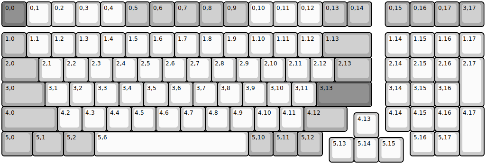
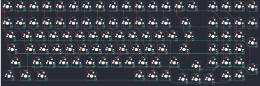

## keychron/k4_pro/ansi_rgb

[layout](ansi_rgb-kle.json) - [PCB](ansi_rgb.kicad_pcb)

{:loading="lazy"}

[Open in keyboard-layout-editor](http://www.keyboard-layout-editor.com/##@@_c=#777777;&=0,0&_c=#cccccc;&=0,1&=0,2&=0,3&=0,4&_c=#aaaaaa;&=0,5&=0,6&=0,7&=0,8&=0,9&_c=#cccccc;&=0,10&=0,11&=0,12&_c=#aaaaaa;&=0,13&=0,14&_x:0.55;&=0,15&=0,16&=0,17&=3,17;&@_y:0.25;&=1,0&_c=#cccccc;&=1,1&=1,2&=1,3&=1,4&=1,5&=1,6&=1,7&=1,8&=1,9&=1,10&=1,11&=1,12&_c=#aaaaaa&w:2;&=1,13&_x:0.55&c=#cccccc;&=1,14&=1,15&=1,16&=1,17;&@_c=#aaaaaa&w:1.5;&=2,0&_c=#cccccc;&=2,1&=2,2&=2,3&=2,4&=2,5&=2,6&=2,7&=2,8&=2,9&=2,10&=2,11&=2,12&_c=#aaaaaa&w:1.5;&=2,13&_x:0.55&c=#cccccc;&=2,14&=2,15&=2,16&_h:2.0;&=2,17;&@_c=#aaaaaa&w:1.75;&=3,0&_c=#cccccc;&=3,1&=3,2&=3,3&=3,4&=3,5&=3,6&=3,7&=3,8&=3,9&=3,10&=3,11&_c=#777777&w:2.25;&=3,13&_x:0.56&c=#cccccc;&=3,14&=3,15&=3,16;&@_c=#aaaaaa&w:2.25;&=4,0&_c=#cccccc;&=4,2&=4,3&=4,4&=4,5&=4,6&=4,7&=4,8&=4,9&=4,10&=4,11&_c=#aaaaaa&w:1.75;&=4,12;&@_x:14.28&y:-0.75&c=#cccccc;&=4,13;&@_x:15.56&y:-1.25;&=4,14&=4,15&=4,16&_h:2;&=4,17;&@_c=#aaaaaa&w:1.25;&=5,0&_w:1.25;&=5,1&_w:1.25;&=5,2&_c=#cccccc&w:6.25;&=5,6&_c=#aaaaaa;&=5,10&=5,11&=5,12;&@_x:13.28&y:-0.75&c=#cccccc;&=5,13&=5,14&=5,15;&@_x:16.56&y:-1.25;&=5,16&=5,17)

{:loading="lazy"}

## keychron/k4_pro/ansi_white

[layout](ansi_white-kle.json) - [PCB](ansi_white.kicad_pcb)

{:loading="lazy"}

[Open in keyboard-layout-editor](http://www.keyboard-layout-editor.com/##@@_c=#777777;&=0,0&_c=#cccccc;&=0,1&=0,2&=0,3&=0,4&_c=#aaaaaa;&=0,5&=0,6&=0,7&=0,8&=0,9&_c=#cccccc;&=0,10&=0,11&=0,12&_c=#aaaaaa;&=0,13&=0,14&_x:0.55;&=0,15&=0,16&=0,17&=3,17;&@_y:0.25;&=1,0&_c=#cccccc;&=1,1&=1,2&=1,3&=1,4&=1,5&=1,6&=1,7&=1,8&=1,9&=1,10&=1,11&=1,12&_c=#aaaaaa&w:2;&=1,13&_x:0.55&c=#cccccc;&=1,14&=1,15&=1,16&=1,17;&@_c=#aaaaaa&w:1.5;&=2,0&_c=#cccccc;&=2,1&=2,2&=2,3&=2,4&=2,5&=2,6&=2,7&=2,8&=2,9&=2,10&=2,11&=2,12&_c=#aaaaaa&w:1.5;&=2,13&_x:0.55&c=#cccccc;&=2,14&=2,15&=2,16&_h:2.0;&=2,17;&@_c=#aaaaaa&w:1.75;&=3,0&_c=#cccccc;&=3,1&=3,2&=3,3&=3,4&=3,5&=3,6&=3,7&=3,8&=3,9&=3,10&=3,11&_c=#777777&w:2.25;&=3,13&_x:0.56&c=#cccccc;&=3,14&=3,15&=3,16;&@_c=#aaaaaa&w:2.25;&=4,0&_c=#cccccc;&=4,2&=4,3&=4,4&=4,5&=4,6&=4,7&=4,8&=4,9&=4,10&=4,11&_c=#aaaaaa&w:1.75;&=4,12;&@_x:14.28&y:-0.75&c=#cccccc;&=4,13;&@_x:15.56&y:-1.25;&=4,14&=4,15&=4,16&_h:2;&=4,17;&@_c=#aaaaaa&w:1.25;&=5,0&_w:1.25;&=5,1&_w:1.25;&=5,2&_c=#cccccc&w:6.25;&=5,6&_c=#aaaaaa;&=5,10&=5,11&=5,12;&@_x:13.28&y:-0.75&c=#cccccc;&=5,13&=5,14&=5,15;&@_x:16.56&y:-1.25;&=5,16&=5,17)

{:loading="lazy"}

