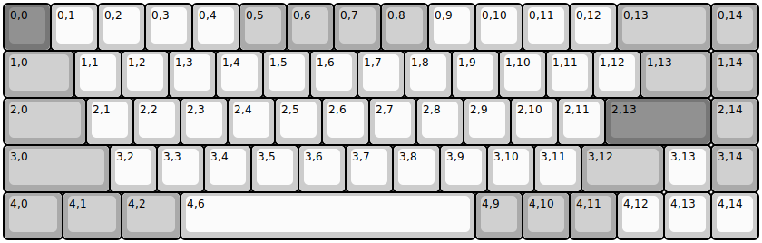
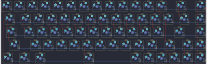
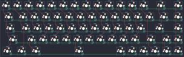
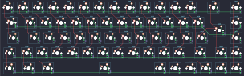
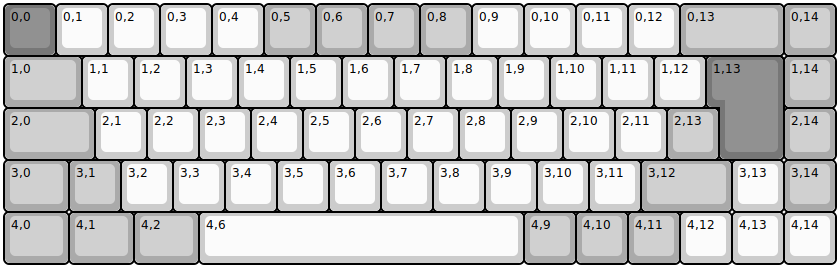
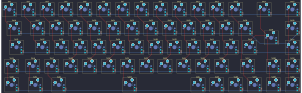
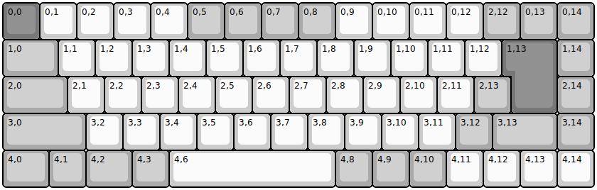
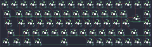

## keychron/k6_pro/ansi_rgb

[layout](ansi_rgb-kle.json) - [PCB](ansi_rgb.kicad_pcb)

{:loading="lazy"}

[Open in keyboard-layout-editor](http://www.keyboard-layout-editor.com/##@@_c=#777777;&=0,0&_c=#cccccc;&=0,1&=0,2&=0,3&=0,4&_c=#aaaaaa;&=0,5&=0,6&=0,7&=0,8&_c=#cccccc;&=0,9&=0,10&=0,11&=0,12&_c=#aaaaaa&w:2;&=0,13&=0,14;&@_w:1.5;&=1,0&_c=#cccccc;&=1,1&=1,2&=1,3&=1,4&=1,5&=1,6&=1,7&=1,8&=1,9&=1,10&=1,11&=1,12&_c=#aaaaaa&w:1.5;&=1,13&=1,14;&@_w:1.75;&=2,0&_c=#cccccc;&=2,1&=2,2&=2,3&=2,4&=2,5&=2,6&=2,7&=2,8&=2,9&=2,10&=2,11&_c=#777777&w:2.25;&=2,13&_c=#aaaaaa;&=2,14;&@_w:2.25;&=3,0&_c=#cccccc;&=3,2&=3,3&=3,4&=3,5&=3,6&=3,7&=3,8&=3,9&=3,10&=3,11&_c=#aaaaaa&w:1.75;&=3,12&_c=#cccccc;&=3,13&_c=#aaaaaa;&=3,14;&@_w:1.25;&=4,0&_w:1.25;&=4,1&_w:1.25;&=4,2&_c=#cccccc&w:6.25;&=4,6&_c=#aaaaaa;&=4,9&=4,10&=4,11&_c=#cccccc;&=4,12&=4,13&=4,14)

{:loading="lazy"}

## keychron/k6_pro/ansi_white

[layout](ansi_white-kle.json) - [PCB](ansi_white.kicad_pcb)

{:loading="lazy"}

[Open in keyboard-layout-editor](http://www.keyboard-layout-editor.com/##@@_c=#777777;&=0,0&_c=#cccccc;&=0,1&=0,2&=0,3&=0,4&_c=#aaaaaa;&=0,5&=0,6&=0,7&=0,8&_c=#cccccc;&=0,9&=0,10&=0,11&=0,12&_c=#aaaaaa&w:2;&=0,13&=0,14;&@_w:1.5;&=1,0&_c=#cccccc;&=1,1&=1,2&=1,3&=1,4&=1,5&=1,6&=1,7&=1,8&=1,9&=1,10&=1,11&=1,12&_c=#aaaaaa&w:1.5;&=1,13&=1,14;&@_w:1.75;&=2,0&_c=#cccccc;&=2,1&=2,2&=2,3&=2,4&=2,5&=2,6&=2,7&=2,8&=2,9&=2,10&=2,11&_c=#777777&w:2.25;&=2,13&_c=#aaaaaa;&=2,14;&@_w:2.25;&=3,0&_c=#cccccc;&=3,2&=3,3&=3,4&=3,5&=3,6&=3,7&=3,8&=3,9&=3,10&=3,11&_c=#aaaaaa&w:1.75;&=3,12&_c=#cccccc;&=3,13&_c=#aaaaaa;&=3,14;&@_w:1.25;&=4,0&_w:1.25;&=4,1&_w:1.25;&=4,2&_c=#cccccc&w:6.25;&=4,6&_c=#aaaaaa;&=4,9&=4,10&=4,11&_c=#cccccc;&=4,12&=4,13&=4,14)

{:loading="lazy"}

## keychron/k6_pro/iso_rgb

[layout](iso_rgb-kle.json) - [PCB](iso_rgb.kicad_pcb)

{:loading="lazy"}

[Open in keyboard-layout-editor](http://www.keyboard-layout-editor.com/##@@_c=#777777;&=0,0&_c=#cccccc;&=0,1&=0,2&=0,3&=0,4&_c=#aaaaaa;&=0,5&=0,6&=0,7&=0,8&_c=#cccccc;&=0,9&=0,10&=0,11&=0,12&_c=#aaaaaa&w:2;&=0,13&=0,14;&@_w:1.5;&=1,0&_c=#cccccc;&=1,1&=1,2&=1,3&=1,4&=1,5&=1,6&=1,7&=1,8&=1,9&=1,10&=1,11&=1,12&_x:0.25&c=#777777&w:1.25&h:2&w2:1.5&h2:1&x2:-0.25;&=1,13&_c=#aaaaaa;&=1,14;&@_w:1.75;&=2,0&_c=#cccccc;&=2,1&=2,2&=2,3&=2,4&=2,5&=2,6&=2,7&=2,8&=2,9&=2,10&=2,11&_c=#aaaaaa;&=2,13&_x:1.25;&=2,14;&@_w:1.25;&=3,0&=3,1&_c=#cccccc;&=3,2&=3,3&=3,4&=3,5&=3,6&=3,7&=3,8&=3,9&=3,10&=3,11&_c=#aaaaaa&w:1.75;&=3,12&_c=#cccccc;&=3,13&_c=#aaaaaa;&=3,14;&@_w:1.25;&=4,0&_w:1.25;&=4,1&_w:1.25;&=4,2&_c=#cccccc&w:6.25;&=4,6&_c=#aaaaaa;&=4,9&=4,10&=4,11&_c=#cccccc;&=4,12&=4,13&=4,14)

{:loading="lazy"}

## keychron/k6_pro/iso_white

[layout](iso_white-kle.json) - [PCB](iso_white.kicad_pcb)

{:loading="lazy"}

[Open in keyboard-layout-editor](http://www.keyboard-layout-editor.com/##@@_c=#777777;&=0,0&_c=#cccccc;&=0,1&=0,2&=0,3&=0,4&_c=#aaaaaa;&=0,5&=0,6&=0,7&=0,8&_c=#cccccc;&=0,9&=0,10&=0,11&=0,12&_c=#aaaaaa&w:2;&=0,13&=0,14;&@_w:1.5;&=1,0&_c=#cccccc;&=1,1&=1,2&=1,3&=1,4&=1,5&=1,6&=1,7&=1,8&=1,9&=1,10&=1,11&=1,12&_x:0.25&c=#777777&w:1.25&h:2&w2:1.5&h2:1&x2:-0.25;&=1,13&_c=#aaaaaa;&=1,14;&@_w:1.75;&=2,0&_c=#cccccc;&=2,1&=2,2&=2,3&=2,4&=2,5&=2,6&=2,7&=2,8&=2,9&=2,10&=2,11&_c=#aaaaaa;&=2,13&_x:1.25;&=2,14;&@_w:1.25;&=3,0&=3,1&_c=#cccccc;&=3,2&=3,3&=3,4&=3,5&=3,6&=3,7&=3,8&=3,9&=3,10&=3,11&_c=#aaaaaa&w:1.75;&=3,12&_c=#cccccc;&=3,13&_c=#aaaaaa;&=3,14;&@_w:1.25;&=4,0&_w:1.25;&=4,1&_w:1.25;&=4,2&_c=#cccccc&w:6.25;&=4,6&_c=#aaaaaa;&=4,9&=4,10&=4,11&_c=#cccccc;&=4,12&=4,13&=4,14)

{:loading="lazy"}

## keychron/k6_pro/jis_rgb

[layout](jis_rgb-kle.json) - [PCB](jis_rgb.kicad_pcb)

{:loading="lazy"}

[Open in keyboard-layout-editor](http://www.keyboard-layout-editor.com/##@@_c=#777777;&=0,0&_c=#cccccc;&=0,1&=0,2&=0,3&=0,4&_c=#aaaaaa;&=0,5&=0,6&=0,7&=0,8&_c=#cccccc;&=0,9&=0,10&=0,11&=0,12&_c=#aaaaaa;&=2,12&=0,13&=0,14;&@_w:1.5;&=1,0&_c=#cccccc;&=1,1&=1,2&=1,3&=1,4&=1,5&=1,6&=1,7&=1,8&=1,9&=1,10&=1,11&=1,12&_x:0.25&c=#777777&w:1.25&h:2&w2:1.5&h2:1&x2:-0.25;&=1,13&_c=#aaaaaa;&=1,14;&@_w:1.75;&=2,0&_c=#cccccc;&=2,1&=2,2&=2,3&=2,4&=2,5&=2,6&=2,7&=2,8&=2,9&=2,10&=2,11&_c=#aaaaaa;&=2,13&_x:1.25;&=2,14;&@_w:2.25;&=3,0&_c=#cccccc;&=3,2&=3,3&=3,4&=3,5&=3,6&=3,7&=3,8&=3,9&=3,10&=3,11&_c=#aaaaaa;&=3,12&_w:1.75;&=3,13&=3,14;&@_w:1.25;&=4,0&=4,1&_w:1.25;&=4,2&=4,3&_c=#cccccc&w:4.5;&=4,6&_c=#aaaaaa;&=4,8&=4,9&=4,10&_c=#cccccc;&=4,11&=4,12&=4,13&=4,14)

{:loading="lazy"}

