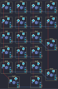
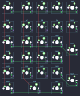

## keychron/q0/rev_0130

[layout](rev_0130-kle.json) - [PCB](rev_0130.kicad_pcb)

{:loading="lazy"}

[Open in keyboard-layout-editor](http://www.keyboard-layout-editor.com/##@@=0,0&=0,1&=0,2&=0,3;&@=1,0&=1,1&=1,2&=1,3;&@=2,0&=2,1&=2,2;&@=3,0&=3,1&=3,2;&@_x:3&y:-2&h:2;&=2,3;&@_y:1;&=4,0&=4,1&=4,2;&@_w:2;&=5,0&=5,2;&@_x:3&y:-2&h:2;&=4,3)

{:loading="lazy"}

## keychron/q0/rev_0131

[layout](rev_0131-kle.json) - [PCB](rev_0131.kicad_pcb)

{:loading="lazy"}

[Open in keyboard-layout-editor](http://www.keyboard-layout-editor.com/##@@=0,0%0A%0A%0A%0A%0A%0A%0A%0A%0Ae0&_x:0.25&c=#aaaaaa;&=0,1&=0,2&=0,3&=0,4;&@_y:0.25&c=#cccccc;&=1,0&_x:0.25;&=1,1&=1,2&=1,3&=1,4;&@=2,0&_x:0.25;&=2,1&=2,2&=2,3&_h:2;&=2,4;&@=3,0&_x:0.25;&=3,1&=3,2&=3,3;&@=4,0&_x:0.25;&=4,1&=4,2&=4,3&_h:2;&=4,4;&@=5,0&_x:0.25&w:2;&=5,1&=5,3)

{:loading="lazy"}

