## keychron/q1/ansi_atmega32u4

[layout](ansi_atmega32u4-kle.json) - [PCB](ansi_atmega32u4.kicad_pcb)

{:loading="lazy"}

[Open in keyboard-layout-editor](http://www.keyboard-layout-editor.com/##@@_c=#777777;&=0,0%0AESC&_x:0.25&c=#cccccc;&=0,2&=0,3&=0,4&=0,5&_x:0.25&c=#aaaaaa;&=0,6&=0,7&=0,8&=0,9&_x:0.25&c=#cccccc;&=0,10&=0,11&=0,12&=0,13&_x:0.25&c=#aaaaaa;&=4,14&_x:0.25;&=0,14;&@_y:0.25&c=#cccccc;&=1,0&=1,1&=1,2&=1,3&=1,4&=1,5&=1,6&=1,7&=1,8&=1,9&=1,10&=1,11&=1,12&_c=#aaaaaa&w:2;&=1,13&_x:0.25;&=1,14;&@_w:1.5;&=2,0&_c=#cccccc;&=2,1&=2,2&=2,3&=2,4&=2,5&=2,6&=2,7&=2,8&=2,9&=2,10&=2,11&=2,12&_w:1.5;&=2,13&_x:0.25&c=#aaaaaa;&=2,14;&@_w:1.75;&=3,0&_c=#cccccc;&=3,1&=3,2&=3,3&=3,4&=3,5&=3,6&=3,7&=3,8&=3,9&=3,10&=3,11&_c=#777777&w:2.25;&=3,13&_x:0.25&c=#aaaaaa;&=3,14;&@_w:2.25;&=4,0&_c=#cccccc;&=4,2&=4,3&=4,4&=4,5&=4,6&=4,7&=4,8&=4,9&=4,10&=4,11&_c=#aaaaaa&w:1.75;&=4,13;&@_x:14.25&y:-0.75;&=3,12;&@_y:-0.25&w:1.25;&=5,0&_w:1.25;&=5,1&_w:1.25;&=5,2&_c=#cccccc&w:6.25;&=5,6&_c=#aaaaaa;&=5,10&=5,11&=5,12;&@_x:13.25&y:-0.75;&=5,13&=4,12&=5,14)

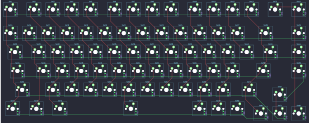{:loading="lazy"}

## keychron/q1/ansi_atmega32u4_encoder

[layout](ansi_atmega32u4_encoder-kle.json) - [PCB](ansi_atmega32u4_encoder.kicad_pcb)

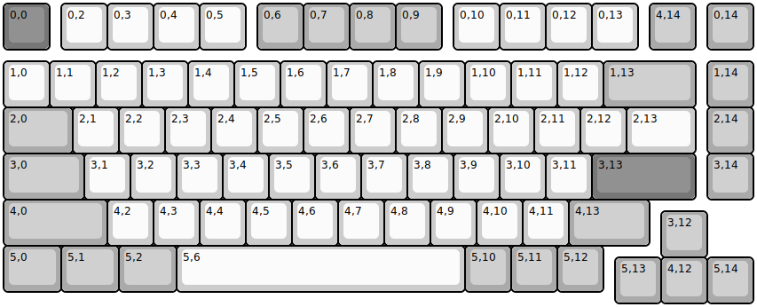{:loading="lazy"}

[Open in keyboard-layout-editor](http://www.keyboard-layout-editor.com/##@@_c=#777777;&=0,0%0AESC&_x:0.25&c=#cccccc;&=0,2&=0,3&=0,4&=0,5&_x:0.25&c=#aaaaaa;&=0,6&=0,7&=0,8&=0,9&_x:0.25&c=#cccccc;&=0,10&=0,11&=0,12&=0,13&_x:0.25&c=#aaaaaa;&=4,14&_x:0.25;&=0,14%0A%0A%0A%0A%0A%0A%0A%0A%0Ae0;&@_y:0.25&c=#cccccc;&=1,0&=1,1&=1,2&=1,3&=1,4&=1,5&=1,6&=1,7&=1,8&=1,9&=1,10&=1,11&=1,12&_c=#aaaaaa&w:2;&=1,13&_x:0.25;&=1,14;&@_w:1.5;&=2,0&_c=#cccccc;&=2,1&=2,2&=2,3&=2,4&=2,5&=2,6&=2,7&=2,8&=2,9&=2,10&=2,11&=2,12&_w:1.5;&=2,13&_x:0.25&c=#aaaaaa;&=2,14;&@_w:1.75;&=3,0&_c=#cccccc;&=3,1&=3,2&=3,3&=3,4&=3,5&=3,6&=3,7&=3,8&=3,9&=3,10&=3,11&_c=#777777&w:2.25;&=3,13&_x:0.25&c=#aaaaaa;&=3,14;&@_w:2.25;&=4,0&_c=#cccccc;&=4,2&=4,3&=4,4&=4,5&=4,6&=4,7&=4,8&=4,9&=4,10&=4,11&_c=#aaaaaa&w:1.75;&=4,13;&@_x:14.25&y:-0.75;&=3,12;&@_y:-0.25&w:1.25;&=5,0&_w:1.25;&=5,1&_w:1.25;&=5,2&_c=#cccccc&w:6.25;&=5,6&_c=#aaaaaa;&=5,10&=5,11&=5,12;&@_x:13.25&y:-0.75;&=5,13&=4,12&=5,14)

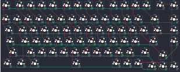{:loading="lazy"}

## keychron/q1/ansi_stm32l432

[layout](ansi_stm32l432-kle.json) - [PCB](ansi_stm32l432.kicad_pcb)

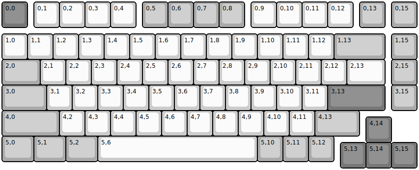{:loading="lazy"}

[Open in keyboard-layout-editor](http://www.keyboard-layout-editor.com/##@@_c=#777777;&=0,0%0AESC&_x:0.25&c=#cccccc;&=0,1&=0,2&=0,3&=0,4&_x:0.25&c=#aaaaaa;&=0,5&=0,6&=0,7&=0,8&_x:0.25&c=#cccccc;&=0,9&=0,10&=0,11&=0,12&_x:0.25&c=#aaaaaa;&=0,13&_x:0.25;&=0,15;&@_y:0.25&c=#cccccc;&=1,0&=1,1&=1,2&=1,3&=1,4&=1,5&=1,6&=1,7&=1,8&=1,9&=1,10&=1,11&=1,12&_c=#aaaaaa&w:2;&=1,13&_x:0.25;&=1,15;&@_w:1.5;&=2,0&_c=#cccccc;&=2,1&=2,2&=2,3&=2,4&=2,5&=2,6&=2,7&=2,8&=2,9&=2,10&=2,11&=2,12&_w:1.5;&=2,13&_x:0.25&c=#aaaaaa;&=2,15;&@_w:1.75;&=3,0&_c=#cccccc;&=3,1&=3,2&=3,3&=3,4&=3,5&=3,6&=3,7&=3,8&=3,9&=3,10&=3,11&_c=#777777&w:2.25;&=3,13&_x:0.25&c=#aaaaaa;&=3,15;&@_w:2.25;&=4,0&_c=#cccccc;&=4,2&=4,3&=4,4&=4,5&=4,6&=4,7&=4,8&=4,9&=4,10&=4,11&_c=#aaaaaa&w:1.75;&=4,13;&@_x:14.25&y:-0.75&c=#777777;&=4,14;&@_y:-0.25&c=#aaaaaa&w:1.25;&=5,0&_w:1.25;&=5,1&_w:1.25;&=5,2&_c=#cccccc&w:6.25;&=5,6&_c=#aaaaaa;&=5,10&=5,11&=5,12;&@_x:13.25&y:-0.75&c=#777777;&=5,13&=5,14&=5,15)

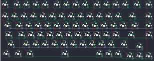{:loading="lazy"}

## keychron/q1/ansi_stm32l432_encoder

[layout](ansi_stm32l432_encoder-kle.json) - [PCB](ansi_stm32l432_encoder.kicad_pcb)

{:loading="lazy"}

[Open in keyboard-layout-editor](http://www.keyboard-layout-editor.com/##@@_c=#777777;&=0,0%0AESC&_x:0.25&c=#cccccc;&=0,1&=0,2&=0,3&=0,4&_x:0.25&c=#aaaaaa;&=0,5&=0,6&=0,7&=0,8&_x:0.25&c=#cccccc;&=0,9&=0,10&=0,11&=0,12&_x:0.25&c=#aaaaaa;&=0,13&_x:0.25;&=0,15%0A%0A%0A%0A%0A%0A%0A%0A%0Ae0;&@_y:0.25&c=#cccccc;&=1,0&=1,1&=1,2&=1,3&=1,4&=1,5&=1,6&=1,7&=1,8&=1,9&=1,10&=1,11&=1,12&_c=#aaaaaa&w:2;&=1,13&_x:0.25;&=1,15;&@_w:1.5;&=2,0&_c=#cccccc;&=2,1&=2,2&=2,3&=2,4&=2,5&=2,6&=2,7&=2,8&=2,9&=2,10&=2,11&=2,12&_w:1.5;&=2,13&_x:0.25&c=#aaaaaa;&=2,15;&@_w:1.75;&=3,0&_c=#cccccc;&=3,1&=3,2&=3,3&=3,4&=3,5&=3,6&=3,7&=3,8&=3,9&=3,10&=3,11&_c=#777777&w:2.25;&=3,13&_x:0.25&c=#aaaaaa;&=3,15;&@_w:2.25;&=4,0&_c=#cccccc;&=4,2&=4,3&=4,4&=4,5&=4,6&=4,7&=4,8&=4,9&=4,10&=4,11&_c=#aaaaaa&w:1.75;&=4,13;&@_x:14.25&y:-0.75&c=#777777;&=4,14;&@_y:-0.25&c=#aaaaaa&w:1.25;&=5,0&_w:1.25;&=5,1&_w:1.25;&=5,2&_c=#cccccc&w:6.25;&=5,6&_c=#aaaaaa;&=5,10&=5,11&=5,12;&@_x:13.25&y:-0.75&c=#777777;&=5,13&=5,14&=5,15)

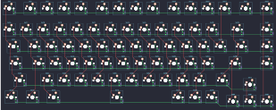{:loading="lazy"}

## keychron/q1/iso_atmega32u4

[layout](iso_atmega32u4-kle.json) - [PCB](iso_atmega32u4.kicad_pcb)

{:loading="lazy"}

[Open in keyboard-layout-editor](http://www.keyboard-layout-editor.com/##@@_c=#777777;&=0,0%0AESC&_x:0.25&c=#cccccc;&=0,2&=0,3&=0,4&=0,5&_x:0.25&c=#aaaaaa;&=0,6&=0,7&=0,8&=0,9&_x:0.25&c=#cccccc;&=0,10&=0,11&=0,12&=0,13&_x:0.25&c=#aaaaaa;&=4,14&_x:0.25;&=0,14;&@_y:0.25&c=#cccccc;&=1,0&=1,1&=1,2&=1,3&=1,4&=1,5&=1,6&=1,7&=1,8&=1,9&=1,10&=1,11&=1,12&_c=#aaaaaa&w:2;&=1,13&_x:0.25;&=1,14;&@_w:1.5;&=2,0&_c=#cccccc;&=2,1&=2,2&=2,3&=2,4&=2,5&=2,6&=2,7&=2,8&=2,9&=2,10&=2,11&=2,12&_x:0.25&c=#777777&w:1.25&h:2&w2:1.5&h2:1&x2:-0.25;&=2,13&_x:0.25&c=#aaaaaa;&=2,14;&@_w:1.75;&=3,0&_c=#cccccc;&=3,1&=3,2&=3,3&=3,4&=3,5&=3,6&=3,7&=3,8&=3,9&=3,10&=3,11&=3,13&_x:1.5&c=#aaaaaa;&=3,14;&@_w:1.25;&=4,0&_c=#cccccc;&=4,1&=4,2&=4,3&=4,4&=4,5&=4,6&=4,7&=4,8&=4,9&=4,10&=4,11&_c=#aaaaaa&w:1.75;&=4,13;&@_x:14.25&y:-0.75&c=#777777;&=3,12;&@_y:-0.25&c=#aaaaaa&w:1.25;&=5,0&_w:1.25;&=5,1&_w:1.25;&=5,2&_c=#cccccc&w:6.25;&=5,6&_c=#aaaaaa;&=5,10&=5,11&=5,12;&@_x:13.25&y:-0.75&c=#777777;&=5,13&=4,12&=5,14)

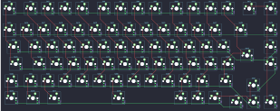{:loading="lazy"}

## keychron/q1/iso_atmega32u4_encoder

[layout](iso_atmega32u4_encoder-kle.json) - [PCB](iso_atmega32u4_encoder.kicad_pcb)

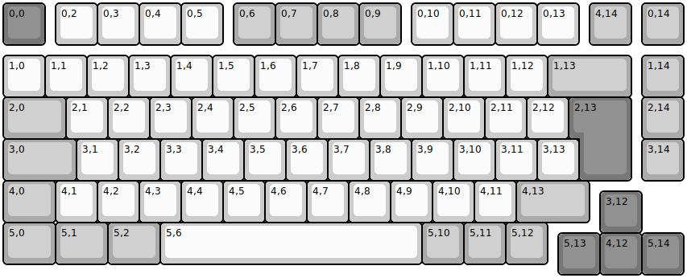{:loading="lazy"}

[Open in keyboard-layout-editor](http://www.keyboard-layout-editor.com/##@@_c=#777777;&=0,0%0AESC&_x:0.25&c=#cccccc;&=0,2&=0,3&=0,4&=0,5&_x:0.25&c=#aaaaaa;&=0,6&=0,7&=0,8&=0,9&_x:0.25&c=#cccccc;&=0,10&=0,11&=0,12&=0,13&_x:0.25&c=#aaaaaa;&=4,14&_x:0.25;&=0,14%0A%0A%0A%0A%0A%0A%0A%0A%0Ae0;&@_y:0.25&c=#cccccc;&=1,0&=1,1&=1,2&=1,3&=1,4&=1,5&=1,6&=1,7&=1,8&=1,9&=1,10&=1,11&=1,12&_c=#aaaaaa&w:2;&=1,13&_x:0.25;&=1,14;&@_w:1.5;&=2,0&_c=#cccccc;&=2,1&=2,2&=2,3&=2,4&=2,5&=2,6&=2,7&=2,8&=2,9&=2,10&=2,11&=2,12&_x:0.25&c=#777777&w:1.25&h:2&w2:1.5&h2:1&x2:-0.25;&=2,13&_x:0.25&c=#aaaaaa;&=2,14;&@_w:1.75;&=3,0&_c=#cccccc;&=3,1&=3,2&=3,3&=3,4&=3,5&=3,6&=3,7&=3,8&=3,9&=3,10&=3,11&=3,13&_x:1.5&c=#aaaaaa;&=3,14;&@_w:1.25;&=4,0&_c=#cccccc;&=4,1&=4,2&=4,3&=4,4&=4,5&=4,6&=4,7&=4,8&=4,9&=4,10&=4,11&_c=#aaaaaa&w:1.75;&=4,13;&@_x:14.25&y:-0.75&c=#777777;&=3,12;&@_y:-0.25&c=#aaaaaa&w:1.25;&=5,0&_w:1.25;&=5,1&_w:1.25;&=5,2&_c=#cccccc&w:6.25;&=5,6&_c=#aaaaaa;&=5,10&=5,11&=5,12;&@_x:13.25&y:-0.75&c=#777777;&=5,13&=4,12&=5,14)

{:loading="lazy"}

## keychron/q1/iso_stm32l432

[layout](iso_stm32l432-kle.json) - [PCB](iso_stm32l432.kicad_pcb)

{:loading="lazy"}

[Open in keyboard-layout-editor](http://www.keyboard-layout-editor.com/##@@_c=#777777;&=0,0%0AESC&_x:0.25&c=#cccccc;&=0,1&=0,2&=0,3&=0,4&_x:0.25&c=#aaaaaa;&=0,5&=0,6&=0,7&=0,8&_x:0.25&c=#cccccc;&=0,9&=0,10&=0,11&=0,12&_x:0.25&c=#aaaaaa;&=0,13&_x:0.25;&=0,15;&@_y:0.25&c=#cccccc;&=1,0&=1,1&=1,2&=1,3&=1,4&=1,5&=1,6&=1,7&=1,8&=1,9&=1,10&=1,11&=1,12&_c=#aaaaaa&w:2;&=1,13&_x:0.25;&=1,15;&@_w:1.5;&=2,0&_c=#cccccc;&=2,1&=2,2&=2,3&=2,4&=2,5&=2,6&=2,7&=2,8&=2,9&=2,10&=2,11&=2,12&_x:0.25&c=#777777&w:1.25&h:2&w2:1.5&h2:1&x2:-0.25;&=2,13&_x:0.25&c=#aaaaaa;&=2,15;&@_w:1.75;&=3,0&_c=#cccccc;&=3,1&=3,2&=3,3&=3,4&=3,5&=3,6&=3,7&=3,8&=3,9&=3,10&=3,11&=3,13&_x:1.5&c=#aaaaaa;&=3,15;&@_w:1.25;&=4,0&_c=#cccccc;&=4,1&=4,2&=4,3&=4,4&=4,5&=4,6&=4,7&=4,8&=4,9&=4,10&=4,11&_c=#aaaaaa&w:1.75;&=4,13;&@_x:14.25&y:-0.75&c=#777777;&=4,14;&@_y:-0.25&c=#aaaaaa&w:1.25;&=5,0&_w:1.25;&=5,1&_w:1.25;&=5,2&_c=#cccccc&w:6.25;&=5,6&_c=#aaaaaa;&=5,10&=5,11&=5,12;&@_x:13.25&y:-0.75&c=#777777;&=5,13&=5,14&=5,15)

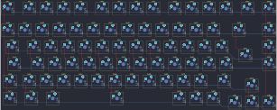{:loading="lazy"}

## keychron/q1/iso_stm32l432_encoder

[layout](iso_stm32l432_encoder-kle.json) - [PCB](iso_stm32l432_encoder.kicad_pcb)

{:loading="lazy"}

[Open in keyboard-layout-editor](http://www.keyboard-layout-editor.com/##@@_c=#777777;&=0,0%0AESC&_x:0.25&c=#cccccc;&=0,1&=0,2&=0,3&=0,4&_x:0.25&c=#aaaaaa;&=0,5&=0,6&=0,7&=0,8&_x:0.25&c=#cccccc;&=0,9&=0,10&=0,11&=0,12&_x:0.25&c=#aaaaaa;&=0,13&_x:0.25;&=0,15%0A%0A%0A%0A%0A%0A%0A%0A%0Ae0;&@_y:0.25&c=#cccccc;&=1,0&=1,1&=1,2&=1,3&=1,4&=1,5&=1,6&=1,7&=1,8&=1,9&=1,10&=1,11&=1,12&_c=#aaaaaa&w:2;&=1,13&_x:0.25;&=1,15;&@_w:1.5;&=2,0&_c=#cccccc;&=2,1&=2,2&=2,3&=2,4&=2,5&=2,6&=2,7&=2,8&=2,9&=2,10&=2,11&=2,12&_x:0.25&c=#777777&w:1.25&h:2&w2:1.5&h2:1&x2:-0.25;&=2,13&_x:0.25&c=#aaaaaa;&=2,15;&@_w:1.75;&=3,0&_c=#cccccc;&=3,1&=3,2&=3,3&=3,4&=3,5&=3,6&=3,7&=3,8&=3,9&=3,10&=3,11&=3,13&_x:1.5&c=#aaaaaa;&=3,15;&@_w:1.25;&=4,0&_c=#cccccc;&=4,1&=4,2&=4,3&=4,4&=4,5&=4,6&=4,7&=4,8&=4,9&=4,10&=4,11&_c=#aaaaaa&w:1.75;&=4,13;&@_x:14.25&y:-0.75&c=#777777;&=4,14;&@_y:-0.25&c=#aaaaaa&w:1.25;&=5,0&_w:1.25;&=5,1&_w:1.25;&=5,2&_c=#cccccc&w:6.25;&=5,6&_c=#aaaaaa;&=5,10&=5,11&=5,12;&@_x:13.25&y:-0.75&c=#777777;&=5,13&=5,14&=5,15)

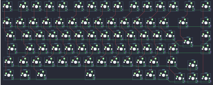{:loading="lazy"}

## keychron/q1/jis_stm32l432

[layout](jis_stm32l432-kle.json) - [PCB](jis_stm32l432.kicad_pcb)

{:loading="lazy"}

[Open in keyboard-layout-editor](http://www.keyboard-layout-editor.com/##@@_c=#777777;&=0,0%0AESC&_x:0.25&c=#cccccc;&=0,1&=0,2&=0,3&=0,4&_x:0.25&c=#aaaaaa;&=0,5&=0,6&=0,7&=0,8&_x:0.25&c=#cccccc;&=0,9&=0,10&=0,11&=0,12&_x:0.25&c=#aaaaaa;&=0,13&_x:0.25;&=0,15;&@_y:0.25;&=1,0&_c=#cccccc;&=1,1&=1,2&=1,3&=1,4&=1,5&=1,6&=1,7&=1,8&=1,9&=1,10&=1,11&=1,12&=1,13&_c=#aaaaaa;&=1,14&_x:0.25;&=1,15;&@_w:1.5;&=2,0&_c=#cccccc;&=2,1&=2,2&=2,3&=2,4&=2,5&=2,6&=2,7&=2,8&=2,9&=2,10&=2,11&=2,12&_x:0.25&c=#777777&w:1.25&h:2&w2:1.5&h2:1&x2:-0.25;&=2,13&_x:0.25&c=#aaaaaa;&=2,15;&@_w:1.75;&=3,0&_c=#cccccc;&=3,1&=3,2&=3,3&=3,4&=3,5&=3,6&=3,7&=3,8&=3,9&=3,10&=3,11&_c=#aaaaaa;&=3,13&_x:1.5;&=3,15;&@_w:2.25;&=4,0&_c=#cccccc;&=4,2&=4,3&=4,4&=4,5&=4,6&=4,7&=4,8&=4,9&=4,10&=4,11&=4,12&_c=#aaaaaa;&=4,13&_c=#777777;&=4,14;&@_c=#aaaaaa&w:1.25;&=5,0&=5,1&_w:1.25;&=5,2&=5,3&_c=#cccccc&w:4.5;&=5,6&_c=#aaaaaa&w:1.25;&=5,9&=5,10&=5,11&=5,12&_c=#777777;&=5,13&=5,14&=5,15)

{:loading="lazy"}

## keychron/q1/jis_stm32l432_encoder

[layout](jis_stm32l432_encoder-kle.json) - [PCB](jis_stm32l432_encoder.kicad_pcb)

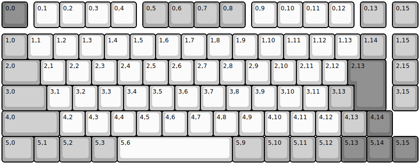{:loading="lazy"}

[Open in keyboard-layout-editor](http://www.keyboard-layout-editor.com/##@@_c=#777777;&=0,0%0AESC&_x:0.25&c=#cccccc;&=0,1&=0,2&=0,3&=0,4&_x:0.25&c=#aaaaaa;&=0,5&=0,6&=0,7&=0,8&_x:0.25&c=#cccccc;&=0,9&=0,10&=0,11&=0,12&_x:0.25&c=#aaaaaa;&=0,13&_x:0.25;&=0,15%0A%0A%0A%0A%0A%0A%0A%0A%0Ae0;&@_y:0.25;&=1,0&_c=#cccccc;&=1,1&=1,2&=1,3&=1,4&=1,5&=1,6&=1,7&=1,8&=1,9&=1,10&=1,11&=1,12&=1,13&_c=#aaaaaa;&=1,14&_x:0.25;&=1,15;&@_w:1.5;&=2,0&_c=#cccccc;&=2,1&=2,2&=2,3&=2,4&=2,5&=2,6&=2,7&=2,8&=2,9&=2,10&=2,11&=2,12&_x:0.25&c=#777777&w:1.25&h:2&w2:1.5&h2:1&x2:-0.25;&=2,13&_x:0.25&c=#aaaaaa;&=2,15;&@_w:1.75;&=3,0&_c=#cccccc;&=3,1&=3,2&=3,3&=3,4&=3,5&=3,6&=3,7&=3,8&=3,9&=3,10&=3,11&_c=#aaaaaa;&=3,13&_x:1.5;&=3,15;&@_w:2.25;&=4,0&_c=#cccccc;&=4,2&=4,3&=4,4&=4,5&=4,6&=4,7&=4,8&=4,9&=4,10&=4,11&=4,12&_c=#aaaaaa;&=4,13&_c=#777777;&=4,14;&@_c=#aaaaaa&w:1.25;&=5,0&=5,1&_w:1.25;&=5,2&=5,3&_c=#cccccc&w:4.5;&=5,6&_c=#aaaaaa&w:1.25;&=5,9&=5,10&=5,11&=5,12&_c=#777777;&=5,13&=5,14&=5,15)

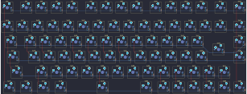{:loading="lazy"}

