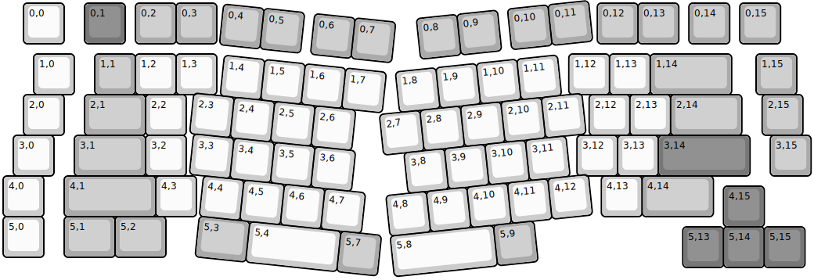
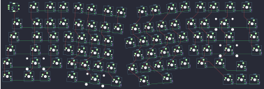
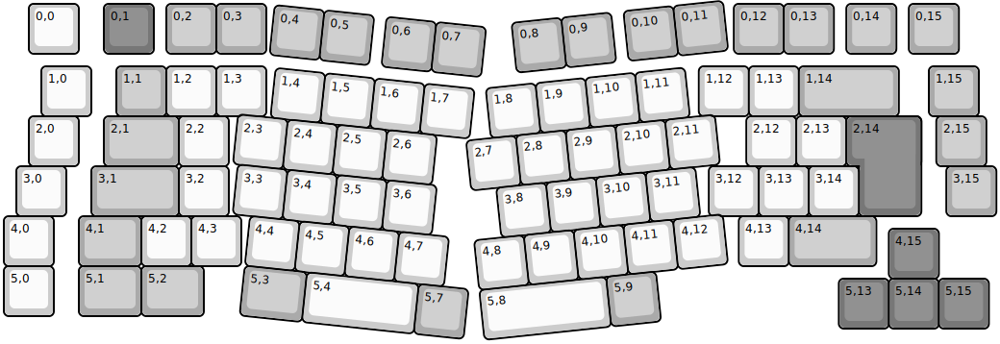
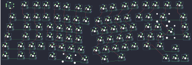

## keychron/q10/ansi_encoder

[layout](ansi_encoder-kle.json) - [PCB](ansi_encoder.kicad_pcb)

{:loading="lazy"}

[Open in keyboard-layout-editor](http://www.keyboard-layout-editor.com/##@@_x:0.5;&=0,0%0A%0A%0A%0A%0A%0A%0A%0A%0Ae0&_x:0.5&c=#777777;&=0,1%0AESC&_x:0.25&c=#aaaaaa;&=0,2&=0,3&_x:9.35;&=0,12&=0,13&_x:0.25;&=0,14&_x:0.25;&=0,15;&@_x:0.75&y:0.25&c=#cccccc;&=1,0&_x:0.5&c=#aaaaaa;&=1,1&_c=#cccccc;&=1,2&=1,3&_x:8.65;&=1,12&=1,13&_c=#aaaaaa&w:2;&=1,14&_x:0.6;&=1,15;&@_x:0.5&c=#cccccc;&=2,0&_x:0.5&c=#aaaaaa&w:1.5;&=2,1&_c=#cccccc;&=2,2&_x:9.9;&=2,12&=2,13&_c=#aaaaaa&w:1.75;&=2,14&_x:0.5;&=2,15;&@_x:0.25&c=#cccccc;&=3,0&_x:0.5&c=#aaaaaa&w:1.75;&=3,1&_c=#cccccc;&=3,2&_x:9.6;&=3,12&=3,13&_c=#777777&w:2.25;&=3,14&_x:0.5&c=#aaaaaa;&=3,15;&@_c=#cccccc;&=4,0&_x:0.5&c=#aaaaaa&w:2.25;&=4,1&_c=#cccccc;&=4,3&_x:9.95;&=4,13&_c=#aaaaaa&w:1.75;&=4,14;&@_x:17.7&y:-0.75&c=#777777;&=4,15;&@_y:-0.25&c=#cccccc;&=5,0&_x:0.5&c=#aaaaaa&w:1.25;&=5,1&_w:1.25;&=5,2;&@_x:16.7&y:-0.75&c=#777777;&=5,13&=5,14&=5,15;&@_r:6&x:5.4&y:-7.05&c=#aaaaaa;&=0,4&=0,5&_x:0.25;&=0,6&=0,7;&@_x:5.55&y:0.25&c=#cccccc;&=1,4&=1,5&=1,6&=1,7;&@_x:4.9;&=2,3&=2,4&=2,5&=2,6;&@_x:5;&=3,3&=3,4&=3,5&=3,6;&@_x:5.35;&=4,4&=4,5&=4,6&=4,7;&@_x:5.35&c=#aaaaaa&w:1.25;&=5,3&_c=#cccccc&w:2.25;&=5,4&_c=#aaaaaa;&=5,7;&@_r:-6&x:10.05&y:-4.25;&=0,8&=0,9&_x:0.25;&=0,10&=0,11;&@_x:9.4&y:0.25&c=#cccccc;&=1,8&=1,9&=1,10&=1,11;&@_x:8.9;&=2,7&=2,8&=2,9&=2,10&=2,11;&@_x:9.4;&=3,8&=3,9&=3,10&=3,11;&@_x:8.85;&=4,8&=4,9&=4,10&=4,11&=4,12;&@_x:8.85&w:2.55;&=5,8&_c=#aaaaaa;&=5,9)

{:loading="lazy"}

## keychron/q10/iso_encoder

[layout](iso_encoder-kle.json) - [PCB](iso_encoder.kicad_pcb)

{:loading="lazy"}

[Open in keyboard-layout-editor](http://www.keyboard-layout-editor.com/##@@_x:0.5;&=0,0%0A%0A%0A%0A%0A%0A%0A%0A%0Ae0&_x:0.5&c=#777777;&=0,1%0AESC&_x:0.25&c=#aaaaaa;&=0,2&=0,3&_x:9.35;&=0,12&=0,13&_x:0.25;&=0,14&_x:0.25;&=0,15;&@_x:0.75&y:0.25&c=#cccccc;&=1,0&_x:0.5&c=#aaaaaa;&=1,1&_c=#cccccc;&=1,2&=1,3&_x:8.65;&=1,12&=1,13&_c=#aaaaaa&w:2;&=1,14&_x:0.6;&=1,15;&@_x:0.5&c=#cccccc;&=2,0&_x:0.5&c=#aaaaaa&w:1.5;&=2,1&_c=#cccccc;&=2,2&_x:10.35;&=2,12&=2,13&_x:0.25&c=#777777&w:1.25&h:2&w2:1.5&h2:1&x2:-0.25;&=2,14&_x:0.3&c=#aaaaaa;&=2,15;&@_x:0.25&c=#cccccc;&=3,0&_x:0.5&c=#aaaaaa&w:1.75;&=3,1&_c=#cccccc;&=3,2&_x:9.6;&=3,12&=3,13&=3,14&_x:1.75&c=#aaaaaa;&=3,15;&@_c=#cccccc;&=4,0&_x:0.5&c=#aaaaaa&w:1.25;&=4,1&_c=#cccccc;&=4,2&=4,3&_x:9.95;&=4,13&_c=#aaaaaa&w:1.75;&=4,14;&@_x:17.7&y:-0.75&c=#777777;&=4,15;&@_y:-0.25&c=#cccccc;&=5,0&_x:0.5&c=#aaaaaa&w:1.25;&=5,1&_w:1.25;&=5,2;&@_x:16.7&y:-0.75&c=#777777;&=5,13&=5,14&=5,15;&@_r:6&x:5.4&y:-7.05&c=#aaaaaa;&=0,4&=0,5&_x:0.25;&=0,6&=0,7;&@_x:5.55&y:0.25&c=#cccccc;&=1,4&=1,5&=1,6&=1,7;&@_x:4.9;&=2,3&=2,4&=2,5&=2,6;&@_x:5;&=3,3&=3,4&=3,5&=3,6;&@_x:5.35;&=4,4&=4,5&=4,6&=4,7;&@_x:5.35&c=#aaaaaa&w:1.25;&=5,3&_c=#cccccc&w:2.25;&=5,4&_c=#aaaaaa;&=5,7;&@_r:-6&x:10.05&y:-4.25;&=0,8&=0,9&_x:0.25;&=0,10&=0,11;&@_x:9.4&y:0.25&c=#cccccc;&=1,8&=1,9&=1,10&=1,11;&@_x:8.9;&=2,7&=2,8&=2,9&=2,10&=2,11;&@_x:9.4;&=3,8&=3,9&=3,10&=3,11;&@_x:8.85;&=4,8&=4,9&=4,10&=4,11&=4,12;&@_x:8.85&w:2.55;&=5,8&_c=#aaaaaa;&=5,9)

{:loading="lazy"}

