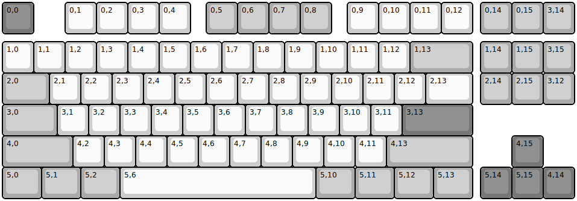
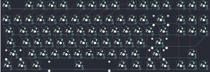
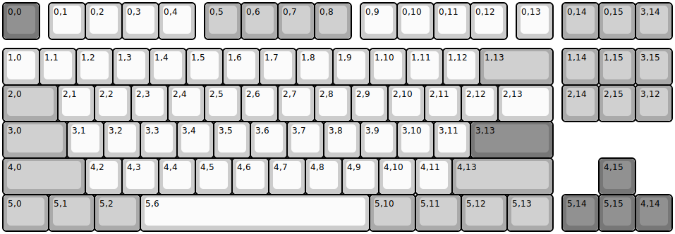
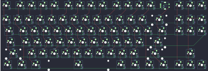
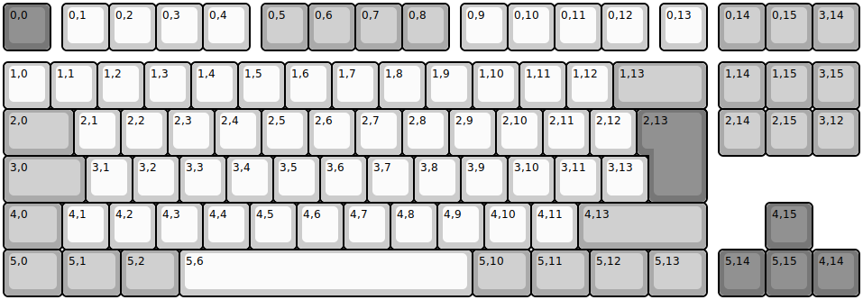
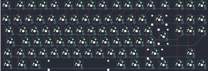
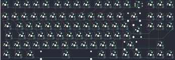
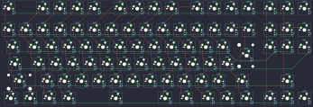
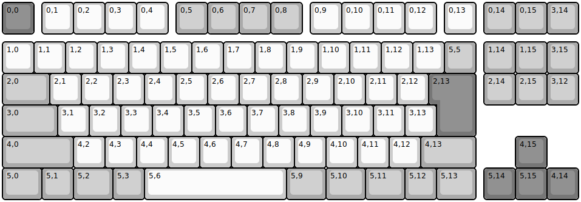
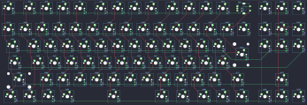

## keychron/q3/ansi

[layout](ansi-kle.json) - [PCB](ansi.kicad_pcb)

{:loading="lazy"}

[Open in keyboard-layout-editor](http://www.keyboard-layout-editor.com/##@@_c=#777777;&=0,0%0AESC&_x:1&c=#cccccc;&=0,1&=0,2&=0,3&=0,4&_x:0.5&c=#aaaaaa;&=0,5&=0,6&=0,7&=0,8&_x:0.5&c=#cccccc;&=0,9&=0,10&=0,11&=0,12&_x:0.25&c=#aaaaaa;&=0,14&=0,15&=3,14;&@_y:0.25&c=#cccccc;&=1,0&=1,1&=1,2&=1,3&=1,4&=1,5&=1,6&=1,7&=1,8&=1,9&=1,10&=1,11&=1,12&_c=#aaaaaa&w:2;&=1,13&_x:0.25;&=1,14&=1,15&=3,15;&@_w:1.5;&=2,0&_c=#cccccc;&=2,1&=2,2&=2,3&=2,4&=2,5&=2,6&=2,7&=2,8&=2,9&=2,10&=2,11&=2,12&_w:1.5;&=2,13&_x:0.25&c=#aaaaaa;&=2,14&=2,15&=3,12;&@_w:1.75;&=3,0&_c=#cccccc;&=3,1&=3,2&=3,3&=3,4&=3,5&=3,6&=3,7&=3,8&=3,9&=3,10&=3,11&_c=#777777&w:2.25;&=3,13;&@_c=#aaaaaa&w:2.25;&=4,0&_c=#cccccc;&=4,2&=4,3&=4,4&=4,5&=4,6&=4,7&=4,8&=4,9&=4,10&=4,11&_c=#aaaaaa&w:2.75;&=4,13&_x:1.25&c=#777777;&=4,15;&@_c=#aaaaaa&w:1.25;&=5,0&_w:1.25;&=5,1&_w:1.25;&=5,2&_c=#cccccc&w:6.25;&=5,6&_c=#aaaaaa&w:1.25;&=5,10&_w:1.25;&=5,11&_w:1.25;&=5,12&_w:1.25;&=5,13&_x:0.25&c=#777777;&=5,14&=5,15&=4,14)

{:loading="lazy"}

## keychron/q3/ansi_encoder

[layout](ansi_encoder-kle.json) - [PCB](ansi_encoder.kicad_pcb)

{:loading="lazy"}

[Open in keyboard-layout-editor](http://www.keyboard-layout-editor.com/##@@_c=#777777;&=0,0%0AESC&_x:0.25&c=#cccccc;&=0,1&=0,2&=0,3&=0,4&_x:0.25&c=#aaaaaa;&=0,5&=0,6&=0,7&=0,8&_x:0.25&c=#cccccc;&=0,9&=0,10&=0,11&=0,12&_x:0.25;&=0,13%0A%0A%0A%0A%0A%0A%0A%0A%0Ae0&_x:0.25&c=#aaaaaa;&=0,14&=0,15&=3,14;&@_y:0.25&c=#cccccc;&=1,0&=1,1&=1,2&=1,3&=1,4&=1,5&=1,6&=1,7&=1,8&=1,9&=1,10&=1,11&=1,12&_c=#aaaaaa&w:2;&=1,13&_x:0.25;&=1,14&=1,15&=3,15;&@_w:1.5;&=2,0&_c=#cccccc;&=2,1&=2,2&=2,3&=2,4&=2,5&=2,6&=2,7&=2,8&=2,9&=2,10&=2,11&=2,12&_w:1.5;&=2,13&_x:0.25&c=#aaaaaa;&=2,14&=2,15&=3,12;&@_w:1.75;&=3,0&_c=#cccccc;&=3,1&=3,2&=3,3&=3,4&=3,5&=3,6&=3,7&=3,8&=3,9&=3,10&=3,11&_c=#777777&w:2.25;&=3,13;&@_c=#aaaaaa&w:2.25;&=4,0&_c=#cccccc;&=4,2&=4,3&=4,4&=4,5&=4,6&=4,7&=4,8&=4,9&=4,10&=4,11&_c=#aaaaaa&w:2.75;&=4,13&_x:1.25&c=#777777;&=4,15;&@_c=#aaaaaa&w:1.25;&=5,0&_w:1.25;&=5,1&_w:1.25;&=5,2&_c=#cccccc&w:6.25;&=5,6&_c=#aaaaaa&w:1.25;&=5,10&_w:1.25;&=5,11&_w:1.25;&=5,12&_w:1.25;&=5,13&_x:0.25&c=#777777;&=5,14&=5,15&=4,14)

{:loading="lazy"}

## keychron/q3/iso

[layout](iso-kle.json) - [PCB](iso.kicad_pcb)

{:loading="lazy"}

[Open in keyboard-layout-editor](http://www.keyboard-layout-editor.com/##@@_c=#777777;&=0,0%0AESC&_x:0.25&c=#cccccc;&=0,1&=0,2&=0,3&=0,4&_x:0.25&c=#aaaaaa;&=0,5&=0,6&=0,7&=0,8&_x:0.25&c=#cccccc;&=0,9&=0,10&=0,11&=0,12&_x:0.25;&=0,13&_x:0.25&c=#aaaaaa;&=0,14&=0,15&=3,14;&@_y:0.25&c=#cccccc;&=1,0&=1,1&=1,2&=1,3&=1,4&=1,5&=1,6&=1,7&=1,8&=1,9&=1,10&=1,11&=1,12&_c=#aaaaaa&w:2;&=1,13&_x:0.25;&=1,14&=1,15&=3,15;&@_w:1.5;&=2,0&_c=#cccccc;&=2,1&=2,2&=2,3&=2,4&=2,5&=2,6&=2,7&=2,8&=2,9&=2,10&=2,11&=2,12&_x:0.25&c=#777777&w:1.25&h:2&w2:1.5&h2:1&x2:-0.25;&=2,13&_x:0.25&c=#aaaaaa;&=2,14&=2,15&=3,12;&@_w:1.75;&=3,0&_c=#cccccc;&=3,1&=3,2&=3,3&=3,4&=3,5&=3,6&=3,7&=3,8&=3,9&=3,10&=3,11&=3,13;&@_c=#aaaaaa&w:1.25;&=4,0&_c=#cccccc;&=4,1&=4,2&=4,3&=4,4&=4,5&=4,6&=4,7&=4,8&=4,9&=4,10&=4,11&_c=#aaaaaa&w:2.75;&=4,13&_x:1.25&c=#777777;&=4,15;&@_c=#aaaaaa&w:1.25;&=5,0&_w:1.25;&=5,1&_w:1.25;&=5,2&_c=#cccccc&w:6.25;&=5,6&_c=#aaaaaa&w:1.25;&=5,10&_w:1.25;&=5,11&_w:1.25;&=5,12&_w:1.25;&=5,13&_x:0.25&c=#777777;&=5,14&=5,15&=4,14)

{:loading="lazy"}

## keychron/q3/iso_encoder

[layout](iso_encoder-kle.json) - [PCB](iso_encoder.kicad_pcb)

{:loading="lazy"}

[Open in keyboard-layout-editor](http://www.keyboard-layout-editor.com/##@@_c=#777777;&=0,0%0AESC&_x:0.25&c=#cccccc;&=0,1&=0,2&=0,3&=0,4&_x:0.25&c=#aaaaaa;&=0,5&=0,6&=0,7&=0,8&_x:0.25&c=#cccccc;&=0,9&=0,10&=0,11&=0,12&_x:0.25;&=0,13%0A%0A%0A%0A%0A%0A%0A%0A%0Ae0&_x:0.25&c=#aaaaaa;&=0,14&=0,15&=3,14;&@_y:0.25&c=#cccccc;&=1,0&=1,1&=1,2&=1,3&=1,4&=1,5&=1,6&=1,7&=1,8&=1,9&=1,10&=1,11&=1,12&_c=#aaaaaa&w:2;&=1,13&_x:0.25;&=1,14&=1,15&=3,15;&@_w:1.5;&=2,0&_c=#cccccc;&=2,1&=2,2&=2,3&=2,4&=2,5&=2,6&=2,7&=2,8&=2,9&=2,10&=2,11&=2,12&_x:0.25&c=#777777&w:1.25&h:2&w2:1.5&h2:1&x2:-0.25;&=2,13&_x:0.25&c=#aaaaaa;&=2,14&=2,15&=3,12;&@_w:1.75;&=3,0&_c=#cccccc;&=3,1&=3,2&=3,3&=3,4&=3,5&=3,6&=3,7&=3,8&=3,9&=3,10&=3,11&=3,13;&@_c=#aaaaaa&w:1.25;&=4,0&_c=#cccccc;&=4,1&=4,2&=4,3&=4,4&=4,5&=4,6&=4,7&=4,8&=4,9&=4,10&=4,11&_c=#aaaaaa&w:2.75;&=4,13&_x:1.25&c=#777777;&=4,15;&@_c=#aaaaaa&w:1.25;&=5,0&_w:1.25;&=5,1&_w:1.25;&=5,2&_c=#cccccc&w:6.25;&=5,6&_c=#aaaaaa&w:1.25;&=5,10&_w:1.25;&=5,11&_w:1.25;&=5,12&_w:1.25;&=5,13&_x:0.25&c=#777777;&=5,14&=5,15&=4,14)

{:loading="lazy"}

## keychron/q3/jis

[layout](jis-kle.json) - [PCB](jis.kicad_pcb)

{:loading="lazy"}

[Open in keyboard-layout-editor](http://www.keyboard-layout-editor.com/##@@_c=#777777;&=0,0%0AESC&_x:1&c=#cccccc;&=0,1&=0,2&=0,3&=0,4&_x:0.5&c=#aaaaaa;&=0,5&=0,6&=0,7&=0,8&_x:0.5&c=#cccccc;&=0,9&=0,10&=0,11&=0,12&_x:0.25&c=#aaaaaa;&=0,14&=0,15&=3,14;&@_y:0.25&c=#cccccc;&=1,0&=1,1&=1,2&=1,3&=1,4&=1,5&=1,6&=1,7&=1,8&=1,9&=1,10&=1,11&=1,12&=1,13&_c=#aaaaaa;&=0,13&_x:0.25;&=1,14&=1,15&=3,15;&@_w:1.5;&=2,0&_c=#cccccc;&=2,1&=2,2&=2,3&=2,4&=2,5&=2,6&=2,7&=2,8&=2,9&=2,10&=2,11&=2,12&_x:0.25&c=#777777&w:1.25&h:2&w2:1.5&h2:1&x2:-0.25;&=2,13&_x:0.25&c=#aaaaaa;&=2,14&=2,15&=3,12;&@_w:1.75;&=3,0&_c=#cccccc;&=3,1&=3,2&=3,3&=3,4&=3,5&=3,6&=3,7&=3,8&=3,9&=3,10&=3,11&=3,13;&@_c=#aaaaaa&w:2.25;&=4,0&_c=#cccccc;&=4,2&=4,3&=4,4&=4,5&=4,6&=4,7&=4,8&=4,9&=4,10&=4,11&=4,12&_c=#aaaaaa&w:1.75;&=4,13&_x:1.25&c=#777777;&=4,15;&@_c=#aaaaaa&w:1.25;&=5,0&=5,1&_w:1.25;&=5,2&=5,3&_c=#cccccc&w:4.5;&=5,6&_c=#aaaaaa&w:1.25;&=5,9&_w:1.25;&=5,10&_w:1.25;&=5,11&=5,12&_w:1.25;&=5,13&_x:0.25&c=#777777;&=5,14&=5,15&=4,14)

{:loading="lazy"}

## keychron/q3/jis_encoder

[layout](jis_encoder-kle.json) - [PCB](jis_encoder.kicad_pcb)

{:loading="lazy"}

[Open in keyboard-layout-editor](http://www.keyboard-layout-editor.com/##@@_c=#777777;&=0,0%0AESC&_x:0.25&c=#cccccc;&=0,1&=0,2&=0,3&=0,4&_x:0.25&c=#aaaaaa;&=0,5&=0,6&=0,7&=0,8&_x:0.25&c=#cccccc;&=0,9&=0,10&=0,11&=0,12&_x:0.25;&=0,13%0A%0A%0A%0A%0A%0A%0A%0A%0Ae0&_x:0.25&c=#aaaaaa;&=0,14&=0,15&=3,14;&@_y:0.25&c=#cccccc;&=1,0&=1,1&=1,2&=1,3&=1,4&=1,5&=1,6&=1,7&=1,8&=1,9&=1,10&=1,11&=1,12&=1,13&_c=#aaaaaa;&=5,5&_x:0.25;&=1,14&=1,15&=3,15;&@_w:1.5;&=2,0&_c=#cccccc;&=2,1&=2,2&=2,3&=2,4&=2,5&=2,6&=2,7&=2,8&=2,9&=2,10&=2,11&=2,12&_x:0.25&c=#777777&w:1.25&h:2&w2:1.5&h2:1&x2:-0.25;&=2,13&_x:0.25&c=#aaaaaa;&=2,14&=2,15&=3,12;&@_w:1.75;&=3,0&_c=#cccccc;&=3,1&=3,2&=3,3&=3,4&=3,5&=3,6&=3,7&=3,8&=3,9&=3,10&=3,11&=3,13;&@_c=#aaaaaa&w:2.25;&=4,0&_c=#cccccc;&=4,2&=4,3&=4,4&=4,5&=4,6&=4,7&=4,8&=4,9&=4,10&=4,11&=4,12&_c=#aaaaaa&w:1.75;&=4,13&_x:1.25&c=#777777;&=4,15;&@_c=#aaaaaa&w:1.25;&=5,0&=5,1&_w:1.25;&=5,2&=5,3&_c=#cccccc&w:4.5;&=5,6&_c=#aaaaaa&w:1.25;&=5,9&_w:1.25;&=5,10&_w:1.25;&=5,11&=5,12&_w:1.25;&=5,13&_x:0.25&c=#777777;&=5,14&=5,15&=4,14)

{:loading="lazy"}

