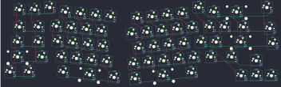
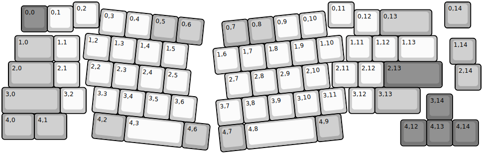
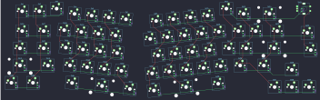
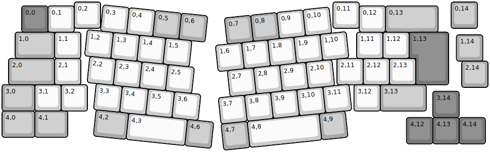
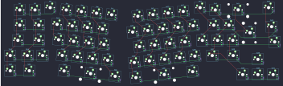
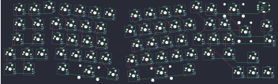

## keychron/q8/ansi

[layout](ansi-kle.json) - [PCB](ansi.kicad_pcb)

{:loading="lazy"}

[Open in keyboard-layout-editor](http://www.keyboard-layout-editor.com/##@@_x:2.75;&=0,2&_x:8.85;&=0,11&_x:3.5&c=#aaaaaa;&=0,14;&@_x:0.75&y:-0.85&c=#777777;&=0,0%0AESC&_c=#cccccc;&=0,1;&@_x:13.6&y:-0.85;&=0,12&_c=#aaaaaa&w:2;&=0,13;&@_x:0.5&w:1.5;&=1,0&_c=#cccccc;&=1,1&_x:10.3;&=1,11&=1,12&_w:1.5;&=1,13;&@_x:17.3&y:-0.9&c=#aaaaaa;&=1,14;&@_x:0.25&y:-0.1&w:1.75;&=2,0&_c=#cccccc;&=2,1&_x:9.75;&=2,11&=2,12&_c=#777777&w:2.25;&=2,13;&@_x:17.5&y:-0.9&c=#aaaaaa;&=2,14;&@_y:-0.1&w:2.25;&=3,0&_c=#cccccc;&=3,2&_x:10.15;&=3,12&_c=#aaaaaa&w:1.75;&=3,13;&@_x:16.4&y:-0.75&c=#777777;&=3,14;&@_y:-0.25&c=#aaaaaa&w:1.25;&=4,0&_w:1.25;&=4,1;&@_x:15.4&y:-0.75&c=#777777;&=4,12&=4,13&=4,14;&@_r:6&x:3.85&y:-5.7&c=#cccccc;&=0,3&=0,4&_c=#aaaaaa;&=0,5&=0,6;&@_x:3.35&c=#cccccc;&=1,2&=1,3&=1,4&=1,5;&@_x:3.55;&=2,2&=2,3&=2,4&=2,5;&@_x:3.9;&=3,3&=3,4&=3,5&=3,6;&@_x:4&c=#aaaaaa&w:1.25;&=4,2&_c=#cccccc&w:2.25;&=4,3&_c=#aaaaaa;&=4,6;&@_r:-6&x:8.35&y:-3.2;&=0,7&=0,8&_c=#cccccc;&=0,9&=0,10;&@_x:7.9;&=1,6&=1,7&=1,8&=1,9&=1,10;&@_x:8.25;&=2,7&=2,8&=2,9&=2,10;&@_x:7.8;&=3,7&=3,8&=3,9&=3,10&=3,11;&@_x:7.8&c=#aaaaaa;&=4,7&_c=#cccccc&w:2.75;&=4,8&_c=#aaaaaa;&=4,9)

{:loading="lazy"}

## keychron/q8/ansi_encoder

[layout](ansi_encoder-kle.json) - [PCB](ansi_encoder.kicad_pcb)

{:loading="lazy"}

[Open in keyboard-layout-editor](http://www.keyboard-layout-editor.com/##@@_x:2.75;&=0,2&_x:8.85;&=0,11&_x:3.5&c=#aaaaaa;&=0,14%0A%0A%0A%0A%0A%0A%0A%0A%0Ae0;&@_x:0.75&y:-0.85&c=#777777;&=0,0%0AESC&_c=#cccccc;&=0,1;&@_x:13.6&y:-0.85;&=0,12&_c=#aaaaaa&w:2;&=0,13;&@_x:0.5&w:1.5;&=1,0&_c=#cccccc;&=1,1&_x:10.3;&=1,11&=1,12&_w:1.5;&=1,13;&@_x:17.3&y:-0.9&c=#aaaaaa;&=1,14;&@_x:0.25&y:-0.1&w:1.75;&=2,0&_c=#cccccc;&=2,1&_x:9.75;&=2,11&=2,12&_c=#777777&w:2.25;&=2,13;&@_x:17.5&y:-0.9&c=#aaaaaa;&=2,14;&@_y:-0.1&w:2.25;&=3,0&_c=#cccccc;&=3,2&_x:10.15;&=3,12&_c=#aaaaaa&w:1.75;&=3,13;&@_x:16.4&y:-0.75&c=#777777;&=3,14;&@_y:-0.25&c=#aaaaaa&w:1.25;&=4,0&_w:1.25;&=4,1;&@_x:15.4&y:-0.75&c=#777777;&=4,12&=4,13&=4,14;&@_r:6&x:3.85&y:-5.7&c=#cccccc;&=0,3&=0,4&_c=#aaaaaa;&=0,5&=0,6;&@_x:3.35&c=#cccccc;&=1,2&=1,3&=1,4&=1,5;&@_x:3.55;&=2,2&=2,3&=2,4&=2,5;&@_x:3.9;&=3,3&=3,4&=3,5&=3,6;&@_x:4&c=#aaaaaa&w:1.25;&=4,2&_c=#cccccc&w:2.25;&=4,3&_c=#aaaaaa;&=4,6;&@_r:-6&x:8.35&y:-3.2;&=0,7&=0,8&_c=#cccccc;&=0,9&=0,10;&@_x:7.9;&=1,6&=1,7&=1,8&=1,9&=1,10;&@_x:8.25;&=2,7&=2,8&=2,9&=2,10;&@_x:7.8;&=3,7&=3,8&=3,9&=3,10&=3,11;&@_x:7.8&c=#aaaaaa;&=4,7&_c=#cccccc&w:2.75;&=4,8&_c=#aaaaaa;&=4,9)

{:loading="lazy"}

## keychron/q8/iso

[layout](iso-kle.json) - [PCB](iso.kicad_pcb)

{:loading="lazy"}

[Open in keyboard-layout-editor](http://www.keyboard-layout-editor.com/##@@_x:2.75;&=0,2&_x:8.85;&=0,11&_x:3.5&c=#aaaaaa;&=0,14;&@_x:0.75&y:-0.85&c=#777777;&=0,0%0AESC&_c=#cccccc;&=0,1&_x:10.85;&=0,12&_c=#aaaaaa&w:2;&=0,13;&@_x:0.5&w:1.5;&=1,0&_c=#cccccc;&=1,1&_x:10.5;&=1,11&=1,12&_x:0.25&c=#777777&w:1.25&h:2&w2:1.5&h2:1&x2:-0.25;&=1,13;&@_x:17.3&y:-0.9&c=#aaaaaa;&=1,14;&@_x:0.25&y:-0.1&w:1.75;&=2,0&_c=#cccccc;&=2,1&_x:9.75;&=2,11&=2,12&=2,13;&@_x:17.5&y:-0.9&c=#aaaaaa;&=2,14;&@_y:-0.1&w:1.25;&=3,0&_c=#cccccc;&=3,1&=3,2&_x:10.15;&=3,12&_c=#aaaaaa&w:1.75;&=3,13;&@_x:16.4&y:-0.75&c=#777777;&=3,14;&@_y:-0.25&c=#aaaaaa&w:1.25;&=4,0&_w:1.25;&=4,1;&@_x:15.4&y:-0.75&c=#777777;&=4,12&=4,13&=4,14;&@_r:6&x:3.85&y:-5.7&c=#cccccc;&=0,3&=0,4&_c=#aaaaaa;&=0,5&=0,6;&@_x:3.35&c=#cccccc;&=1,2&=1,3&=1,4&=1,5;&@_x:3.55;&=2,2&=2,3&=2,4&=2,5;&@_x:3.9;&=3,3&=3,4&=3,5&=3,6;&@_x:4&c=#aaaaaa&w:1.25;&=4,2&_c=#cccccc&w:2.25;&=4,3&_c=#aaaaaa;&=4,6;&@_r:-6&x:8.35&y:-3.2;&=0,7&=0,8&_c=#cccccc;&=0,9&=0,10;&@_x:7.9;&=1,6&=1,7&=1,8&=1,9&=1,10;&@_x:8.25;&=2,7&=2,8&=2,9&=2,10;&@_x:7.8;&=3,7&=3,8&=3,9&=3,10&=3,11;&@_x:7.8&c=#aaaaaa;&=4,7&_c=#cccccc&w:2.75;&=4,8&_c=#aaaaaa;&=4,9)

{:loading="lazy"}

## keychron/q8/iso_encoder

[layout](iso_encoder-kle.json) - [PCB](iso_encoder.kicad_pcb)

{:loading="lazy"}

[Open in keyboard-layout-editor](http://www.keyboard-layout-editor.com/##@@_x:2.75;&=0,2&_x:8.85;&=0,11&_x:3.5&c=#aaaaaa;&=0,14%0A%0A%0A%0A%0A%0A%0A%0A%0Ae0;&@_x:0.75&y:-0.85&c=#777777;&=0,0%0AESC&_c=#cccccc;&=0,1&_x:10.85;&=0,12&_c=#aaaaaa&w:2;&=0,13;&@_x:0.5&w:1.5;&=1,0&_c=#cccccc;&=1,1&_x:10.5;&=1,11&=1,12&_x:0.25&c=#777777&w:1.25&h:2&w2:1.5&h2:1&x2:-0.25;&=1,13;&@_x:17.3&y:-0.9&c=#aaaaaa;&=1,14;&@_x:0.25&y:-0.1&w:1.75;&=2,0&_c=#cccccc;&=2,1&_x:9.75;&=2,11&=2,12&=2,13;&@_x:17.5&y:-0.9&c=#aaaaaa;&=2,14;&@_y:-0.1&w:1.25;&=3,0&_c=#cccccc;&=3,1&=3,2&_x:10.15;&=3,12&_c=#aaaaaa&w:1.75;&=3,13;&@_x:16.4&y:-0.75&c=#777777;&=3,14;&@_y:-0.25&c=#aaaaaa&w:1.25;&=4,0&_w:1.25;&=4,1;&@_x:15.4&y:-0.75&c=#777777;&=4,12&=4,13&=4,14;&@_r:6&x:3.85&y:-5.7&c=#cccccc;&=0,3&=0,4&_c=#aaaaaa;&=0,5&=0,6;&@_x:3.35&c=#cccccc;&=1,2&=1,3&=1,4&=1,5;&@_x:3.55;&=2,2&=2,3&=2,4&=2,5;&@_x:3.9;&=3,3&=3,4&=3,5&=3,6;&@_x:4&c=#aaaaaa&w:1.25;&=4,2&_c=#cccccc&w:2.25;&=4,3&_c=#aaaaaa;&=4,6;&@_r:-6&x:8.35&y:-3.2;&=0,7&=0,8&_c=#cccccc;&=0,9&=0,10;&@_x:7.9;&=1,6&=1,7&=1,8&=1,9&=1,10;&@_x:8.25;&=2,7&=2,8&=2,9&=2,10;&@_x:7.8;&=3,7&=3,8&=3,9&=3,10&=3,11;&@_x:7.8&c=#aaaaaa;&=4,7&_c=#cccccc&w:2.75;&=4,8&_c=#aaaaaa;&=4,9)

{:loading="lazy"}

