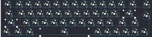
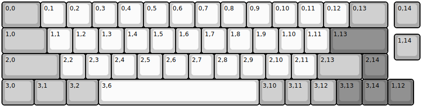
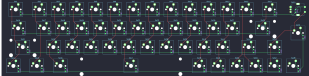
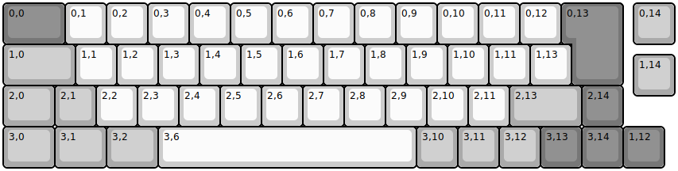
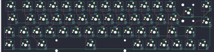
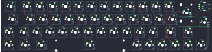

## keychron/q9/ansi

[layout](ansi-kle.json) - [PCB](ansi.kicad_pcb)

{:loading="lazy"}

[Open in keyboard-layout-editor](http://www.keyboard-layout-editor.com/##@@_c=#aaaaaa&w:1.5;&=0,0&_c=#cccccc;&=0,1&=0,2&=0,3&=0,4&=0,5&=0,6&=0,7&=0,8&=0,9&=0,10&=0,11&=0,12&_c=#aaaaaa&w:1.5;&=0,13&_x:0.25;&=0,14;&@_w:1.75;&=1,0&_c=#cccccc;&=1,1&=1,2&=1,3&=1,4&=1,5&=1,6&=1,7&=1,8&=1,9&=1,10&=1,11&_c=#777777&w:2.25;&=1,13;&@_x:15.25&y:-0.75&c=#aaaaaa;&=1,14;&@_y:-0.25&w:2.25;&=2,0&_c=#cccccc;&=2,2&=2,3&=2,4&=2,5&=2,6&=2,7&=2,8&=2,9&=2,10&=2,11&_c=#aaaaaa&w:1.75;&=2,13&_c=#777777;&=2,14;&@_c=#aaaaaa&w:1.25;&=3,0&_w:1.25;&=3,1&_w:1.25;&=3,2&_c=#cccccc&w:6.25;&=3,6&_c=#aaaaaa;&=3,10&=3,11&=3,12&_c=#777777;&=3,13&=3,14&=1,12)

{:loading="lazy"}

## keychron/q9/ansi_encoder

[layout](ansi_encoder-kle.json) - [PCB](ansi_encoder.kicad_pcb)

{:loading="lazy"}

[Open in keyboard-layout-editor](http://www.keyboard-layout-editor.com/##@@_c=#aaaaaa&w:1.5;&=0,0&_c=#cccccc;&=0,1&=0,2&=0,3&=0,4&=0,5&=0,6&=0,7&=0,8&=0,9&=0,10&=0,11&=0,12&_c=#aaaaaa&w:1.5;&=0,13&_x:0.25;&=0,14%0A%0A%0A%0A%0A%0A%0A%0A%0Ae0;&@_w:1.75;&=1,0&_c=#cccccc;&=1,1&=1,2&=1,3&=1,4&=1,5&=1,6&=1,7&=1,8&=1,9&=1,10&=1,11&_c=#777777&w:2.25;&=1,13;&@_x:15.25&y:-0.75&c=#aaaaaa;&=1,14;&@_y:-0.25&w:2.25;&=2,0&_c=#cccccc;&=2,2&=2,3&=2,4&=2,5&=2,6&=2,7&=2,8&=2,9&=2,10&=2,11&_c=#aaaaaa&w:1.75;&=2,13&_c=#777777;&=2,14;&@_c=#aaaaaa&w:1.25;&=3,0&_w:1.25;&=3,1&_w:1.25;&=3,2&_c=#cccccc&w:6.25;&=3,6&_c=#aaaaaa;&=3,10&=3,11&=3,12&_c=#777777;&=3,13&=3,14&=1,12)

{:loading="lazy"}

## keychron/q9/iso

[layout](iso-kle.json) - [PCB](iso.kicad_pcb)

{:loading="lazy"}

[Open in keyboard-layout-editor](http://www.keyboard-layout-editor.com/##@@_c=#777777&w:1.5;&=0,0&_c=#cccccc;&=0,1&=0,2&=0,3&=0,4&=0,5&=0,6&=0,7&=0,8&=0,9&=0,10&=0,11&=0,12&_x:0.25&c=#777777&w:1.25&h:2&w2:1.5&h2:1&x2:-0.25;&=0,13&_x:0.25&c=#aaaaaa;&=0,14;&@_w:1.75;&=1,0&_c=#cccccc;&=1,1&=1,2&=1,3&=1,4&=1,5&=1,6&=1,7&=1,8&=1,9&=1,10&=1,11&=1,13;&@_x:15.25&y:-0.75&c=#aaaaaa;&=1,14;&@_y:-0.25&w:1.25;&=2,0&=2,1&_c=#cccccc;&=2,2&=2,3&=2,4&=2,5&=2,6&=2,7&=2,8&=2,9&=2,10&=2,11&_c=#aaaaaa&w:1.75;&=2,13&_c=#777777;&=2,14;&@_c=#aaaaaa&w:1.25;&=3,0&_w:1.25;&=3,1&_w:1.25;&=3,2&_c=#cccccc&w:6.25;&=3,6&_c=#aaaaaa;&=3,10&=3,11&=3,12&_c=#777777;&=3,13&=3,14&=1,12)

{:loading="lazy"}

## keychron/q9/iso_encoder

[layout](iso_encoder-kle.json) - [PCB](iso_encoder.kicad_pcb)

{:loading="lazy"}

[Open in keyboard-layout-editor](http://www.keyboard-layout-editor.com/##@@_c=#777777&w:1.5;&=0,0&_c=#cccccc;&=0,1&=0,2&=0,3&=0,4&=0,5&=0,6&=0,7&=0,8&=0,9&=0,10&=0,11&=0,12&_x:0.25&c=#777777&w:1.25&h:2&w2:1.5&h2:1&x2:-0.25;&=0,13&_x:0.25&c=#aaaaaa;&=0,14%0A%0A%0A%0A%0A%0A%0A%0A%0Ae0;&@_w:1.75;&=1,0&_c=#cccccc;&=1,1&=1,2&=1,3&=1,4&=1,5&=1,6&=1,7&=1,8&=1,9&=1,10&=1,11&=1,13;&@_x:15.25&y:-0.75&c=#aaaaaa;&=1,14;&@_y:-0.25&w:1.25;&=2,0&=2,1&_c=#cccccc;&=2,2&=2,3&=2,4&=2,5&=2,6&=2,7&=2,8&=2,9&=2,10&=2,11&_c=#aaaaaa&w:1.75;&=2,13&_c=#777777;&=2,14;&@_c=#aaaaaa&w:1.25;&=3,0&_w:1.25;&=3,1&_w:1.25;&=3,2&_c=#cccccc&w:6.25;&=3,6&_c=#aaaaaa;&=3,10&=3,11&=3,12&_c=#777777;&=3,13&=3,14&=1,12)

{:loading="lazy"}

