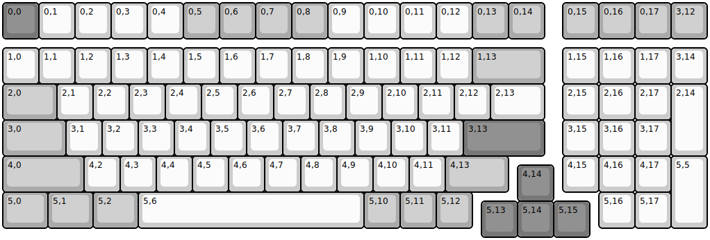
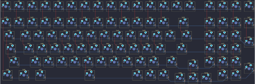
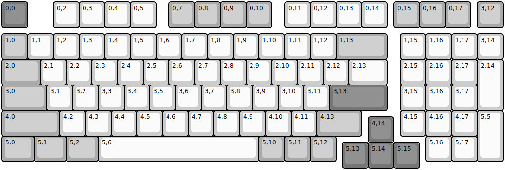
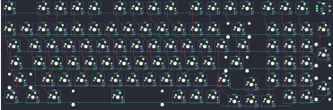
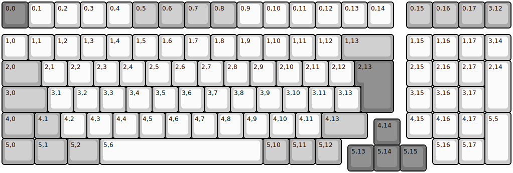
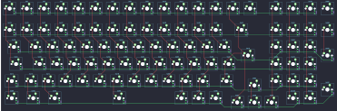
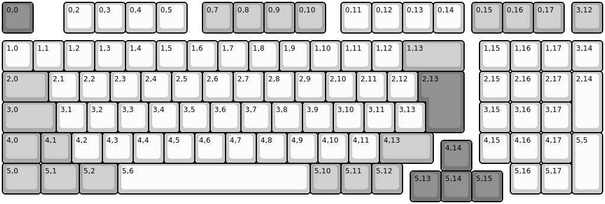
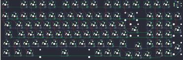

## keychron/v5/ansi

[layout](ansi-kle.json) - [PCB](ansi.kicad_pcb)

{:loading="lazy"}

[Open in keyboard-layout-editor](http://www.keyboard-layout-editor.com/##@@_c=#777777;&=0,0%0AESC&_c=#cccccc;&=0,1&=0,2&=0,3&=0,4&_c=#aaaaaa;&=0,5&=0,6&=0,7&=0,8&_c=#cccccc;&=0,9&=0,10&=0,11&=0,12&_c=#aaaaaa;&=0,13&=0,14&_x:0.5;&=0,15&=0,16&=0,17&=3,12;&@_y:0.25&c=#cccccc;&=1,0&=1,1&=1,2&=1,3&=1,4&=1,5&=1,6&=1,7&=1,8&=1,9&=1,10&=1,11&=1,12&_c=#aaaaaa&w:2;&=1,13&_x:0.5&c=#cccccc;&=1,15&=1,16&=1,17&=3,14;&@_c=#aaaaaa&w:1.5;&=2,0&_c=#cccccc;&=2,1&=2,2&=2,3&=2,4&=2,5&=2,6&=2,7&=2,8&=2,9&=2,10&=2,11&=2,12&_w:1.5;&=2,13&_x:0.5;&=2,15&=2,16&=2,17&_h:2;&=2,14;&@_c=#aaaaaa&w:1.75;&=3,0&_c=#cccccc;&=3,1&=3,2&=3,3&=3,4&=3,5&=3,6&=3,7&=3,8&=3,9&=3,10&=3,11&_c=#777777&w:2.25;&=3,13&_x:0.5&c=#cccccc;&=3,15&=3,16&=3,17;&@_c=#aaaaaa&w:2.25;&=4,0&_c=#cccccc;&=4,2&=4,3&=4,4&=4,5&=4,6&=4,7&=4,8&=4,9&=4,10&=4,11&_c=#aaaaaa&w:1.75;&=4,13&_x:1.5&c=#cccccc;&=4,15&=4,16&=4,17&_h:2;&=5,5;&@_x:14.25&y:-0.75&c=#777777;&=4,14;&@_y:-0.25&c=#aaaaaa&w:1.25;&=5,0&_w:1.25;&=5,1&_w:1.25;&=5,2&_c=#cccccc&w:6.25;&=5,6&_c=#aaaaaa;&=5,10&=5,11&=5,12&_x:3.5&c=#cccccc;&=5,16&=5,17;&@_x:13.25&y:-0.75&c=#777777;&=5,13&=5,14&=5,15)

{:loading="lazy"}

## keychron/v5/ansi_encoder

[layout](ansi_encoder-kle.json) - [PCB](ansi_encoder.kicad_pcb)

{:loading="lazy"}

[Open in keyboard-layout-editor](http://www.keyboard-layout-editor.com/##@@_c=#777777;&=0,0%0AESC&_x:1&c=#cccccc;&=0,2&=0,3&=0,4&=0,5&_x:0.5&c=#aaaaaa;&=0,7&=0,8&=0,9&=0,10&_x:0.5&c=#cccccc;&=0,11&=0,12&=0,13&=0,14&_x:0.25&c=#aaaaaa;&=0,15&=0,16&=0,17&_x:0.25;&=3,12%0A%0A%0A%0A%0A%0A%0A%0A%0Ae0;&@_y:0.25;&=1,0&_c=#cccccc;&=1,1&=1,2&=1,3&=1,4&=1,5&=1,6&=1,7&=1,8&=1,9&=1,10&=1,11&=1,12&_c=#aaaaaa&w:2;&=1,13&_x:0.5&c=#cccccc;&=1,15&=1,16&=1,17&=3,14;&@_c=#aaaaaa&w:1.5;&=2,0&_c=#cccccc;&=2,1&=2,2&=2,3&=2,4&=2,5&=2,6&=2,7&=2,8&=2,9&=2,10&=2,11&=2,12&_w:1.5;&=2,13&_x:0.5;&=2,15&=2,16&=2,17&_h:2;&=2,14;&@_c=#aaaaaa&w:1.75;&=3,0&_c=#cccccc;&=3,1&=3,2&=3,3&=3,4&=3,5&=3,6&=3,7&=3,8&=3,9&=3,10&=3,11&_c=#777777&w:2.25;&=3,13&_x:0.5&c=#cccccc;&=3,15&=3,16&=3,17;&@_c=#aaaaaa&w:2.25;&=4,0&_c=#cccccc;&=4,2&=4,3&=4,4&=4,5&=4,6&=4,7&=4,8&=4,9&=4,10&=4,11&_c=#aaaaaa&w:1.75;&=4,13&_x:1.5&c=#cccccc;&=4,15&=4,16&=4,17&_h:2;&=5,5;&@_x:14.25&y:-0.75&c=#777777;&=4,14;&@_y:-0.25&c=#aaaaaa&w:1.25;&=5,0&_w:1.25;&=5,1&_w:1.25;&=5,2&_c=#cccccc&w:6.25;&=5,6&_c=#aaaaaa;&=5,10&=5,11&=5,12&_x:3.5&c=#cccccc;&=5,16&=5,17;&@_x:13.25&y:-0.75&c=#777777;&=5,13&=5,14&=5,15)

{:loading="lazy"}

## keychron/v5/iso

[layout](iso-kle.json) - [PCB](iso.kicad_pcb)

{:loading="lazy"}

[Open in keyboard-layout-editor](http://www.keyboard-layout-editor.com/##@@_c=#777777;&=0,0%0AESC&_c=#cccccc;&=0,1&=0,2&=0,3&=0,4&_c=#aaaaaa;&=0,5&=0,6&=0,7&=0,8&_c=#cccccc;&=0,9&=0,10&=0,11&=0,12&=0,13&=0,14&_x:0.5&c=#aaaaaa;&=0,15&=0,16&=0,17&=3,12;&@_y:0.25&c=#cccccc;&=1,0&=1,1&=1,2&=1,3&=1,4&=1,5&=1,6&=1,7&=1,8&=1,9&=1,10&=1,11&=1,12&_c=#aaaaaa&w:2;&=1,13&_x:0.5&c=#cccccc;&=1,15&=1,16&=1,17&=3,14;&@_c=#aaaaaa&w:1.5;&=2,0&_c=#cccccc;&=2,1&=2,2&=2,3&=2,4&=2,5&=2,6&=2,7&=2,8&=2,9&=2,10&=2,11&=2,12&_x:0.25&c=#777777&w:1.25&h:2&w2:1.5&h2:1&x2:-0.25;&=2,13&_x:0.5&c=#cccccc;&=2,15&=2,16&=2,17&_h:2;&=2,14;&@_c=#aaaaaa&w:1.75;&=3,0&_c=#cccccc;&=3,1&=3,2&=3,3&=3,4&=3,5&=3,6&=3,7&=3,8&=3,9&=3,10&=3,11&=3,13&_x:1.75;&=3,15&=3,16&=3,17;&@_c=#aaaaaa&w:1.25;&=4,0&=4,1&_c=#cccccc;&=4,2&=4,3&=4,4&=4,5&=4,6&=4,7&=4,8&=4,9&=4,10&=4,11&_c=#aaaaaa&w:1.75;&=4,13&_x:1.5&c=#cccccc;&=4,15&=4,16&=4,17&_h:2;&=5,5;&@_x:14.25&y:-0.75&c=#777777;&=4,14;&@_y:-0.25&c=#aaaaaa&w:1.25;&=5,0&_w:1.25;&=5,1&_w:1.25;&=5,2&_c=#cccccc&w:6.25;&=5,6&_c=#aaaaaa;&=5,10&=5,11&=5,12&_x:3.5&c=#cccccc;&=5,16&=5,17;&@_x:13.25&y:-0.75&c=#777777;&=5,13&=5,14&=5,15)

{:loading="lazy"}

## keychron/v5/iso_encoder

[layout](iso_encoder-kle.json) - [PCB](iso_encoder.kicad_pcb)

{:loading="lazy"}

[Open in keyboard-layout-editor](http://www.keyboard-layout-editor.com/##@@_c=#777777;&=0,0%0AESC&_x:1&c=#cccccc;&=0,2&=0,3&=0,4&=0,5&_x:0.5&c=#aaaaaa;&=0,7&=0,8&=0,9&=0,10&_x:0.5&c=#cccccc;&=0,11&=0,12&=0,13&=0,14&_x:0.25&c=#aaaaaa;&=0,15&=0,16&=0,17&_x:0.25;&=3,12%0A%0A%0A%0A%0A%0A%0A%0A%0Ae0;&@_y:0.25&c=#cccccc;&=1,0&=1,1&=1,2&=1,3&=1,4&=1,5&=1,6&=1,7&=1,8&=1,9&=1,10&=1,11&=1,12&_c=#aaaaaa&w:2;&=1,13&_x:0.5&c=#cccccc;&=1,15&=1,16&=1,17&=3,14;&@_c=#aaaaaa&w:1.5;&=2,0&_c=#cccccc;&=2,1&=2,2&=2,3&=2,4&=2,5&=2,6&=2,7&=2,8&=2,9&=2,10&=2,11&=2,12&_x:0.25&c=#777777&w:1.25&h:2&w2:1.5&h2:1&x2:-0.25;&=2,13&_x:0.5&c=#cccccc;&=2,15&=2,16&=2,17&_h:2;&=2,14;&@_c=#aaaaaa&w:1.75;&=3,0&_c=#cccccc;&=3,1&=3,2&=3,3&=3,4&=3,5&=3,6&=3,7&=3,8&=3,9&=3,10&=3,11&=3,13&_x:1.75;&=3,15&=3,16&=3,17;&@_c=#aaaaaa&w:1.25;&=4,0&=4,1&_c=#cccccc;&=4,2&=4,3&=4,4&=4,5&=4,6&=4,7&=4,8&=4,9&=4,10&=4,11&_c=#aaaaaa&w:1.75;&=4,13&_x:1.5&c=#cccccc;&=4,15&=4,16&=4,17&_h:2;&=5,5;&@_x:14.25&y:-0.75&c=#777777;&=4,14;&@_y:-0.25&c=#aaaaaa&w:1.25;&=5,0&_w:1.25;&=5,1&_w:1.25;&=5,2&_c=#cccccc&w:6.25;&=5,6&_c=#aaaaaa;&=5,10&=5,11&=5,12&_x:3.5&c=#cccccc;&=5,16&=5,17;&@_x:13.25&y:-0.75&c=#777777;&=5,13&=5,14&=5,15)

{:loading="lazy"}

