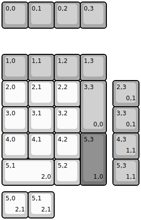
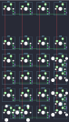

## keyten/kt3700

[layout](kt3700-kle.json) - [PCB](kt3700.kicad_pcb)

{:loading="lazy"}

[Open in keyboard-layout-editor](http://www.keyboard-layout-editor.com/##@@_c=#aaaaaa;&=0,0&=0,1&=0,2&=0,3;&@_y:1;&=1,0&=1,1&=1,2&=1,3;&@_c=#cccccc;&=2,0&=2,1&=2,2&_c=#aaaaaa&h:2;&=3,3%0A%0A%0A0,0;&@_c=#cccccc;&=3,0&=3,1&=3,2;&@=4,0&=4,1&=4,2&_c=#777777&h:2;&=5,3%0A%0A%0A1,0;&@_c=#cccccc&w:2;&=5,1%0A%0A%0A2,0&=5,2;&@_x:4.25&y:-4&c=#aaaaaa;&=2,3%0A%0A%0A0,1;&@_x:4.25;&=3,3%0A%0A%0A0,1;&@_x:4.25;&=4,3%0A%0A%0A1,1;&@_x:4.25;&=5,3%0A%0A%0A1,1;&@_y:0.25&c=#cccccc;&=5,0%0A%0A%0A2,1&=5,1%0A%0A%0A2,1)

{:loading="lazy"}

