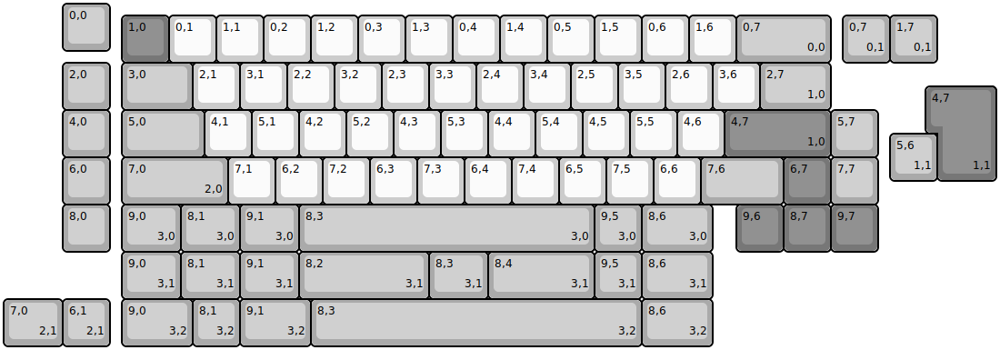
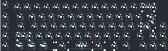
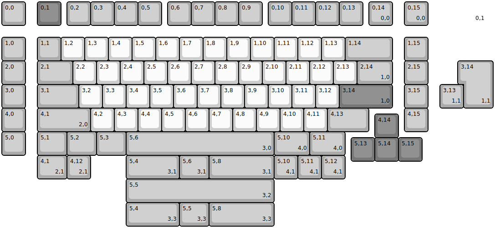
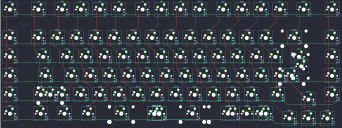

## kikoslab/ellora65

[layout](ellora65-kle.json) - [PCB](ellora65.kicad_pcb)

{:loading="lazy"}

[Open in keyboard-layout-editor](http://www.keyboard-layout-editor.com/##@@_x:1.25&c=#aaaaaa;&=0,0;&@_x:2.5&y:-0.75&c=#777777;&=1,0&_c=#cccccc;&=0,1&=1,1&=0,2&=1,2&=0,3&=1,3&=0,4&=1,4&=0,5&=1,5&=0,6&=1,6&_c=#aaaaaa&w:2;&=0,7%0A%0A%0A0,0;&@_x:1.25;&=2,0&_x:0.25&w:1.5;&=3,0&_c=#cccccc;&=2,1&=3,1&=2,2&=3,2&=2,3&=3,3&=2,4&=3,4&=2,5&=3,5&=2,6&=3,6&_c=#aaaaaa&w:1.5;&=2,7%0A%0A%0A1,0;&@_x:1.25;&=4,0&_x:0.25&w:1.75;&=5,0&_c=#cccccc;&=4,1&=5,1&=4,2&=5,2&=4,3&=5,3&=4,4&=5,4&=4,5&=5,5&=4,6&_c=#777777&w:2.25;&=4,7%0A%0A%0A1,0&_c=#aaaaaa;&=5,7;&@_x:1.25;&=6,0&_x:0.25&w:2.25;&=7,0%0A%0A%0A2,0&_c=#cccccc;&=7,1&=6,2&=7,2&=6,3&=7,3&=6,4&=7,4&=6,5&=7,5&=6,6&_c=#aaaaaa&w:1.75;&=7,6&_c=#777777;&=6,7&_c=#aaaaaa;&=7,7;&@_x:1.25;&=8,0&_x:0.25&w:1.25;&=9,0%0A%0A%0A3,0&_w:1.25;&=8,1%0A%0A%0A3,0&_w:1.25;&=9,1%0A%0A%0A3,0&_w:6.25;&=8,3%0A%0A%0A3,0&=9,5%0A%0A%0A3,0&_w:1.5;&=8,6%0A%0A%0A3,0&_x:0.5&c=#777777;&=9,6&=8,7&=9,7;&@_x:17.75&y:-5.0&c=#aaaaaa;&=0,7%0A%0A%0A0,1&=1,7%0A%0A%0A0,1;&@_x:19.75&y:0.5&c=#777777&w:1.25&h:2&w2:1.5&h2:1&x2:-0.25;&=4,7%0A%0A%0A1,1;&@_x:18.75&c=#aaaaaa;&=5,6%0A%0A%0A1,1;&@_x:2.5&y:1.5&w:1.25;&=9,0%0A%0A%0A3,1&_w:1.25;&=8,1%0A%0A%0A3,1&_w:1.25;&=9,1%0A%0A%0A3,1&_w:2.75;&=8,2%0A%0A%0A3,1&_w:1.25;&=8,3%0A%0A%0A3,1&_w:2.25;&=8,4%0A%0A%0A3,1&=9,5%0A%0A%0A3,1&_w:1.5;&=8,6%0A%0A%0A3,1;&@_w:1.25;&=7,0%0A%0A%0A2,1&=6,1%0A%0A%0A2,1&_x:0.25&w:1.5;&=9,0%0A%0A%0A3,2&=8,1%0A%0A%0A3,2&_w:1.5;&=9,1%0A%0A%0A3,2&_w:7;&=8,3%0A%0A%0A3,2&_w:1.5;&=8,6%0A%0A%0A3,2)

{:loading="lazy"}

## kikoslab/kl90

[layout](kl90-kle.json) - [PCB](kl90.kicad_pcb)

{:loading="lazy"}

[Open in keyboard-layout-editor](http://www.keyboard-layout-editor.com/##@@_c=#aaaaaa;&=0,0&_x:0.5&c=#777777;&=0,1&_x:0.25&c=#aaaaaa;&=0,2&=0,3&=0,4&=0,5&_x:0.25;&=0,6&=0,7&=0,8&=0,9&_x:0.25;&=0,10&=0,11&=0,12&=0,13&_x:0.25;&=0,14%0A%0A%0A0,0&_x:0.5;&=0,15%0A%0A%0A0,0;&@_y:0.5;&=1,0&_x:0.5;&=1,1&_c=#cccccc;&=1,2&=1,3&=1,4&=1,5&=1,6&=1,7&=1,8&=1,9&=1,10&=1,11&=1,12&=1,13&_c=#aaaaaa&w:2;&=1,14&_x:0.5;&=1,15;&@=2,0&_x:0.5&w:1.5;&=2,1&_c=#cccccc;&=2,2&=2,3&=2,4&=2,5&=2,6&=2,7&=2,8&=2,9&=2,10&=2,11&=2,12&=2,13&_c=#aaaaaa&w:1.5;&=2,14%0A%0A%0A1,0&_x:0.5;&=2,15;&@=3,0&_x:0.5&w:1.75;&=3,1&_c=#cccccc;&=3,2&=3,3&=3,4&=3,5&=3,6&=3,7&=3,8&=3,9&=3,10&=3,11&=3,12&_c=#777777&w:2.25;&=3,14%0A%0A%0A1,0&_x:0.5&c=#aaaaaa;&=3,15;&@=4,0&_x:0.5&w:2.25;&=4,1%0A%0A%0A2,0&_c=#cccccc;&=4,2&=4,3&=4,4&=4,5&=4,6&=4,7&=4,8&=4,9&=4,10&=4,11&_c=#aaaaaa&w:1.75;&=4,13&_x:1.5;&=4,15;&@_x:15.75&y:-0.75&c=#777777;&=4,14;&@_y:-0.25&c=#aaaaaa;&=5,0&_x:0.5&w:1.25;&=5,1&_w:1.25;&=5,2&_w:1.25;&=5,3&_w:6.25;&=5,6%0A%0A%0A3,0&_w:1.5;&=5,10%0A%0A%0A4,0&_w:1.5;&=5,11%0A%0A%0A4,0;&@_x:14.75&y:-0.75&c=#777777;&=5,13&=5,14&=5,15;&@_x:18.5&y:-6.75&c=#cccccc&w:2&d:true;&=%0A%0A%0A0,1;&@_x:19.5&y:1.5&c=#aaaaaa&w:1.25&h:2&w2:1.5&h2:1&x2:-0.25;&=3,14%0A%0A%0A1,1;&@_x:18.5;&=3,13%0A%0A%0A1,1;&@_x:1.5&y:2.0&w:1.25;&=4,1%0A%0A%0A2,1&=4,12%0A%0A%0A2,1&_x:1.5&w:2.25;&=5,4%0A%0A%0A3,1&_w:1.25;&=5,6%0A%0A%0A3,1&_w:2.75;&=5,8%0A%0A%0A3,1&=5,10%0A%0A%0A4,1&=5,11%0A%0A%0A4,1&=5,12%0A%0A%0A4,1;&@_x:5.25&w:6.25;&=5,5%0A%0A%0A3,2;&@_x:5.25&w:2.25;&=5,4%0A%0A%0A3,3&_w:1.25;&=5,5%0A%0A%0A3,3&_w:2.75;&=5,8%0A%0A%0A3,3)

{:loading="lazy"}

