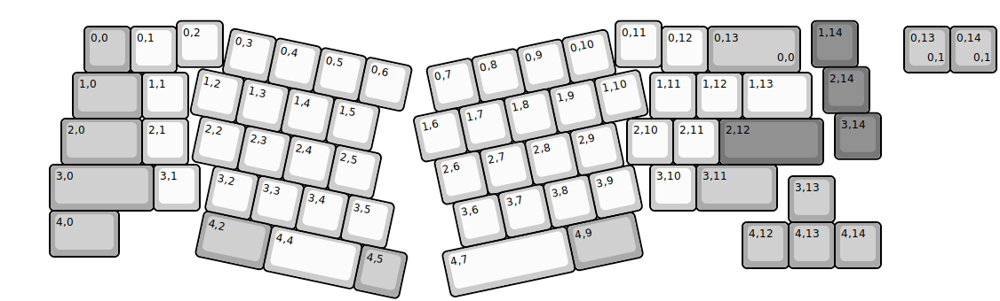
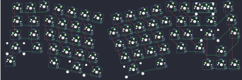
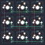
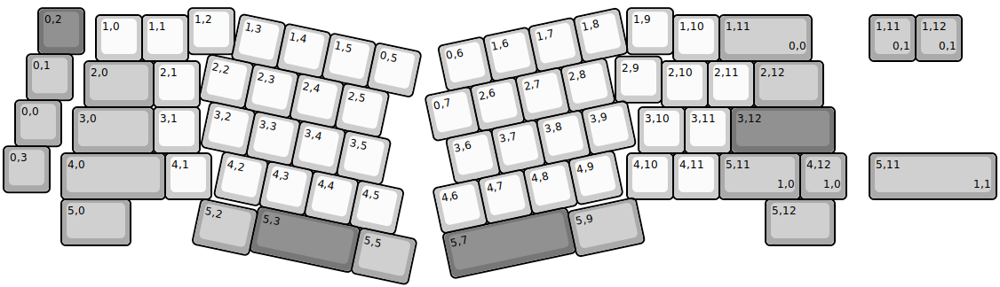
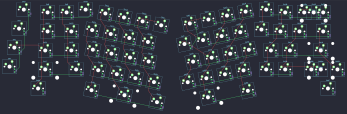

## kiwikey/borderland

[layout](borderland-kle.json) - [PCB](borderland.kicad_pcb)

{:loading="lazy"}

[Open in keyboard-layout-editor](http://www.keyboard-layout-editor.com/##@@_x:3.75&y:0.38;&=0,2&_x:8.5;&=0,11&_x:3.25&c=#777777;&=1,14;&@_x:1.75&y:-0.88&c=#aaaaaa;&=0,0&_c=#cccccc;&=0,1&_x:10.5;&=0,12&_c=#aaaaaa&w:2;&=0,13%0A%0A%0A0,0;&@_x:17.75&y:-0.12&c=#777777;&=2,14;&@_x:1.5&y:-0.88&c=#aaaaaa&w:1.5;&=1,0&_c=#cccccc;&=1,1&_x:10.0;&=1,11&=1,12&_w:1.5;&=1,13;&@_x:18&y:-0.12&c=#777777;&=3,14;&@_x:1.25&y:-0.88&c=#aaaaaa&w:1.75;&=2,0&_c=#cccccc;&=2,1&_x:9.5;&=2,10&=2,11&_c=#777777&w:2.25;&=2,12;&@_x:1&c=#aaaaaa&w:2.25;&=3,0&_c=#cccccc;&=3,1&_x:9.75;&=3,10&_c=#aaaaaa&w:1.75;&=3,11;&@_x:17&y:-0.75;&=3,13;&@_x:1&y:-0.25&w:1.5;&=4,0;&@_x:16&y:-0.75;&=4,12&=4,13&=4,14;&@_r:12&rx:4.75&ry:1.5&y:-1.0&c=#cccccc;&=0,3&=0,4&=0,5&=0,6;&@_x:-0.5;&=1,2&=1,3&=1,4&=1,5;&@_x:-0.25;&=2,2&=2,3&=2,4&=2,5;&@_x:0.25;&=3,2&=3,3&=3,4&=3,5;&@_x:0.25&c=#aaaaaa&w:1.5;&=4,2&_c=#cccccc&w:2;&=4,4&_c=#aaaaaa;&=4,5;&@_r:-12&rx:13.5&x:-4.25&y:-1.0&c=#cccccc;&=0,7&=0,8&=0,9&=0,10;&@_x:-4.75;&=1,6&=1,7&=1,8&=1,9&=1,10;&@_x:-4.5;&=2,6&=2,7&=2,8&=2,9;&@_x:-4.75&y:1.0&w:2.75;&=4,7&_c=#aaaaaa&w:1.5;&=4,9;&@_ry:1.75&x:-4.25&y:1.75&c=#cccccc;&=3,6&=3,7&=3,8&=3,9;&@_r:0&rx:0&ry:0&x:19.5&y:0.5&c=#aaaaaa;&=0,13%0A%0A%0A0,1&=0,14%0A%0A%0A0,1)

{:loading="lazy"}

## kiwikey/kawii9

[layout](kawii9-kle.json) - [PCB](kawii9.kicad_pcb)

{:loading="lazy"}

[Open in keyboard-layout-editor](http://www.keyboard-layout-editor.com/##@@=0,0&=0,1&=0,2;&@=1,0&=1,1&=1,2;&@=2,0&=2,1&=2,2)

{:loading="lazy"}

## kiwikey/wanderland

[layout](wanderland-kle.json) - [PCB](wanderland.kicad_pcb)

{:loading="lazy"}

[Open in keyboard-layout-editor](http://www.keyboard-layout-editor.com/##@@_x:0.75&y:0.1&c=#777777;&=0,2&_x:2.25&c=#cccccc;&=1,2&_x:8.5;&=1,9;&@_x:15.5&y:-0.85&c=#aaaaaa&w:2;&=1,11%0A%0A%0A0,0&_x:-15.5&c=#cccccc;&=1,0&=1,1&_x:10.5;&=1,10;&@_x:0.5&y:-0.15&c=#aaaaaa;&=0,1;&@_x:13.25&y:-0.95&c=#cccccc;&=2,9;&@_x:1.75&y:-0.9&c=#aaaaaa&w:1.5;&=2,0&_c=#cccccc;&=2,1&_x:10.0;&=2,10&=2,11&_c=#aaaaaa&w:1.5;&=2,12;&@_x:0.25&y:-0.15;&=0,0;&@_x:1.5&y:-0.85&w:1.75;&=3,0&_c=#cccccc;&=3,1&_x:9.5;&=3,10&=3,11&_c=#777777&w:2.25;&=3,12;&@_y:-0.15&c=#aaaaaa;&=0,3;&@_x:1.25&y:-0.85&w:2.25;&=4,0&_c=#cccccc;&=4,1&_x:9.0;&=4,10&=4,11&_c=#aaaaaa&w:1.75;&=5,11%0A%0A%0A1,0&=4,12%0A%0A%0A1,0;&@_x:1.25&w:1.5;&=5,0&_x:13.75&w:1.5;&=5,12;&@_r:12&rx:5.5&ry:1&x:-0.5&y:-0.7&c=#cccccc;&=1,3&=1,4&=1,5&=0,5;&@_x:-1.0;&=2,2&=2,3&=2,4&=2,5;&@_x:-0.75;&=3,2&=3,3&=3,4&=3,5;&@_x:-0.25;&=4,2&=4,3&=4,4&=4,5;&@_x:0.75&c=#777777&w:2.25;&=5,3&_c=#aaaaaa&w:1.25;&=5,5;&@_x:-0.5&y:-0.9&w:1.25;&=5,2;&@_r:-12&rx:13&ry:3.5&x:-3&y:-3.25&c=#cccccc;&=0,6&=1,6&=1,7&=1,8;&@_x:-3.5;&=0,7&=2,6&=2,7&=2,8;&@_x:-3.25;&=3,6&=3,7&=3,8&=3,9;&@_x:-3.75;&=4,6&=4,7&=4,8&=4,9;&@_x:-3.75&c=#777777&w:2.75;&=5,7;&@_x:-1&y:-0.9&c=#aaaaaa&w:1.5;&=5,9;&@_r:0&rx:0&ry:0&x:18.75&y:0.25;&=1,11%0A%0A%0A0,1&=1,12%0A%0A%0A0,1;&@_x:18.75&y:2.0&w:2.75;&=5,11%0A%0A%0A1,1)

{:loading="lazy"}

