## kprepublic/bm16s

[layout](bm16s-kle.json) - [PCB](bm16s.kicad_pcb)

{:loading="lazy"}

[Open in keyboard-layout-editor](http://www.keyboard-layout-editor.com/##@@=0,0&=0,1&=0,2&=0,3;&@=1,0&=1,1&=1,2&=1,3;&@=2,0&=2,1&=2,2&=2,3;&@=3,0&=3,1&=3,2&=3,3)

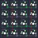{:loading="lazy"}

## kprepublic/bm40hsrgb

[layout](bm40hsrgb-kle.json) - [PCB](bm40hsrgb.kicad_pcb)

{:loading="lazy"}

[Open in keyboard-layout-editor](http://www.keyboard-layout-editor.com/##@@_c=#aaaaaa;&=0,0&_c=#ccccccc;&=0,1&=0,2&=0,3&=0,4&=0,5&=0,6&=0,7&=0,8&=0,9&=0,10&_c=#aaaaaa;&=0,11;&@_c=#777777;&=1,0&_c=#ccccccc;&=1,1&=1,2&=1,3&=1,4&=1,5&=1,6&=1,7&=1,8&=1,9&=1,10&_c=#aaaaaa;&=1,11;&@=2,0&_c=#ccccccc;&=2,1&=2,2&=2,3&=2,4&=2,5&=2,6&=2,7&=2,8&=2,9&=2,10&_c=#777777;&=2,11;&@_c=#aaaaaa;&=3,0&=3,1&=3,2&=3,3&=3,4&_w:2;&=3,5&=3,7&_c=#777777;&=3,8&=3,9&=3,10&=3,11)

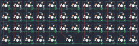{:loading="lazy"}

## kprepublic/bm60poker

[layout](bm60poker-kle.json) - [PCB](bm60poker.kicad_pcb)

{:loading="lazy"}

[Open in keyboard-layout-editor](http://www.keyboard-layout-editor.com/##@@_c=#777777;&=0,0&_c=#cccccc;&=0,1&=0,2&=0,3&=0,4&=0,5&=0,6&=0,7&=0,8&=0,9&=0,10&=0,11&=0,12&_c=#aaaaaa&w:2;&=0,13;&@_w:1.5;&=1,0&_c=#cccccc;&=1,1&=1,2&=1,3&=1,4&=1,5&=1,6&=1,7&=1,8&=1,9&=1,10&=1,11&=1,12&_w:1.5;&=1,13;&@_c=#aaaaaa&w:1.75;&=2,0&_c=#cccccc;&=2,2&=2,3&=2,4&=2,5&=2,6&=2,7&=2,8&=2,9&=2,10&=2,11&=2,12&_c=#777777&w:2.25;&=2,13;&@_c=#aaaaaa&w:2.25;&=3,1&_c=#cccccc;&=3,2&=3,3&=3,4&=3,5&=3,6&=3,7&=3,8&=3,9&=3,10&=3,11&_c=#aaaaaa&w:2.75;&=3,13;&@_w:1.25;&=4,0&_w:1.25;&=4,1&_w:1.25;&=4,2&_c=#cccccc&w:6.25;&=4,6&_c=#aaaaaa&w:1.25;&=4,9&_w:1.25;&=4,10&_w:1.25;&=4,12&_w:1.25;&=4,13)

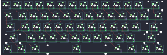{:loading="lazy"}

## kprepublic/bm60poker_v2

[layout](bm60poker_v2-kle.json) - [PCB](bm60poker_v2.kicad_pcb)

{:loading="lazy"}

[Open in keyboard-layout-editor](http://www.keyboard-layout-editor.com/##@@_c=#777777;&=0,0&_c=#cccccc;&=0,1&=0,2&=0,3&=0,4&=0,5&=0,6&=0,7&=0,8&=0,9&=0,10&=0,11&=0,12&_c=#aaaaaa&w:2;&=0,13;&@_w:1.5;&=1,0&_c=#cccccc;&=1,1&=1,2&=1,3&=1,4&=1,5&=1,6&=1,7&=1,8&=1,9&=1,10&=1,11&=1,12&_w:1.5;&=1,13;&@_c=#aaaaaa&w:1.75;&=2,0&_c=#cccccc;&=2,1&=2,2&=2,3&=2,4&=2,5&=2,6&=2,7&=2,8&=2,9&=2,10&=2,11&_c=#777777&w:2.25;&=2,13;&@_c=#aaaaaa&w:2.25;&=3,0&_c=#cccccc;&=3,1&=3,2&=3,3&=3,4&=3,5&=3,6&=3,7&=3,8&=3,9&=3,10&_c=#aaaaaa&w:2.75;&=3,13;&@_w:1.25;&=4,0&_w:1.25;&=4,1&_w:1.25;&=4,2&_c=#cccccc&w:6.25;&=4,5&_c=#aaaaaa&w:1.25;&=4,9&_w:1.25;&=4,10&_w:1.25;&=4,11&_w:1.25;&=4,13)

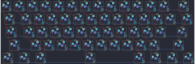{:loading="lazy"}

## kprepublic/bm60rgb

[layout](bm60rgb-kle.json) - [PCB](bm60rgb.kicad_pcb)

{:loading="lazy"}

[Open in keyboard-layout-editor](http://www.keyboard-layout-editor.com/##@@_c=#777777;&=0,0&_c=#cccccc;&=0,1&=0,2&=0,3&=0,4&=0,5&=0,6&=0,7&=0,8&=0,9&=0,10&=0,11&=0,12&_c=#aaaaaa&w:2;&=0,13;&@_w:1.5;&=1,0&_c=#cccccc;&=1,1&=1,2&=1,3&=1,4&=1,5&=1,6&=1,7&=1,8&=1,9&=1,10&=1,11&=1,12&_w:1.5;&=1,13;&@_c=#aaaaaa&w:1.75;&=2,0&_c=#cccccc;&=2,2&=2,3&=2,4&=2,5&=2,6&=2,7&=2,8&=2,9&=2,10&=2,11&=2,12&_c=#777777&w:2.25;&=2,13;&@_c=#aaaaaa&w:2.25;&=3,1&_c=#cccccc;&=3,2&=3,3&=3,4&=3,5&=3,6&=3,7&=3,8&=3,9&=3,10&_c=#aaaaaa&w:1.75;&=3,11&_c=#777777;&=3,12&_c=#cccccc;&=3,13;&@_c=#aaaaaa&w:1.25;&=4,0&_w:1.25;&=4,1&_w:1.25;&=4,2&_c=#777777&w:6.25;&=4,6&_c=#aaaaaa;&=4,9&=4,10&_c=#777777;&=4,11&=4,12&=4,13)

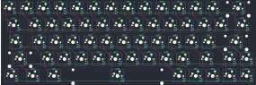{:loading="lazy"}

## kprepublic/bm60rgb_v2

[layout](bm60rgb_v2-kle.json) - [PCB](bm60rgb_v2.kicad_pcb)

{:loading="lazy"}

[Open in keyboard-layout-editor](http://www.keyboard-layout-editor.com/##@@_c=#777777;&=0,0&_c=#cccccc;&=0,1&=0,2&=0,3&=0,4&=0,5&=0,6&=0,7&=0,8&=0,9&=0,10&=0,11&=0,12&_c=#aaaaaa&w:2;&=0,13;&@_w:1.5;&=1,0&_c=#cccccc;&=1,1&=1,2&=1,3&=1,4&=1,5&=1,6&=1,7&=1,8&=1,9&=1,10&=1,11&=1,12&_w:1.5;&=1,13;&@_c=#aaaaaa&w:1.75;&=2,0&_c=#cccccc;&=2,2&=2,3&=2,4&=2,5&=2,6&=2,7&=2,8&=2,9&=2,10&=2,11&=2,12&_c=#777777&w:2.25;&=2,13;&@_c=#aaaaaa&w:2.25;&=3,1&_c=#cccccc;&=3,2&=3,3&=3,4&=3,5&=3,6&=3,7&=3,8&=3,9&=3,10&_c=#aaaaaa&w:1.75;&=3,11&_c=#777777;&=3,12&_c=#cccccc;&=3,13;&@_c=#aaaaaa&w:1.25;&=4,0&_w:1.25;&=4,1&_w:1.25;&=4,2&_c=#777777&w:6.25;&=4,6&_c=#aaaaaa;&=4,9&=4,10&_c=#777777;&=4,11&=4,12&=4,13)

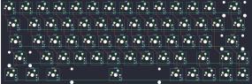{:loading="lazy"}

## kprepublic/bm60v2_ec

[layout](bm60v2_ec-kle.json) - [PCB](bm60v2_ec.kicad_pcb)

{:loading="lazy"}

[Open in keyboard-layout-editor](http://www.keyboard-layout-editor.com/##@@=0,0&=0,1&=0,2&=0,3&=0,4&=0,5&=0,6&=0,7&=0,8&=0,9&=0,10&=0,11&=0,12&=0,13&_x:0.75&w:0.75;&=4,3&=2,12&_w:0.75;&=4,4;&@_w:1.5;&=1,0&=1,1&=1,2&=1,3&=1,4&=1,5&=1,6&=1,7&=1,8&=1,9&=1,10&=1,11&=1,12&_w:1.5;&=1,13;&@_w:1.75;&=2,0&=2,1&=2,2&=2,3&=2,4&=2,5&=2,6&=2,7&=2,8&=2,9&=2,10&=2,11&_w:2.25;&=2,13;&@_w:2.25;&=3,0&=3,1&=3,2&=3,3&=3,4&=3,5&=3,6&=3,7&=3,8&=3,9&_w:1.75;&=3,11&=3,12&=3,13;&@_w:1.25;&=4,0&_w:1.25;&=4,1&_w:1.25;&=4,2&_w:6.25;&=4,6&=4,9&=4,10&=4,11&=4,12&=4,13)

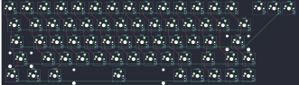{:loading="lazy"}

## kprepublic/bm68rgb

[layout](bm68rgb-kle.json) - [PCB](bm68rgb.kicad_pcb)

{:loading="lazy"}

[Open in keyboard-layout-editor](http://www.keyboard-layout-editor.com/##@@_c=#aaaaaa;&=0,0&_c=#cccccc;&=0,1&=0,2&=0,3&=0,4&=0,5&=0,6&=0,7&=0,8&=0,9&=0,10&=0,11&=0,12&_c=#777777&w:2;&=0,13&=0,14;&@_w:1.5;&=1,0&_c=#cccccc;&=1,1&=1,2&=1,3&=1,4&=1,5&=1,6&=1,7&=1,8&=1,9&=1,10&=1,11&=1,12&_w:1.5;&=1,13&_c=#777777;&=1,14;&@_w:1.75;&=2,0&_c=#cccccc;&=2,2&=2,3&=2,4&=2,5&=2,6&=2,7&=2,8&=2,9&=2,10&=2,11&=2,12&_c=#aaaaaa&w:2.25;&=2,13&_c=#777777;&=2,14;&@_w:2.25;&=3,1&_c=#cccccc;&=3,2&=3,3&=3,4&=3,5&=3,6&=3,7&=3,8&=3,9&=3,10&=3,11&_c=#777777&w:1.75;&=3,12&=3,13&=3,14;&@_w:1.25;&=4,0&_w:1.25;&=4,1&_w:1.25;&=4,2&_c=#aaaaaa&w:6.25;&=4,6&_c=#777777;&=4,9&=4,10&=4,11&=4,12&=4,13&=4,14)

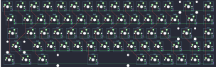{:loading="lazy"}

## kprepublic/bm80

[layout](bm80-kle.json) - [PCB](bm80.kicad_pcb)

{:loading="lazy"}

[Open in keyboard-layout-editor](http://www.keyboard-layout-editor.com/##@@_x:2.5&y:0.25&c=#777777;&=0,0&_x:1.0&c=#cccccc;&=0,2&=0,3&=0,4&=0,5&_x:0.5&c=#aaaaaa;&=0,7&=0,8&=0,9&=0,10&_x:0.5&c=#cccccc;&=0,11&=0,12&=3,12&=0,13&_x:0.25&c=#aaaaaa;&=0,14&=0,15&=0,16;&@_x:2.5&y:0.5&c=#cccccc;&=1,0&=1,1&=1,2&=1,3&=1,4&=1,5&=1,6&=1,7&=1,8&=1,9&=1,10&=1,11&=1,12&_c=#aaaaaa&w:2;&=1,13&_x:0.25;&=1,14&=1,15&=1,16;&@_x:2.5&w:1.5;&=2,0&_c=#cccccc;&=2,1&=2,2&=2,3&=2,4&=2,5&=2,6&=2,7&=2,8&=2,9&=2,10&=2,11&=2,12&_w:1.5;&=2,13&_x:0.25&c=#aaaaaa;&=2,14&=2,15&=2,16;&@_x:2.5&w:1.75;&=3,0&_c=#cccccc;&=3,1&=3,2&=3,3&=3,4&=3,5&=3,6&=3,7&=3,8&=3,9&=3,10&=3,11&_c=#777777&w:2.25;&=3,13;&@_x:2.5&c=#aaaaaa&w:2.25;&=4,0&=4,1&=4,2&=4,3&=4,4&=4,5&=4,6&=4,7&=4,8&=4,9&=4,10&_w:2.75;&=4,12&_x:1.25;&=4,15;&@_x:2.5&w:1.25;&=5,0&_w:1.25;&=5,1&_w:1.25;&=5,2&_c=#cccccc&w:6.25;&=5,5&_c=#aaaaaa&w:1.25;&=5,9&_w:1.25;&=5,10&_w:1.25;&=5,11&_w:1.25;&=5,12&_x:0.25;&=5,13&=5,15&=5,16)

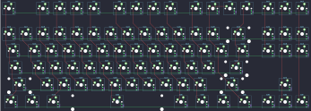{:loading="lazy"}

## kprepublic/bm980

[layout](bm980-kle.json) - [PCB](bm980.kicad_pcb)

{:loading="lazy"}

[Open in keyboard-layout-editor](http://www.keyboard-layout-editor.com/##@@_c=#777777;&=0,0&_x:1&c=#cccccc;&=0,1&=0,2&=0,3&=0,4&_x:0.5&c=#aaaaaa;&=0,5&=0,6&=0,7&=0,8&_x:0.5&c=#cccccc;&=0,9&=0,10&=0,11&=0,12&_x:1.0&c=#aaaaaa;&=0,13&=1,14&=1,10&=1,6;&@_y:0.5;&=2,0&_c=#cccccc;&=2,1&=2,2&=2,3&=2,4&=2,5&=2,6&=2,7&=2,8&=2,9&=2,10&=2,11&=2,12&_c=#aaaaaa&w:2;&=2,14&_x:1;&=2,13&=1,11&=1,9&=1,2;&@_w:1.5;&=3,0&_c=#cccccc;&=3,1&=3,2&=3,3&=3,4&=3,5&=3,6&=3,7&=3,8&=3,9&=3,10&=3,11&=3,12&_c=#aaaaaa&w:1.5;&=3,14&_x:1.0&c=#cccccc;&=3,13&=1,3&=1,4&_c=#aaaaaa&h:2;&=1,5;&@_w:1.75;&=4,0&_c=#cccccc;&=4,1&=4,2&=4,3&=4,4&=4,5&=4,6&=4,7&=4,8&=4,9&=4,10&=4,11&_c=#777777&w:2.25;&=4,14&_x:1.0&c=#cccccc;&=4,13&=1,8&=1,7;&@_c=#aaaaaa&w:2.25;&=5,0&_c=#cccccc;&=5,2&=5,3&=5,4&=5,5&=5,6&=5,7&=5,8&=5,9&=5,10&=5,11&_c=#aaaaaa&w:1.75;&=5,12&_x:2.0&c=#cccccc;&=5,13&=6,8&=6,7&_c=#aaaaaa&h:2;&=6,5;&@_x:14.5&y:-0.75&c=#777777;&=5,14;&@_y:-0.25&c=#aaaaaa&w:1.25;&=6,0&_w:1.25;&=6,1&_w:1.25;&=6,2&_c=#777777&w:6.25;&=6,6&_c=#aaaaaa;&=6,9&=6,10&=6,11&_x:4.0&c=#cccccc;&=6,3&=6,4;&@_x:13.5&y:-0.75&c=#777777;&=6,12&=6,14&=6,13)

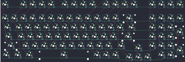{:loading="lazy"}

## kprepublic/cospad

[layout](cospad-kle.json) - [PCB](cospad.kicad_pcb)

{:loading="lazy"}

[Open in keyboard-layout-editor](http://www.keyboard-layout-editor.com/##@@_x:2.25&y:0.25;&=0,0&=0,1&=0,2&=0,3;&@_x:2.25;&=1,0&=1,1&=1,2&=1,3%0A%0A%0A0,0;&@_x:2.25;&=2,0&=2,1&=2,2&=2,3%0A%0A%0A0,0;&@_x:2.25;&=3,0&=3,1&=3,2&=3,3%0A%0A%0A0,0;&@_x:2.25;&=4,0%0A%0A%0A2,0&=4,1%0A%0A%0A2,0&=4,2&=4,3%0A%0A%0A0,0;&@_x:2.25;&=5,0%0A%0A%0A1,0&=5,1%0A%0A%0A1,0&=5,2&=5,3%0A%0A%0A0,0;&@_x:6.5&y:-5.0&h:2;&=1,3%0A%0A%0A0,1&=1,3%0A%0A%0A0,2&=1,3%0A%0A%0A0,3&=1,3%0A%0A%0A0,4&_h:2;&=1,3%0A%0A%0A0,5&_h:2;&=1,3%0A%0A%0A0,6&=1,3%0A%0A%0A0,7;&@_x:7.5&h:2;&=2,3%0A%0A%0A0,2&=2,3%0A%0A%0A0,3&=2,3%0A%0A%0A0,4&_x:2.0&h:2;&=2,3%0A%0A%0A0,7;&@_x:6.5;&=3,3%0A%0A%0A0,1&_x:1.0&h:2;&=3,3%0A%0A%0A0,3&=3,3%0A%0A%0A0,4&_h:2;&=3,3%0A%0A%0A0,5&=3,3%0A%0A%0A0,6;&@_w:2;&=4,0%0A%0A%0A2,1&_x:4.5;&=4,3%0A%0A%0A0,1&=4,3%0A%0A%0A0,2&_x:1.0&h:2;&=4,3%0A%0A%0A0,4&_x:1.0&h:2;&=4,3%0A%0A%0A0,6&_h:2;&=4,3%0A%0A%0A0,7;&@_x:6.5;&=5,3%0A%0A%0A0,1&=5,3%0A%0A%0A0,2&=5,3%0A%0A%0A0,3&_x:1.0;&=5,3%0A%0A%0A0,5;&@_x:2.25&y:0.25&w:2;&=5,0%0A%0A%0A1,1)

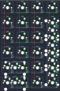{:loading="lazy"}

## kprepublic/daisy40

[layout](daisy40-kle.json) - [PCB](daisy40.kicad_pcb)

{:loading="lazy"}

[Open in keyboard-layout-editor](http://www.keyboard-layout-editor.com/##@@_c=#777777;&=0,0&_c=#aaaaaa;&=0,1&=0,2&=0,3&=0,4&=0,5&=0,6&=0,7&=0,8&=0,9&=0,10&=3,10;&@_c=#cccccc&w:1.25;&=1,0&=1,1&=1,2&=1,3&=1,4&=1,5&=1,6&=1,7&=1,8&=1,9&_c=#777777&w:1.75;&=1,10;&@_c=#aaaaaa&w:1.75;&=2,0&=2,1&=2,2&=2,3&=2,4&=2,5&=2,6&=2,7&=2,8&=2,9&_w:1.25;&=2,10;&@_w:1.25;&=3,0&=3,1&=3,2%0A%0A%0A0,0&_c=#777777&w:6.25;&=3,5%0A%0A%0A0,0&_c=#aaaaaa&w:1.25;&=3,8%0A%0A%0A0,0&_w:1.25;&=3,9%0A%0A%0A0,0;&@_w:1.25;&=3,2%0A%0A%0A0,1&_c=#777777&w:2.5;&=3,4%0A%0A%0A0,1&_w:2.5;&=3,5%0A%0A%0A0,1&_c=#aaaaaa&w:1.25;&=3,7%0A%0A%0A0,1&=3,8%0A%0A%0A0,1&_w:1.25;&=3,9%0A%0A%0A0,1)

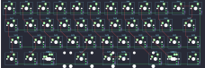{:loading="lazy"}

## kprepublic/jj40

[layout](jj40-kle.json) - [PCB](jj40.kicad_pcb)

{:loading="lazy"}

[Open in keyboard-layout-editor](http://www.keyboard-layout-editor.com/##@@_c=#aaaaaa;&=0,0&_c=#ccccccc;&=0,1&=0,2&=0,3&=0,4&=0,5&=0,6&=0,7&=0,8&=0,9&=0,10&_c=#aaaaaa;&=0,11;&@_c=#777777;&=1,0&_c=#ccccccc;&=1,1&=1,2&=1,3&=1,4&=1,5&=1,6&=1,7&=1,8&=1,9&=1,10&_c=#aaaaaa;&=1,11;&@=2,0&_c=#ccccccc;&=2,1&=2,2&=2,3&=2,4&=2,5&=2,6&=2,7&=2,8&=2,9&=2,10&_c=#777777;&=2,11;&@_c=#aaaaaa;&=3,0&=3,1&=3,2&=3,3&=3,4%0A%0A%0A0,0&=3,5%0A%0A%0A0,0&=3,6%0A%0A%0A0,0&=3,7%0A%0A%0A0,0&_c=#777777;&=3,8&=3,9&=3,10&=3,11;&@_x:4&c=#aaaaaa;&=3,4%0A%0A%0A0,1&_w:2;&=3,5%0A%0A%0A0,1&=3,7%0A%0A%0A0,1;&@_x:4&w:2;&=3,4%0A%0A%0A0,2&=3,6%0A%0A%0A0,2&=3,7%0A%0A%0A0,2;&@_x:4;&=3,4%0A%0A%0A0,3&=3,5%0A%0A%0A0,3&_w:2;&=3,6%0A%0A%0A0,3;&@_x:4&w:2;&=3,4%0A%0A%0A0,4&_w:2;&=3,6%0A%0A%0A0,4)

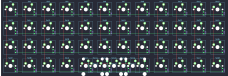{:loading="lazy"}

## kprepublic/jj4x4

[layout](jj4x4-kle.json) - [PCB](jj4x4.kicad_pcb)

{:loading="lazy"}

[Open in keyboard-layout-editor](http://www.keyboard-layout-editor.com/##@@=0,0&=0,1&=0,2&=0,3;&@=1,0&=1,1&=1,2&=1,3;&@=2,0&=2,1&=2,2&=2,3;&@=3,0&=3,1&=3,2&=3,3)

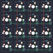{:loading="lazy"}

## kprepublic/jj50

[layout](jj50-kle.json) - [PCB](jj50.kicad_pcb)

{:loading="lazy"}

[Open in keyboard-layout-editor](http://www.keyboard-layout-editor.com/##@@_c=#777777;&=0,0&_c=#ccccccc;&=0,1&=0,2&=0,3&=0,4&=0,5&=0,6&=0,7&=0,8&=0,9&=0,10&_c=#aaaaaa;&=0,11;&@=1,0&_c=#ccccccc;&=1,1&=1,2&=1,3&=1,4&=1,5&=1,6&=1,7&=1,8&=1,9&=1,10&_c=#aaaaaa;&=1,11;&@_c=#777777;&=2,0&_c=#ccccccc;&=2,1&=2,2&=2,3&=2,4&=2,5&=2,6&=2,7&=2,8&=2,9&=2,10&_c=#aaaaaa;&=2,11;&@=3,0&_c=#ccccccc;&=3,1&=3,2&=3,3&=3,4&=3,5&=3,6&=3,7&=3,8&=3,9&=3,10&_c=#777777;&=3,11;&@_c=#aaaaaa;&=4,0&=4,1&=4,2&=4,3&=4,4%0A%0A%0A0,0&=4,5%0A%0A%0A0,0&=4,6%0A%0A%0A0,0&=4,7%0A%0A%0A0,0&_c=#777777;&=4,8&=4,9&=4,10&=4,11;&@_x:4&c=#aaaaaa;&=4,4%0A%0A%0A0,1&_w:2;&=4,5%0A%0A%0A0,1&=4,7%0A%0A%0A0,1;&@_x:4&w:2;&=4,4%0A%0A%0A0,2&=4,6%0A%0A%0A0,2&=4,7%0A%0A%0A0,2;&@_x:4;&=4,4%0A%0A%0A0,3&=4,5%0A%0A%0A0,3&_w:2;&=4,6%0A%0A%0A0,3;&@_x:4&w:2;&=4,4%0A%0A%0A0,4&_w:2;&=4,6%0A%0A%0A0,4)

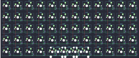{:loading="lazy"}

## kprepublic/xd75

[layout](xd75-kle.json) - [PCB](xd75.kicad_pcb)

{:loading="lazy"}

[Open in keyboard-layout-editor](http://www.keyboard-layout-editor.com/##@@_c=#777777;&=0,0&_c=#cccccc;&=0,1&=0,2&=0,3&=0,4&=0,5&=0,6&=0,7&=0,8&=0,9&=0,10&=0,11&=0,12&=0,13&_c=#aaaaaa;&=0,14;&@=1,0&_c=#cccccc;&=1,1&=1,2&=1,3&=1,4&=1,5&=1,6&=1,7&=1,8&=1,9&=1,10&=1,11&=1,12&=1,13&=1,14;&@_c=#aaaaaa;&=2,0&_c=#cccccc;&=2,1&=2,2&=2,3&=2,4&=2,5&_c=#aaaaaa;&=2,6&=2,7&=2,8&_c=#cccccc;&=2,9&=2,10&=2,11&=2,12&=2,13&_c=#777777;&=2,14;&@_c=#aaaaaa;&=3,0&_c=#cccccc;&=3,1&=3,2&=3,3&=3,4&=3,5&_c=#aaaaaa;&=3,6&_c=#777777;&=3,7&_c=#aaaaaa;&=3,8&_c=#cccccc;&=3,9&=3,10&=3,11&=3,12&=3,13&_c=#aaaaaa;&=3,14;&@=4,0&=4,1&=4,2&=4,3&_c=#cccccc;&=4,4&=4,5&_c=#777777;&=4,6&=4,7&=4,8&_c=#cccccc;&=4,9&=4,10&_c=#aaaaaa;&=4,11&=4,12&=4,13&=4,14)

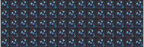{:loading="lazy"}

## kprepublic/xd84pro

[layout](xd84pro-kle.json) - [PCB](xd84pro.kicad_pcb)

{:loading="lazy"}

[Open in keyboard-layout-editor](http://www.keyboard-layout-editor.com/##@@_x:3&c=#777777;&=0,0&_c=#cccccc;&=0,1&=0,2&=0,3&=0,4&_c=#aaaaaa;&=0,5&=0,6&=0,7&=0,8&_c=#cccccc;&=0,9&=0,10&=0,11&=0,12&_c=#aaaaaa;&=0,13%0A%0A%0A0,0&=5,6%0A%0A%0A0,0&=0,14%0A%0A%0A0,0;&@_x:3&c=#cccccc;&=1,0&=1,1&=1,2&=1,3&=1,4&=1,5&=1,6&=1,7&=1,8&=1,9&=1,10&=1,11&=1,12&_c=#aaaaaa&w:2;&=1,13%0A%0A%0A1,0&=1,14%0A%0A%0A1,0;&@_x:3&w:1.5;&=2,0&_c=#cccccc;&=2,1&=2,2&=2,3&=2,4&=2,5&=2,6&=2,7&=2,8&=2,9&=2,10&=2,11&=2,12&_w:1.5;&=2,13%0A%0A%0A2,0&_c=#aaaaaa;&=2,14;&@_x:3&w:1.75;&=3,0&_c=#cccccc;&=3,1&=3,2&=3,3&=3,4&=3,5&=3,6&=3,7&=3,8&=3,9&=3,10&=3,11&_c=#777777&w:2.25;&=3,13%0A%0A%0A2,0&_c=#aaaaaa;&=3,14;&@_x:3.0&w:2.25;&=4,0%0A%0A%0A3,0&_c=#cccccc;&=4,2&=4,3&=4,4&=4,5&=4,6&=4,7&=4,8&=4,9&=4,10&=4,11&_c=#aaaaaa&w:1.75;&=4,12%0A%0A%0A4,0&=4,13%0A%0A%0A4,0&=4,14%0A%0A%0A4,0;&@_x:3&w:1.25;&=5,0%0A%0A%0A5,0&_w:1.25;&=5,1%0A%0A%0A5,0&_w:1.25;&=5,2%0A%0A%0A5,0&_c=#777777&w:6.25;&=5,5%0A%0A%0A5,0&_c=#aaaaaa;&=5,10%0A%0A%0A5,0&=5,11%0A%0A%0A5,0&=5,8%0A%0A%0A5,0&=5,12%0A%0A%0A5,0&=5,13%0A%0A%0A5,0&=5,14%0A%0A%0A5,0;&@_x:19.75&y:-6&c=#cccccc;&=0,13%0A%0A%0A0,1&_c=#aaaaaa&w:2;&=5,6%0A%0A%0A0,1;&@_x:19.75&c=#cccccc;&=1,13%0A%0A%0A1,1&=5,9%0A%0A%0A1,1&=1,14%0A%0A%0A1,1&_x:0.75;&=1,13%0A%0A%0A1,2&_c=#aaaaaa&w:2;&=5,9%0A%0A%0A1,2;&@_x:20.5&c=#777777&w:1.25&h:2&w2:1.5&h2:1&x2:-0.25;&=3,13%0A%0A%0A2,1;&@_x:19.5&c=#cccccc;&=3,12%0A%0A%0A2,1;&@_c=#aaaaaa&w:1.25;&=4,0%0A%0A%0A3,1&_c=#cccccc;&=4,1%0A%0A%0A3,1&_x:17.25&c=#aaaaaa&w:1.25;&=4,12%0A%0A%0A4,1&_w:1.25;&=4,13%0A%0A%0A4,1&_w:1.25;&=4,14%0A%0A%0A4,1;&@_x:3&y:1.25&w:1.25;&=5,0%0A%0A%0A5,1&_w:1.25;&=5,1%0A%0A%0A5,1&_w:1.25;&=5,2%0A%0A%0A5,1&_c=#777777&w:6.25;&=5,5%0A%0A%0A5,1&_c=#aaaaaa;&=5,10%0A%0A%0A5,1&_w:1.25;&=5,11%0A%0A%0A5,1&_w:1.25;&=5,12%0A%0A%0A5,1&_w:1.25;&=5,13%0A%0A%0A5,1&_w:1.25;&=5,14%0A%0A%0A5,1;&@_x:3&y:0.25&w:1.25;&=5,0%0A%0A%0A5,2&_w:1.25;&=5,1%0A%0A%0A5,2&_w:1.25;&=5,2%0A%0A%0A5,2&_c=#777777&w:6.25;&=5,5%0A%0A%0A5,2&_c=#aaaaaa&w:1.25;&=5,10%0A%0A%0A5,2&=5,11%0A%0A%0A5,2&_w:1.25;&=5,12%0A%0A%0A5,2&_w:1.25;&=5,13%0A%0A%0A5,2&_w:1.25;&=5,14%0A%0A%0A5,2;&@_x:3&y:0.25&w:1.5;&=5,0%0A%0A%0A5,3&_w:1.5;&=5,1%0A%0A%0A5,3&_c=#777777&w:7;&=5,5%0A%0A%0A5,3&_c=#aaaaaa&w:1.5;&=5,10%0A%0A%0A5,3&_w:1.5;&=5,11%0A%0A%0A5,3&=5,12%0A%0A%0A5,3&=5,13%0A%0A%0A5,3&=5,14%0A%0A%0A5,3;&@_x:3&y:0.25&w:1.5;&=5,0%0A%0A%0A5,4&=5,1%0A%0A%0A5,4&_w:1.5;&=5,2%0A%0A%0A5,4&_c=#777777&w:6;&=5,5%0A%0A%0A5,4&_c=#aaaaaa;&=5,10%0A%0A%0A5,4&=5,11%0A%0A%0A5,4&=5,8%0A%0A%0A5,4&=5,12%0A%0A%0A5,4&=5,13%0A%0A%0A5,4&=5,14%0A%0A%0A5,4;&@_x:3&y:0.25&w:1.5;&=5,0%0A%0A%0A5,5&=5,1%0A%0A%0A5,5&_w:1.25;&=5,2%0A%0A%0A5,5&_c=#777777&w:6.25;&=5,5%0A%0A%0A5,5&_c=#aaaaaa;&=5,10%0A%0A%0A5,5&=5,11%0A%0A%0A5,5&=5,8%0A%0A%0A5,5&=5,12%0A%0A%0A5,5&=5,13%0A%0A%0A5,5&=5,14%0A%0A%0A5,5;&@_x:3&y:0.25&w:1.5;&=5,0%0A%0A%0A5,6&=5,1%0A%0A%0A5,6&_w:1.5;&=5,2%0A%0A%0A5,6&_c=#777777&w:7;&=5,5%0A%0A%0A5,6&_c=#aaaaaa;&=5,11%0A%0A%0A5,6&=5,8%0A%0A%0A5,6&=5,12%0A%0A%0A5,6&=5,13%0A%0A%0A5,6&=5,14%0A%0A%0A5,6;&@_x:3&y:0.25&w:1.25;&=5,0%0A%0A%0A5,7&_w:1.25;&=5,1%0A%0A%0A5,7&_w:1.25;&=5,2%0A%0A%0A5,7&_c=#777777&w:6.25;&=5,5%0A%0A%0A5,7&_c=#aaaaaa&w:1.5;&=5,10%0A%0A%0A5,7&_w:1.5;&=5,11%0A%0A%0A5,7&=5,12%0A%0A%0A5,7&=5,13%0A%0A%0A5,7&=5,14%0A%0A%0A5,7)

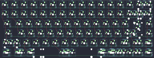{:loading="lazy"}

