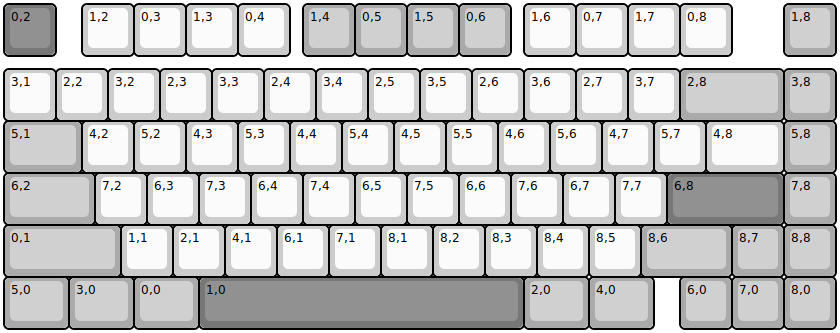
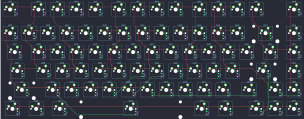

## labyrinth75/labyrinth75

[layout](labyrinth75-kle.json) - [PCB](labyrinth75.kicad_pcb)

{:loading="lazy"}

[Open in keyboard-layout-editor](http://www.keyboard-layout-editor.com/##@@_c=#777777;&=0,2&_x:0.5&c=#cccccc;&=1,2&=0,3&=1,3&=0,4&_x:0.25&c=#aaaaaa;&=1,4&=0,5&=1,5&=0,6&_x:0.25&c=#cccccc;&=1,6&=0,7&=1,7&=0,8&_x:1.0&c=#aaaaaa;&=1,8;&@_y:0.25&c=#cccccc;&=3,1&=2,2&=3,2&=2,3&=3,3&=2,4&=3,4&=2,5&=3,5&=2,6&=3,6&=2,7&=3,7&_c=#aaaaaa&w:2;&=2,8&=3,8;&@_w:1.5;&=5,1&_c=#cccccc;&=4,2&=5,2&=4,3&=5,3&=4,4&=5,4&=4,5&=5,5&=4,6&=5,6&=4,7&=5,7&_w:1.5;&=4,8&_c=#aaaaaa;&=5,8;&@_w:1.75;&=6,2&_c=#cccccc;&=7,2&=6,3&=7,3&=6,4&=7,4&=6,5&=7,5&=6,6&=7,6&=6,7&=7,7&_c=#777777&w:2.25;&=6,8&_c=#aaaaaa;&=7,8;&@_w:2.25;&=0,1&_c=#cccccc;&=1,1&=2,1&=4,1&=6,1&=7,1&=8,1&=8,2&=8,3&=8,4&=8,5&_c=#aaaaaa&w:1.75;&=8,6&=8,7&=8,8;&@_w:1.25;&=5,0&_w:1.25;&=3,0&_w:1.25;&=0,0&_c=#777777&w:6.25;&=1,0&_c=#aaaaaa&w:1.25;&=2,0&_w:1.25;&=4,0&_x:0.5;&=6,0&=7,0&=8,0)

{:loading="lazy"}

