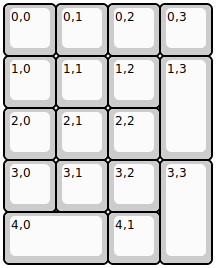
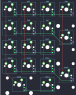

## latin17rgb/latin17rgb

[layout](latin17rgb-kle.json) - [PCB](latin17rgb.kicad_pcb)

{:loading="lazy"}

[Open in keyboard-layout-editor](http://www.keyboard-layout-editor.com/##@@=0,0&=0,1&=0,2&=0,3;&@=1,0&=1,1&=1,2&_h:2;&=1,3;&@=2,0&=2,1&=2,2;&@=3,0&=3,1&=3,2&_h:2;&=3,3;&@_w:2;&=4,0&=4,1)

{:loading="lazy"}

