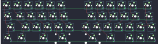
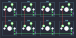
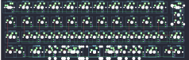
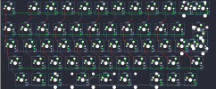
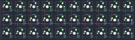
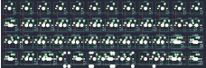
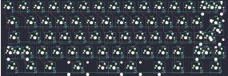

## lazydesigners/bolt

[layout](bolt-kle.json) - [PCB](bolt.kicad_pcb)

{:loading="lazy"}

[Open in keyboard-layout-editor](http://www.keyboard-layout-editor.com/##@@_c=#777777;&=0,0&_c=#cccccc;&=0,1&=0,2&=0,3&=0,4&=0,5&_x:1.5;&=0,6&=0,7&=0,8&=0,9&=0,10&_c=#777777&w:1.75;&=0,11;&@_w:1.25;&=1,0&_c=#aaaaaa;&=1,1&=1,2&=1,3&=1,4&=1,5&_x:1.5;&=1,6&=1,7&=1,8&=1,9&=1,10&_c=#777777&w:1.5;&=1,11;&@_w:1.75;&=2,0&_c=#aaaaaa;&=2,1&=2,2&=2,3&=2,4&=2,5&_x:0.5;&=2,6&=2,7&=2,8&=2,9&=2,10&=2,11&_c=#777777;&=3,11;&@_w:1.25;&=3,0&_w:1.25;&=3,1&_x:0.75&w:1.25;&=3,3&_w:2.25;&=3,4&_x:0.5&w:2.25;&=3,6&=3,7&_x:0.75&c=#cccccc;&=3,8&=3,9&=3,10)

{:loading="lazy"}

## lazydesigners/cassette8

[layout](cassette8-kle.json) - [PCB](cassette8.kicad_pcb)

{:loading="lazy"}

[Open in keyboard-layout-editor](http://www.keyboard-layout-editor.com/##@@=0,0&=0,1&=0,2&=0,3;&@=1,0&=1,1&=1,2&=1,3)

{:loading="lazy"}

## lazydesigners/dimple

[layout](dimple-kle.json) - [PCB](dimple.kicad_pcb)

{:loading="lazy"}

[Open in keyboard-layout-editor](http://www.keyboard-layout-editor.com/##@@_x:1&c=#777777;&=0,0%0A%0A%0A0,0&_c=#cccccc;&=0,1%0A%0A%0A0,0&=0,2%0A%0A%0A0,0&=0,3%0A%0A%0A0,0&=0,4%0A%0A%0A0,0&=0,5%0A%0A%0A0,0&=0,6%0A%0A%0A0,0&=0,7%0A%0A%0A0,0&=0,8%0A%0A%0A0,0&=0,9%0A%0A%0A0,0&=0,10%0A%0A%0A0,0&_c=#aaaaaa&w:1.5;&=0,11%0A%0A%0A0,0;&@_x:1&w:1.25;&=1,0%0A%0A%0A0,0&_c=#cccccc;&=1,1%0A%0A%0A0,0&=1,2%0A%0A%0A0,0&=1,3%0A%0A%0A0,0&=1,4%0A%0A%0A0,0&=1,5%0A%0A%0A0,0&=1,6%0A%0A%0A0,0&=1,7%0A%0A%0A0,0&=1,8%0A%0A%0A0,0&=1,9%0A%0A%0A0,0&=1,10%0A%0A%0A0,0&_c=#aaaaaa&w:1.25;&=1,11%0A%0A%0A0,0;&@_x:1&w:1.75;&=2,0%0A%0A%0A0,0&_c=#cccccc;&=2,1%0A%0A%0A0,0&=2,2%0A%0A%0A0,0&=2,3%0A%0A%0A0,0&=2,4%0A%0A%0A0,0&=2,5%0A%0A%0A0,0&=2,6%0A%0A%0A0,0&=2,7%0A%0A%0A0,0&=2,8%0A%0A%0A0,0&=2,9%0A%0A%0A0,0&_c=#777777&w:1.75;&=2,10%0A%0A%0A0,0;&@_x:1&w:0.75&d:true;&=%0A%0A%0A1,0&_c=#aaaaaa;&=3,0%0A%0A%0A1,0&=3,2%0A%0A%0A1,0&=3,3%0A%0A%0A1,0&_c=#777777&w:2.25;&=3,4%0A%0A%0A1,0&_w:2.75;&=3,6%0A%0A%0A1,0&_c=#aaaaaa;&=3,7%0A%0A%0A1,0&=3,8%0A%0A%0A1,0&=3,9%0A%0A%0A1,0;&@_x:14.5&y:-4&c=#777777;&=0,0%0A%0A%0A0,1&_c=#cccccc;&=0,1%0A%0A%0A0,1&=0,2%0A%0A%0A0,1&=0,3%0A%0A%0A0,1&=0,4%0A%0A%0A0,1&=0,5%0A%0A%0A0,1&=0,6%0A%0A%0A0,1&=0,7%0A%0A%0A0,1&=0,8%0A%0A%0A0,1&=0,9%0A%0A%0A0,1&=0,10%0A%0A%0A0,1&_x:0.25&c=#777777&w:1.25&h:2&w2:1.5&h2:1&x2:-0.25;&=1,11%0A%0A%0A0,1&_x:1.0&w:1.25;&=0,0%0A%0A%0A0,2&_c=#cccccc;&=0,1%0A%0A%0A0,2&=0,2%0A%0A%0A0,2&=0,3%0A%0A%0A0,2&=0,4%0A%0A%0A0,2&=0,5%0A%0A%0A0,2&=0,6%0A%0A%0A0,2&=0,7%0A%0A%0A0,2&=0,8%0A%0A%0A0,2&=0,9%0A%0A%0A0,2&=0,10%0A%0A%0A0,2&_c=#aaaaaa&w:1.25;&=0,11%0A%0A%0A0,2;&@_x:14.5&w:1.25;&=1,0%0A%0A%0A0,1&_c=#cccccc;&=1,1%0A%0A%0A0,1&=1,2%0A%0A%0A0,1&=1,3%0A%0A%0A0,1&=1,4%0A%0A%0A0,1&=1,5%0A%0A%0A0,1&=1,6%0A%0A%0A0,1&=1,7%0A%0A%0A0,1&=1,8%0A%0A%0A0,1&=1,9%0A%0A%0A0,1&=1,10%0A%0A%0A0,1&_x:2.25&w:1.25;&=1,0%0A%0A%0A0,2&=1,1%0A%0A%0A0,2&=1,2%0A%0A%0A0,2&=1,3%0A%0A%0A0,2&=1,4%0A%0A%0A0,2&=1,5%0A%0A%0A0,2&=1,6%0A%0A%0A0,2&=1,7%0A%0A%0A0,2&=1,8%0A%0A%0A0,2&=1,9%0A%0A%0A0,2&=1,10%0A%0A%0A0,2&_c=#aaaaaa&w:1.25;&=1,11%0A%0A%0A0,2;&@_x:14.5&c=#777777&w:1.75;&=2,0%0A%0A%0A0,1&_c=#cccccc;&=2,1%0A%0A%0A0,1&=2,2%0A%0A%0A0,1&=2,3%0A%0A%0A0,1&=2,4%0A%0A%0A0,1&=2,5%0A%0A%0A0,1&=2,6%0A%0A%0A0,1&=2,7%0A%0A%0A0,1&=2,8%0A%0A%0A0,1&=2,9%0A%0A%0A0,1&_c=#777777&w:1.75;&=2,10%0A%0A%0A0,1&_x:1.0&w:1.25;&=2,0%0A%0A%0A0,2&_c=#cccccc;&=2,1%0A%0A%0A0,2&=2,2%0A%0A%0A0,2&=2,3%0A%0A%0A0,2&=2,4%0A%0A%0A0,2&=2,5%0A%0A%0A0,2&=2,6%0A%0A%0A0,2&=2,7%0A%0A%0A0,2&=2,8%0A%0A%0A0,2&=2,9%0A%0A%0A0,2&=2,10%0A%0A%0A0,2&_c=#777777&w:1.25;&=2,11%0A%0A%0A0,2;&@_x:13.75&c=#aaaaaa&w:0.75&d:true;&=%0A%0A%0A1,1&=3,0%0A%0A%0A1,1&=3,2%0A%0A%0A1,1&=3,3%0A%0A%0A1,1&=3,4%0A%0A%0A1,1&_c=#777777&w:3;&=3,5%0A%0A%0A1,1&_c=#aaaaaa;&=3,6%0A%0A%0A1,1&=3,7%0A%0A%0A1,1&=3,8%0A%0A%0A1,1&=3,9%0A%0A%0A1,1&_x:1.0&w:0.75&d:true;&=%0A%0A%0A1,2&=3,0%0A%0A%0A1,2&=3,2%0A%0A%0A1,2&=3,3%0A%0A%0A1,2&_c=#777777&w:2;&=3,4%0A%0A%0A1,2&_c=#aaaaaa;&=3,5%0A%0A%0A1,2&_c=#777777&w:2;&=3,6%0A%0A%0A1,2&_c=#aaaaaa;&=3,7%0A%0A%0A1,2&=3,8%0A%0A%0A1,2&=3,9%0A%0A%0A1,2&_x:1.0&w:0.75&d:true;&=%0A%0A%0A1,3&=3,0%0A%0A%0A1,3&=3,2%0A%0A%0A1,3&_c=#777777&w:7;&=3,4%0A%0A%0A1,3&_c=#aaaaaa;&=3,8%0A%0A%0A1,3&=3,9%0A%0A%0A1,3&_x:1.0&w:1.25;&=3,0%0A%0A%0A1,4&_x:0.63&w:1.25;&=3,2%0A%0A%0A1,4&=3,3%0A%0A%0A1,4&_c=#777777&w:2;&=3,4%0A%0A%0A1,4&_w:2.25;&=3,6%0A%0A%0A1,4&_c=#aaaaaa;&=3,7%0A%0A%0A1,4&_w:1.25;&=3,8%0A%0A%0A1,4&_x:0.63&w:1.25;&=3,9%0A%0A%0A1,4&_x:1.0&w:1.25;&=3,0%0A%0A%0A1,5&_x:0.63&w:1.25;&=3,2%0A%0A%0A1,5&_c=#777777&w:6.25;&=3,4%0A%0A%0A1,5&_c=#aaaaaa&w:1.25;&=3,8%0A%0A%0A1,5&_x:0.63&w:1.25;&=3,9%0A%0A%0A1,5)

{:loading="lazy"}

## lazydesigners/dimpleplus

[layout](dimpleplus-kle.json) - [PCB](dimpleplus.kicad_pcb)

{:loading="lazy"}

[Open in keyboard-layout-editor](http://www.keyboard-layout-editor.com/##@@_c=#777777;&=0,0&_x:0.5&c=#cccccc;&=0,1&=0,2&=0,3&=0,4&=0,5&=0,6&=0,7&=0,8&=0,9&=0,10%0A%0A%0A0,0&=0,11%0A%0A%0A0,0;&@_y:0.25&c=#aaaaaa;&=1,0&=1,1&=1,2&=1,3&=1,4&=1,5&=1,6&=1,7&=1,8&=1,9&=1,10&_c=#777777&w:1.5;&=1,11%0A%0A%0A1,0;&@_w:1.25;&=2,0&_c=#aaaaaa;&=2,1&=2,2&=2,3&=2,4&=2,5&=2,6&=2,7&=2,8&=2,9&=2,10%0A%0A%0A1,0&_c=#777777&w:1.25;&=2,11%0A%0A%0A1,0;&@_w:1.75;&=3,0&_c=#cccccc;&=3,1&=3,2&=3,3&=3,4&=3,5&=3,6&=3,7&=3,8&=3,9&_c=#777777&w:1.75;&=3,10;&@_x:0.75;&=4,0&=4,2&=4,3%0A%0A%0A2,0&_w:2.25;&=4,4%0A%0A%0A2,0&_w:2.75;&=4,6%0A%0A%0A2,0&=4,7%0A%0A%0A2,0&=4,8&=4,9;&@_x:12.5&y:-5.25&w:2;&=0,10%0A%0A%0A0,1;&@_x:12.5&y:0.25&w:1.5;&=1,11%0A%0A%0A1,1&_x:1.75&w:1.25&h:2&w2:1.5&h2:1&x2:-0.25;&=1,11%0A%0A%0A1,2;&@_x:11.75&w:2.25;&=2,11%0A%0A%0A1,1&_x:0.75&c=#cccccc;&=2,10%0A%0A%0A1,2;&@_x:9.75&y:1.0&c=#777777&w:7;&=4,4%0A%0A%0A2,1)

{:loading="lazy"}

## lazydesigners/the30

[layout](the30-kle.json) - [PCB](the30.kicad_pcb)

{:loading="lazy"}

[Open in keyboard-layout-editor](http://www.keyboard-layout-editor.com/##@@=0,0&=0,1&=0,2&=0,3&=0,4&=0,5&=0,6&=0,7&=0,8&=0,9;&@=1,0&=1,1&=1,2&=1,3&=1,4&=1,5&=1,6&=1,7&=1,8&=1,9;&@=2,0&=2,1&=2,2&=2,3&=2,4&=2,5&=2,6&=2,7&=2,8&=2,9)

{:loading="lazy"}

## lazydesigners/the40

[layout](the40-kle.json) - [PCB](the40.kicad_pcb)

{:loading="lazy"}

[Open in keyboard-layout-editor](http://www.keyboard-layout-editor.com/##@@_c=#aaaaaa;&=0,0&_c=#cccccc;&=0,1&=0,2&=0,3&=0,4&=0,5&=0,6&=0,7&=0,8&=0,9&=0,10&_c=#aaaaaa;&=0,11;&@_w:1.25;&=1,0%0A%0A%0A0,0&_c=#cccccc;&=1,1%0A%0A%0A0,0&=1,2%0A%0A%0A0,0&=1,3%0A%0A%0A0,0&=1,4%0A%0A%0A0,0&=1,5%0A%0A%0A0,0&=1,6%0A%0A%0A0,0&=1,7%0A%0A%0A0,0&=1,8%0A%0A%0A0,0&=1,9%0A%0A%0A0,0&_c=#777777&w:1.75;&=1,10%0A%0A%0A0,0;&@_c=#aaaaaa&w:1.75;&=2,0%0A%0A%0A0,0&_c=#cccccc;&=2,1%0A%0A%0A0,0&=2,2%0A%0A%0A0,0&=2,3%0A%0A%0A0,0&=2,4%0A%0A%0A0,0&=2,5%0A%0A%0A0,0&=2,6%0A%0A%0A0,0&=2,7%0A%0A%0A0,0&=2,8%0A%0A%0A0,0&_w:1.25;&=2,9%0A%0A%0A0,0&_c=#aaaaaa;&=2,10%0A%0A%0A0,0;&@_w:1.25;&=3,0%0A%0A%0A1,0&=3,1%0A%0A%0A1,0&_w:1.25;&=3,2%0A%0A%0A1,0&_c=#cccccc&w:2.25;&=3,4%0A%0A%0A1,0&_w:2.75;&=3,6%0A%0A%0A1,0&_c=#aaaaaa&w:1.25;&=3,8%0A%0A%0A1,0&=3,9%0A%0A%0A1,0&_w:1.25;&=3,10%0A%0A%0A1,0;&@_x:12.0&y:-3&w:1.25;&=1,0%0A%0A%0A0,1&_c=#cccccc;&=1,1%0A%0A%0A0,1&=1,2%0A%0A%0A0,1&=1,3%0A%0A%0A0,1&=1,4%0A%0A%0A0,1&=1,5%0A%0A%0A0,1&=1,6%0A%0A%0A0,1&=1,7%0A%0A%0A0,1&=1,8%0A%0A%0A0,1&=1,9%0A%0A%0A0,1&_c=#777777&w:1.75;&=1,10%0A%0A%0A0,1&=1,0%0A%0A%0A0,2&_c=#cccccc;&=1,1%0A%0A%0A0,2&=1,2%0A%0A%0A0,2&=1,3%0A%0A%0A0,2&=1,4%0A%0A%0A0,2&=1,5%0A%0A%0A0,2&=1,6%0A%0A%0A0,2&=1,7%0A%0A%0A0,2&=1,8%0A%0A%0A0,2&=1,9%0A%0A%0A0,2&=1,10%0A%0A%0A0,2&_c=#aaaaaa;&=1,11%0A%0A%0A0,2;&@_x:12.0&w:1.75;&=2,0%0A%0A%0A0,1&_c=#cccccc;&=2,1%0A%0A%0A0,1&=2,2%0A%0A%0A0,1&=2,3%0A%0A%0A0,1&=2,4%0A%0A%0A0,1&=2,5%0A%0A%0A0,1&=2,6%0A%0A%0A0,1&=2,7%0A%0A%0A0,1&=2,8%0A%0A%0A0,1&=2,9%0A%0A%0A0,1&_c=#aaaaaa&w:1.25;&=2,10%0A%0A%0A0,1&=2,0%0A%0A%0A0,2&_c=#cccccc;&=2,1%0A%0A%0A0,2&=2,2%0A%0A%0A0,2&=2,3%0A%0A%0A0,2&=2,4%0A%0A%0A0,2&=2,5%0A%0A%0A0,2&=2,6%0A%0A%0A0,2&=2,7%0A%0A%0A0,2&=2,8%0A%0A%0A0,2&=2,9%0A%0A%0A0,2&=2,10%0A%0A%0A0,2&_c=#aaaaaa;&=2,11%0A%0A%0A0,2;&@_x:12.0&w:1.25;&=3,0%0A%0A%0A1,1&=3,1%0A%0A%0A1,1&=3,2%0A%0A%0A1,1&_c=#cccccc&w:6.25;&=3,4%0A%0A%0A1,1&_c=#aaaaaa&w:1.25;&=3,9%0A%0A%0A1,1&_w:1.25;&=3,10%0A%0A%0A1,1&=3,0%0A%0A%0A1,2&=3,1%0A%0A%0A1,2&=3,2%0A%0A%0A1,2&=3,3%0A%0A%0A1,2&=3,4%0A%0A%0A1,2&=3,5%0A%0A%0A1,2&=3,6%0A%0A%0A1,2&=3,7%0A%0A%0A1,2&=3,8%0A%0A%0A1,2&=3,9%0A%0A%0A1,2&=3,10%0A%0A%0A1,2&=3,11%0A%0A%0A1,2&=3,0%0A%0A%0A1,3&=3,1%0A%0A%0A1,3&=3,2%0A%0A%0A1,3&=3,3%0A%0A%0A1,3&=3,4%0A%0A%0A1,3&_c=#cccccc&w:2;&=3,5%0A%0A%0A1,3&_c=#aaaaaa;&=3,7%0A%0A%0A1,3&=3,8%0A%0A%0A1,3&=3,9%0A%0A%0A1,3&=3,10%0A%0A%0A1,3&=3,11%0A%0A%0A1,3)

{:loading="lazy"}

## lazydesigners/the60rev2

[layout](the60rev2-kle.json) - [PCB](the60rev2.kicad_pcb)

{:loading="lazy"}

[Open in keyboard-layout-editor](http://www.keyboard-layout-editor.com/##@@_x:2.5&c=#777777;&=0,0&_c=#cccccc;&=0,1&=0,2&=0,3&=0,4&=0,5&=0,6&=0,7&=0,8&=0,9&=0,10&=0,11&=0,12&_c=#aaaaaa&w:2;&=0,13%0A%0A%0A0,0;&@_x:2.5&w:1.5;&=1,0&_c=#cccccc;&=1,1&=1,2&=1,3&=1,4&=1,5&=1,6&=1,7&=1,8&=1,9&=1,10&=1,11&=1,12&_c=#aaaaaa&w:1.5;&=1,13%0A%0A%0A1,0;&@_x:2.5&w:1.75;&=2,0&_c=#cccccc;&=2,1&=2,2&=2,3&=2,4&=2,5&=2,6&=2,7&=2,8&=2,9&=2,10&=2,11&_c=#777777&w:2.25;&=2,13%0A%0A%0A1,0;&@_x:2.5&c=#aaaaaa&w:2.25;&=3,0%0A%0A%0A2,0&_c=#cccccc;&=3,2&=3,3&=3,4&=3,5&=3,6&=3,7&=3,8&=3,9&=3,10&=3,11&_c=#aaaaaa&w:1.75;&=3,12%0A%0A%0A3,0&=3,13%0A%0A%0A3,0;&@_x:2.5&w:1.5;&=4,0%0A%0A%0A4,0&=4,1%0A%0A%0A4,0&_w:1.5;&=4,2%0A%0A%0A4,0&_c=#cccccc&w:7;&=4,6%0A%0A%0A4,0&_c=#aaaaaa&w:1.5;&=4,11%0A%0A%0A4,0&=4,12%0A%0A%0A4,0&_w:1.5;&=4,13%0A%0A%0A4,0;&@_x:18.5&y:-5&c=#cccccc;&=0,13%0A%0A%0A0,1&=2,12%0A%0A%0A0,1;&@_x:19.25&c=#777777&w:1.25&h:2&w2:1.5&h2:1&x2:-0.25;&=2,13%0A%0A%0A1,1;&@_x:18.25&c=#cccccc;&=1,13%0A%0A%0A1,1;&@_c=#aaaaaa&w:1.25;&=3,0%0A%0A%0A2,1&=3,1%0A%0A%0A2,1&_x:15.5&w:2.75;&=3,13%0A%0A%0A3,1;&@_x:2.5&y:1&w:1.5;&=4,0%0A%0A%0A4,1&=4,1%0A%0A%0A4,1&_w:1.5;&=4,2%0A%0A%0A4,1&_c=#cccccc&w:2.25;&=4,4%0A%0A%0A4,1&=4,6%0A%0A%0A4,1&_w:2.75;&=4,8%0A%0A%0A4,1&_c=#aaaaaa;&=4,10%0A%0A%0A4,1&_w:1.5;&=4,11%0A%0A%0A4,1&=4,12%0A%0A%0A4,1&_w:1.5;&=4,13%0A%0A%0A4,1;&@_x:2.5&y:0.25&w:1.5;&=4,0%0A%0A%0A4,2&_d:true;&=%0A%0A%0A4,2&_w:1.5;&=4,2%0A%0A%0A4,2&_c=#cccccc&w:7;&=4,6%0A%0A%0A4,2&_c=#aaaaaa&w:1.5;&=4,11%0A%0A%0A4,2&_d:true;&=%0A%0A%0A4,2&_w:1.5;&=4,13%0A%0A%0A4,2;&@_x:2.5&w:1.5&d:true;&=%0A%0A%0A4,3&=4,1%0A%0A%0A4,3&_w:1.5;&=4,2%0A%0A%0A4,3&_c=#cccccc&w:7;&=4,6%0A%0A%0A4,3&_c=#aaaaaa&w:1.5;&=4,11%0A%0A%0A4,3&=4,12%0A%0A%0A4,3&_w:1.5&d:true;&=%0A%0A%0A4,3;&@_x:2.5&y:0.25&w:1.5;&=4,0%0A%0A%0A4,4&_d:true;&=%0A%0A%0A4,4&_w:1.5;&=4,2%0A%0A%0A4,4&_c=#cccccc&w:2.25;&=4,4%0A%0A%0A4,4&=4,6%0A%0A%0A4,4&_w:2.75;&=4,8%0A%0A%0A4,4&_c=#aaaaaa;&=4,10%0A%0A%0A4,4&_w:1.5;&=4,11%0A%0A%0A4,4&_d:true;&=%0A%0A%0A4,4&_w:1.5;&=4,13%0A%0A%0A4,4;&@_x:2.5&w:1.5&d:true;&=%0A%0A%0A4,5&=4,1%0A%0A%0A4,5&_w:1.5;&=4,2%0A%0A%0A4,5&_c=#cccccc&w:2.25;&=4,4%0A%0A%0A4,5&=4,6%0A%0A%0A4,5&_w:2.75;&=4,8%0A%0A%0A4,5&_c=#aaaaaa;&=4,10%0A%0A%0A4,5&_w:1.5;&=4,11%0A%0A%0A4,5&=4,12%0A%0A%0A4,5&_w:1.5&d:true;&=%0A%0A%0A4,5)

{:loading="lazy"}

