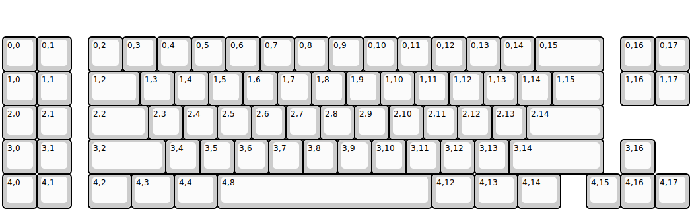
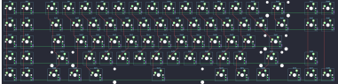

## lfkeyboards/lfk78

[layout](lfk78-kle.json) - [PCB](lfk78.kicad_pcb)

{:loading="lazy"}

[Open in keyboard-layout-editor](http://www.keyboard-layout-editor.com/##@@_y:1;&=0,0&=0,1&_x:0.5;&=0,2&=0,3&=0,4&=0,5&=0,6&=0,7&=0,8&=0,9&=0,10&=0,11&=0,12&=0,13&=0,14&_w:2;&=0,15&_x:0.5;&=0,16&=0,17;&@=1,0&=1,1&_x:0.5&w:1.5;&=1,2&=1,3&=1,4&=1,5&=1,6&=1,7&=1,8&=1,9&=1,10&=1,11&=1,12&=1,13&=1,14&_w:1.5;&=1,15&_x:0.5;&=1,16&=1,17;&@=2,0&=2,1&_x:0.5&w:1.75;&=2,2&=2,3&=2,4&=2,5&=2,6&=2,7&=2,8&=2,9&=2,10&=2,11&=2,12&=2,13&_w:2.25;&=2,14;&@=3,0&=3,1&_x:0.5&w:2.25;&=3,2&=3,4&=3,5&=3,6&=3,7&=3,8&=3,9&=3,10&=3,11&=3,12&=3,13&_w:2.75;&=3,14&_x:0.5;&=3,16;&@=4,0&=4,1&_x:0.5&w:1.25;&=4,2&_w:1.25;&=4,3&_w:1.25;&=4,4&_w:6.25;&=4,8&_w:1.25;&=4,12&_w:1.25;&=4,13&_w:1.25;&=4,14&_x:0.75;&=4,15&=4,16&=4,17)

{:loading="lazy"}

